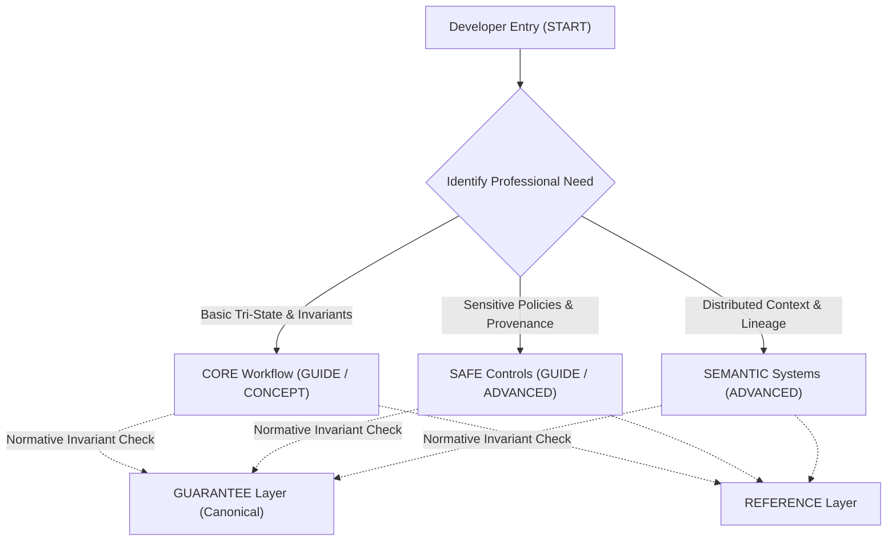

# XoX Documentation Architecture

This document defines the organization, information architecture, navigation principles, progressive disclosure boundaries, and quality evaluation standards for XoX developer documentation.

---

## 1. Documentation Layers

XoX documentation is structured into six discrete layers, each serving a distinct developer need:

| Layer | Purpose | Content & Focus | Target Audience |
| :--- | :--- | :--- | :--- |
| **`START`** | Minimum path from real professional problem to correct first use. | Problem-oriented entry points, minimal essential mental model, immediate correct tri-state handling. | All incoming developers. |
| **`GUIDE`** | Task-oriented workflows and common real-world decisions. | Step-by-step guidance for realistic integration scenarios, explicit policy boundaries, error handling. | Developers solving concrete implementation tasks. |
| **`CONCEPT`** | Stable developer mental models and rationale. | Why XoX behaves as it does, tri-state invariants, domain separation from `bool`, cognitive boundaries. | Developers deepening architectural understanding. |
| **`REFERENCE`** | Precise public API and behavioral contracts. | Function signatures, types, parameter contracts, deterministic behavior specifications. | Active implementers and maintainers. |
| **`GUARANTEE`** | Canonical adopted semantic authority. | Direct pointers to normative foundation documents (`GUARANTEES.md`, `SOURCE_OF_TRUTH.md`). | Developers verifying safety invariants and compliance. |
| **`ADVANCED`** | Specialized controls for high-assurance or distributed needs. | `SAFE` guarded policies, provenance, audit workflows, and `SEMANTIC` lineage / distributed context. | Specialized developers with explicit domain requirements. |

---

## 2. Core Navigation Principles

Documentation navigation enforces progressive disclosure and preserves cognitive focus:

1. **Start from Developer Problems, Not Theory**: Entry points address concrete engineering problems (e.g., handling missing evidence, avoiding silent boolean defaults), never abstract formal logic.
2. **CORE Isolation**: A developer using `CORE` must never be required to read `SAFE` or `SEMANTIC` material for ordinary, correct use.
3. **Additive SAFE Learning**: A developer moving to `SAFE` retains the exact `CORE` mental model and learns only the specific additional policy and provenance controls needed.
4. **SEMANTIC is Not the Default Next Chapter**: `SEMANTIC` material is specialized for distributed and lineage-intensive contexts; it is never presented as an automatic progression for all users.
5. **No Downstream Reinterpretation**: Higher-level or specialized documentation may expose additional contextual detail, but must never redefine or alter lower-level semantics.
6. **Explicit Justification for Public Concepts**: Every concept exposed in public documentation must have an explicit, documented reason for its visibility.
7. **Consequences Before Mechanisms**: Developer-facing operational consequences and failure modes must be explained before internal implementation mechanics.
8. **Link Normative Authority, Do Not Duplicate**: Explanatory pages must link directly to canonical guarantee documents rather than recreating or paraphrasing normative text.
9. **Lowest Sufficient Level Ease**: The documentation hierarchy makes staying in the simplest sufficient API level natural and straightforward.
10. **Discoverable Misuse Paths**: Common anti-patterns, pitfalls, and misuse paths must be documented adjacent to the features or concepts that prompt them.

---

## 3. Information Architecture & Navigation Flows

### Key Architectural Questions & Rules

- **Where does a new developer start?**  
  At the `START` layer, focused on solving a specific missing-evidence or uncertain-decision problem with `CORE`.
- **How does a developer identify their needed level?**  
  Via clear problem-classification criteria:
  - Tri-state evaluation and non-collapsing logic $\rightarrow$ `CORE`.
  - Auditable policies, provenance tracking, freshness, and guarded collapse $\rightarrow$ `SAFE`.
  - Distributed lineage, multi-system context propagation, and framework-level orchestration $\rightarrow$ `SEMANTIC`.
- **Task Guides vs. Conceptual Explanations:**  
  Task guides (`GUIDE`) describe *how to achieve a specific operational outcome*; conceptual documents (`CONCEPT`) explain *why the system behaves as it does* and enforce cognitive invariants.
- **Referencing Normative Guarantees:**  
  Normative guarantees reside exclusively in `docs/00_foundations/`. Explanatory docs reference them via stable canonical links; they never define new guarantees.
- **Discoverability Without Accidental Escalation:**  
  Advanced capabilities are indexed under explicit situational requirements (e.g., "Need audit provenance? See SAFE"), preventing accidental cognitive contamination of standard paths.
- **Unadopted XoXLang Research Semantics:**  
  Research artifacts, unadopted language features, or theoretical models from XoXLang are strictly excluded from public product documentation until formally adopted into canonical foundations.
- **Documentation Evolution & Deprecation:**  
  Deprecated patterns and evolving guides must be clearly flagged with migration paths and version boundaries without altering historical semantic guarantees.
- **Independent Testing Feedback Loop:**  
  Empirical results from developer friction testing directly inform documentation restructuring and cognitive simplification.

---

## 4. Progressive Disclosure & Authority Boundaries

### Authority Rules

1. Documentation pages outside canonical semantic authorities (`docs/00_foundations/`) must not silently redefine guarantees.
2. Examples illustrate behavior; they do not create semantic authority.
3. Developer guides may simplify presentation, but must never omit decision-relevant consequences.
4. If explanatory documentation conflicts with canonical guarantees, `docs/00_foundations/SOURCE_OF_TRUTH.md` governs authority order.
5. Duplication of normative rules is prohibited; use canonical links.

### Progressive Disclosure by API Level

- **CORE**:
  - Exposes: `True`, `False`, `Unknown`, Kleene tri-state logic rules, Bool/XoX domain separation, and explicit handling requirements.
  - Hides: Provenance metadata, policy authorizers, world models, witness structures, and distributed state internals.
- **SAFE**:
  - Exposes: Guarded collapse policies, freshness checks, provenance tracking, explicit authorization boundaries, and audit trail generation.
  - Hides: Multi-node lineage graphs, distributed consensus semantics, and internal AST/prover machinery.
- **SEMANTIC**:
  - Exposes: Context lineage propagation, cross-system trace tokens, and distributed uncertainty reconciliation.
  - Hides: Low-level engine memory layouts, internal compiler rewrite passes, and FFI runtime internals.

---

## 5. Example Architecture Requirements

To ensure practical utility and semantic accuracy, all documentation examples must adhere to the following standards:

1. **Realistic Professional Context**: Every major public concept must be illustrated with a realistic engineering scenario (e.g., microservice health check, authorization gate, network timeout handling).
2. **Tri-State Completeness**: Examples must explicitly demonstrate all relevant outcomes:
   - The verified positive case (`True`)
   - The verified negative case (`False`)
   - The unestablished case (`Unknown`)
   - A realistic misuse case or edge case
3. **Separation of Policy and Logic**: Examples must explicitly distinguish application-level action (retry, deny, alert, prompt) from XoX truth preservation.
4. **AI & Agent Scenarios**: Agent-oriented examples must maintain the strict boundary between deterministic operational uncertainty (`Unknown`) and statistical model confidence/logits.
5. **No Speculative or Research Semantics**: Examples must only rely on adopted, canonical semantics.
6. **Defect Standard**: Any example that contradicts a canonical guarantee in `docs/00_foundations/` constitutes a documentation defect.

---

## 6. Developer Testing Integration

Documentation quality is measured and refined using the [Developer Test Protocol](file:///home/ssr/Desktop/XoX/docs/01_developer_model/DEVELOPER_TEST_PROTOCOL.md):

- **Measurable Metrics**:
  - Time to first correct implementation.
  - Frequency of documentation lookups during task execution.
  - Rate of repeated errors or misconceptions (e.g., collapsing `Unknown` to `False`).
  - Required verbal or written corrections during protocol evaluations.
- **Cognitive Failure Diagnostics**: Repeated misunderstanding of a concept during testing is treated as evidence of documentation or API cognitive friction, not developer incompetence.
- **Continuous Simplification**: When testing reveals that explanatory complexity does not improve task accuracy, documentation must be simplified.
- **Validation Standard**: Successful recall of nomenclature or syntax alone is insufficient; documentation success is measured by correct behavioral reasoning and error-free implementation.

---

## 7. Architectural Boundaries

- **Documentation Architecture vs. Semantic Architecture**: Documentation structure optimizes human comprehension and task velocity; it does not alter, extend, or dictate semantic logic.
- **Hierarchy is Not Authority**: Document navigation hierarchies do not establish precedence over canonical foundations.
- **No Prestige or Gatekeeping Content**: Higher levels (`SAFE`, `SEMANTIC`) represent specialization for specific operational constraints, not advanced status.
- **Searchability vs. Cognitive Load**: Global searchability must not compromise progressive disclosure or pollute entry-level developer paths.
- **Internal vs. Public Documentation**: Internal implementation notes (Rust/PyO3 bindings, memory representations) remain strictly separated from developer-facing architectural documentation.
