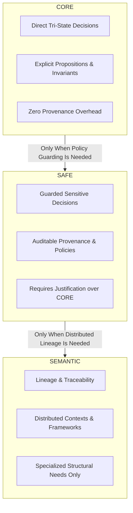

# XoX Example Quality Standard

This document defines the mandatory quality standard that every public XoX example must satisfy. Its purpose is to ensure that examples teach correct developer reasoning, preserve semantic authority boundaries, expose relevant Unknown behavior, and avoid becoming misleading pseudo-specifications.

---

## 1. Core Principle

> **An example is successful only if a developer can copy its reasoning, not merely its syntax, into a different professional situation without learning an incorrect XoX mental model.**

Examples in XoX are pedagogical instruments designed for conceptual transfer. They are not normative specifications, and they must never produce correct output through flawed semantic reasoning.

---

## 2. Required Example Properties

Every public XoX example must satisfy the following fundamental properties:

| ID | Property | Specification |
| :--- | :--- | :--- |
| **`EXAMPLE-REAL-01`** | **Realistic Professional Decision** | Every major example must originate from a realistic professional decision rather than an artificial truth-table exercise or abstract puzzle. |
| **`EXAMPLE-PROPOSITION-01`** | **Explicit Proposition** | The proposition being evaluated must be explicit enough that `True`, `False`, and `Unknown` have clear, unambiguous meanings. |
| **`EXAMPLE-UNKNOWN-01`** | **Unknown vs. Cause Separation** | Where `Unknown` is possible, the example must show what proposition remains unestablished rather than treating the underlying cause, error, timeout, null, or missing data as `Unknown` itself. |
| **`EXAMPLE-POLICY-01`** | **Explicit Application Policy** | Any action taken after evaluating `Unknown` (e.g., retry, fallback, deny, escalate, prompt user) must be explicitly identified as external application policy, never as the inherent meaning of `Unknown`. |
| **`EXAMPLE-AUTHORITY-01`** | **Non-Normative Status** | Examples illustrate adopted behavior but never create semantic authority. If an example conflicts with canonical guarantees, the example is defective. |
| **`EXAMPLE-LEVEL-01`** | **Lowest Sufficient API Level** | Examples must use the lowest sufficient API level (`CORE` by default) and must not introduce `SAFE` or `SEMANTIC` complexity without demonstrated professional necessity. |
| **`EXAMPLE-MONOTONIC-01`** | **Monotonic Mental Models** | A higher-level example (`SAFE` or `SEMANTIC`) must preserve every mental model learned from lower-level examples without redefining baseline semantics. |
| **`EXAMPLE-MISUSE-01`** | **Realistic Misuse Coverage** | Important public concepts must document at least one realistic misuse or incorrect interpretation whenever such misuse is plausible. |
| **`EXAMPLE-EDGE-01`** | **Decisive Edge Conditions** | Important examples must include at least one edge condition capable of changing a developer's decision when relevant. |
| **`EXAMPLE-EFFECTS-01`** | **Preservation of Effects** | Examples involving logical composition must not teach algebraic equivalence that violates observable evaluation or side-effect semantics. |
| **`EXAMPLE-AI-01`** | **AI/Agent Uncertainty Boundaries** | AI and agent examples must model operational or decision uncertainty only, never treating token probability, confidence scores, or hallucination likelihood as XoX `Unknown`. |
| **`EXAMPLE-TRANSFER-01`** | **Domain-Agnostic Transfer** | An example must teach a core structural principle that transfers cleanly beyond its specific domain vocabulary. |

---

## 3. Example Structural Classes & Shapes

XoX distinguishes two structural classes of examples to balance pedagogical completeness with concise reference usage:

### 3.1 Structural Classes

- **`MAJOR_EXAMPLE`**:
  - **Purpose**: Teach a complete professional reasoning pattern across realistic decision lifecycles.
  - **Structure**: Uses the full 13-point specification shape detailed below.
- **`MICRO_EXAMPLE`**:
  - **Purpose**: Illustrate a single narrow concept, function signature, or API-facing consequence with minimal cognitive overhead.
  - **Structure**: Omit non-essential narrative boilerplate, while strictly enforcing mandatory semantic invariants.
  - **Minimum Required Checks**:
    1. Proposition clarity whenever ambiguity would otherwise exist.
    2. Correct `Unknown` semantics when `Unknown` is semantically possible and decision-relevant.
    3. Explicit policy-vs-semantics separation when an action follows `Unknown`.
    4. Lowest sufficient API level (no unneeded `SAFE`/`SEMANTIC` escalation).
    5. Authority-safe wording linked to canonical guarantees.
    6. No unadopted research primitives or internal runtime mechanisms.
    7. No observable-semantics or evaluation side-effect violations.
  - **Escalation Rule**: If omitting a field from a `MICRO_EXAMPLE` would make the example semantically ambiguous, misleading, or non-transferable, that field becomes mandatory for that example.

### 3.2 Standard Shape (`MAJOR_EXAMPLE`)

1. **Professional Context**: The real-world operational setting (e.g., identity verification, risk evaluation, cache validation, automated deployment).
2. **Decision to Make**: The discrete action or branch dependent on the evaluation outcome.
3. **Proposition Being Evaluated**: The explicit statement of fact tested (e.g., `"User is authorized for resource X"`).
4. **Why `bool` is Insufficient (if applicable)**: Explanation of how two-valued logic causes silent failures, false certainty, or forced premature defaults.
5. **Normal `True` Case**: Conditions under which the proposition is definitively verified.
6. **Normal `False` Case**: Conditions under which the proposition is definitively refuted.
7. **`Unknown` Case (if applicable)**: Conditions under which evidence is incomplete, uncontacted, or inconclusive.
8. **Application Policy (if any)**: Explicit post-evaluation decision handling (e.g., quarantine, safe fallback, user escalation) clearly separated from truth evaluation.
9. **Common Misuse**: Concrete demonstration of an intuitive but incorrect implementation pattern and why it fails.
10. **Edge Case (if relevant)**: Boundary conditions (e.g., timeout vs. connection reset, partial authorization lists) that alter decisions.
11. **Lowest Sufficient API Level**: Indication of whether the example requires `CORE`, `SAFE`, or `SEMANTIC`, with justification if above `CORE`.
12. **Canonical Guarantee Links**: Direct hyperlinks to relevant sections in `docs/00_foundations/GUARANTEES.md` and `docs/00_foundations/SOURCE_OF_TRUTH.md`.
13. **What the Example Does Not Mean**: Explicit boundaries preventing over-generalization or false assumptions about unstated guarantees.

---

## 4. Documentation Layer Scaling Rules

Example depth adapts to the documentation layer defined in [DOCUMENTATION_ARCHITECTURE.md](file:///home/ssr/Desktop/XoX/docs/01_developer_model/DOCUMENTATION_ARCHITECTURE.md) without altering underlying semantic checks:

| Documentation Layer | Preferred Structural Class | Scaling & Pedagogical Focus |
| :--- | :--- | :--- |
| **`START`** | `MICRO_EXAMPLE` | Minimize surface area; show only the essential tri-state handling required for first correct use. Avoid cognitive overload. |
| **`GUIDE`** | `MAJOR_EXAMPLE` | Preferred for central end-to-end workflows. `MICRO_EXAMPLE` may support local substeps and intermediate snippets. |
| **`CONCEPT`** | `MAJOR_EXAMPLE` / `MICRO_EXAMPLE` | Optimize for mental-model clarity, invariants, and rationale with minimal syntax dependence. |
| **`REFERENCE`** | `MICRO_EXAMPLE` | Narrow API illustrations; must explicitly link to canonical guarantees and never imply exhaustive behavioral specification. |
| **`GUARANTEE`** | Pointer / Non-authoritative | Canonical text remains sole normative authority; code snippets are illustrative only and never normative evidence. |
| **`ADVANCED`** | `MAJOR_EXAMPLE` | Expose `SAFE` policy guarding or `SEMANTIC` lineage only when professional necessity is explicitly established. |

*Rule*: Layer-specific scaling modifies only the expository depth and presentation structure; it must never relax or alter core semantic safety requirements.

---

## 5. Mandatory Failure Modes

An example is considered defective and must not be published if it exhibits any of the following failure modes:

1. **Timeout as Unknown**: Treating a timeout, network failure, or exception directly as `Unknown` instead of recognizing that the proposition remains unverified due to a timeout.
2. **None/Null as Unknown**: Treating `None`, `null`, or missing data as `Unknown` without defining the underlying proposition being evaluated.
3. **Equating Unknown with False/Deny**: Teaching or implying that `Unknown == False` or that `Unknown` inherently means "deny/reject".
4. **Presenting Policy as Semantics**: Presenting operational policies (retry, escalation, refusal, fallback, clarification) as intrinsic XoX logic rather than application-layer choices.
5. **Probability/Confidence as Unknown**: Using model confidence intervals, token probabilities, or hallucination likelihood as XoX `Unknown`.
6. **Premature Level Elevation**: Introducing `SAFE` or `SEMANTIC` machinery to solve a problem completely expressible at `CORE`.
7. **Exposing Unadopted Research**: Exposing unstable or unadopted research concepts, syntax, or internal runtime mechanics.
8. **Guarantee Paraphrasing**: Paraphrasing canonical guarantees imprecisely instead of referencing normative documentation.
9. **Pseudo-Specification by Example**: Implying that an unstated behavior is guaranteed merely because a code snippet exhibits it.
10. **Correct Output via Defective Logic**: Providing code that yields the correct result while using semantically flawed reasoning or accidental invariants.
11. **Hiding Unknown Branches**: Suppressing or omitting an important `Unknown` branch to make the example look deceptively simple.
12. **Pure Value Equivalence Over Effects**: Teaching logical or algebraic equivalence based solely on truth values while ignoring evaluation side effects or short-circuit semantics.

---

## 6. Persona & API-Level Requirements

### 6.1 Persona Requirements

- **Natural Domain Vocabulary**: Examples should adopt the professional vocabulary of the intended persona (e.g., Python Backend Engineer, Security Architect, Agent Developer).
- **No Jargon Gatekeeping**: Specialized domain jargon must not become a barrier to understanding the underlying XoX principle.
- **Unified Semantic Model**: Persona examples are contextual pedagogical lenses; they must never introduce distinct or incompatible semantic models.
- **Cross-Persona Invariance**: The interpretation of `True`, `False`, and `Unknown` must remain strictly identical across all personas.

### 6.2 API-Level Appropriateness

- **`CORE` Level**:
  - Prefer direct tri-state professional decisions.
  - Do not expose advanced provenance, policy engines, or authority machinery.
  - Keep the proposition, truth states, and `Unknown` interpretations immediate and explicit.
- **`SAFE` Level**:
  - Introduce sensitive-decision guards, audit policies, or provenance tracking only when the problem explicitly demands them.
  - Clearly demonstrate why `CORE` alone is insufficient for the stated decision.
- **`SEMANTIC` Level**:
  - Reserved strictly for examples requiring explicit context propagation, distributed lineage, or framework-level semantic orchestration.
  - Explicitly establish the architectural necessity before presenting advanced machinery.
  - Never frame `SEMANTIC` as the "complete" or recommended default path for ordinary tasks.

---

## 7. Semantic Authority Boundaries

1. **Traceability**: Every behavioral claim made or implied by an example must be directly traceable to adopted normative foundation documents (`PHILOSOPHY.md`, `GUARANTEES.md`, `SOURCE_OF_TRUTH.md`).
2. **Linkage Over Duplication**: Examples must link to canonical guarantees rather than duplicating or modifying normative text.
3. **Defect Precedence**: If an example conflicts with canonical guarantees, the example is defective and must be fixed. Canonical guarantees are never altered to accommodate an example.
4. **No Unadopted Behavior**: Features or behaviors not yet formally adopted into XoX must never appear in stable product documentation examples.
5. **No Authority by Popularity**: Convenience, simplicity, or popularity of an example never overrides semantic authority.

---

## 8. Example Quality Evaluation Checklist

When authoring or reviewing an example, evaluate it against the following quality questions:

- [ ] **Explicit Proposition**: Can an independent developer immediately identify the proposition being evaluated?
- [ ] **Unknown Explanation**: Can a reader explain why `Unknown` occurs without conflating the cause (e.g., network drop) with the truth value?
- [ ] **Policy Separation**: Is application policy clearly distinguished from XoX evaluation semantics?
- [ ] **Minimal Level**: Is the example implemented at the lowest sufficient API level?
- [ ] **Conceptual Transfer**: Can a developer apply the same logical structure to an entirely different problem domain?
- [ ] **Misuse Demonstration**: Does the example identify and warn against at least one plausible misuse pattern?
- [ ] **Guarantee Fidelity**: Would copying this reasoning preserve all established XoX guarantees?
- [ ] **No Research Jargon**: Is the example free from unadopted research terminology and internal implementation details?
- [ ] **Complexity Control**: Does the example avoid unnecessary architectural or syntactic overhead?
- [ ] **Syntax Resilience**: Would the core mental model remain valid even if the public API syntax underwent minor refinements?

---

## 9. Integration with Developer Test Protocol

Examples play a direct role in developer evaluation under [DEVELOPER_TEST_PROTOCOL.md](file:///home/ssr/Desktop/XoX/docs/01_developer_model/DEVELOPER_TEST_PROTOCOL.md):

1. **Unseen-Variant Testing**: Core examples serve as templates for creating unseen transfer test prompts during developer evaluation.
2. **Transfer Over Recognition**: Merely recognizing or reproducing an example is insufficient evidence of competence; a developer must demonstrate transfer of reasoning to unfamiliar scenarios.
3. **Transfer Failure as a Quality Signal**: Systematic developer failure to transfer an example's reasoning indicates a defect in documentation or example design rather than developer error.
4. **Pedagogical Metric**: The success of an example is measured by the reduction of conceptual misunderstandings, not just reading speed.
5. **Empirical Revision**: Examples may be iteratively improved based on developer usability feedback while strictly preserving underlying semantic authority.
