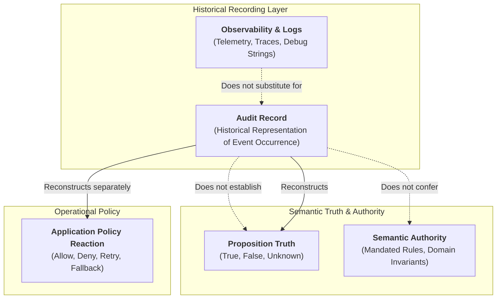

# XoX Audit Contract

This document establishes the conceptual audit contract for XoX, defining what decision-relevant semantic events must be reconstructable and reviewable without making logs, traces, provenance, or audit records themselves semantic authority.

---

## 1. Core Principle & The Audit Problem

> **An audit record documents that a decision-relevant event was represented as occurring; it does not by itself make the underlying proposition `True`, nor does it constitute semantic authority. Auditability ensures that semantic evaluation, uncertainty retention, policy reactions, and authority transitions remain reconstructable without conflating historical recording with semantic truth.**

In production systems, decisions often appear correct at evaluation time but become impossible to audit or review later when:
- The exact proposition framed is lost or conflated with downstream operational reactions.
- Evidence considered during evaluation is not recorded or is assumed `True` merely because an audit entry exists.
- An `Unknown` state is silently converted to `False` or `True` without recording why uncertainty occurred or how it was collapsed.
- A policy reaction (such as an authorization `DENY` or retry trigger) is logged as if it were a factual `False` evaluation.
- Authority, capability, or context state changes over time, yet past evaluations are reused blindly without invalidation tracking.
- Operational telemetry (metrics, traces, unstructured logs) creates high data volume but omits the minimum semantic distinctions needed to reconstruct the decision.

The XoX Audit Contract establishes the conceptual rules and event categories required to guarantee decision reconstructability while strictly preserving semantic boundaries.

---

## 2. Essential Audit Distinctions

Boundary adapters, evaluation frameworks, and developers must maintain strict conceptual boundaries between audit records and semantic state:

| Distinction | Audit Record Realm | Semantic / Operational Realm | Key Invariant |
| :--- | :--- | :--- | :--- |
| **Audit Evidence vs. Proposition Truth** | A record that evidence was submitted or considered. | Whether the factual proposition is actually `True`, `False`, or `Unknown`. | Logging an assertion does not make the underlying fact `True`. |
| **Audit Evidence vs. Semantic Authority** | Durable storage of an evaluation or assertion. | The legitimate mandate to define or govern truth. | A durable or signed log entry holds no authority to override domain rules. |
| **Event Occurrence vs. Event Correctness** | Confirmation that a processing step was executed. | Whether the logic executed at that step was semantically correct. | Recording that an evaluation occurred does not prove its logic was sound. |
| **Recorded Provenance vs. Trusted Provenance** | Lineage and source claims attached to a payload. | Policy-level determination of source trustworthiness. | Recording origin headers does not imply the origin is trustworthy or verified. |
| **Record Completeness vs. Semantic Completeness** | Presence of all expected audit log fields. | Whether the evidence was epistemically sufficient to establish truth. | A fully populated audit schema may still record an epistemically incomplete (`Unknown`) state. |
| **Semantic Evaluation vs. Policy Reaction** | The factual outcome of evaluating evidence (`True`/`False`/`Unknown`). | The downstream business decision (`ALLOW`/`DENY`/`RETRY`). | Policy reaction must never be stored as if it were the semantic evaluation result. |
| **`Unknown` Cause vs. `Unknown` State** | The reason uncertainty persisted (timeout, missing data, conflict). | The tri-state semantic value `Unknown`. | Recording `Unknown` is necessary, but recording *why* it was unestablished is vital for auditability. |
| **Historical Reconstruction vs. Current Truth** | What was evaluated and decided at timestamp $T_0$. | What is factually true at timestamp $T_1$. | Past audit records describe historical state; they do not dictate present truth. |
| **Audit Absence vs. `False`** | The complete lack of an audit record for an event. | A verified factual refutation (`False`). | Missing audit data is an observability failure, never a proof of falsity. |
| **Audit Absence vs. `Unknown`** | The complete lack of an audit record for an event. | An epistemic evaluation yielding `Unknown`. | Missing audit records do not alter domain state to `Unknown`. |
| **Observability Metadata vs. Decision-Relevant Audit** | High-volume operational metrics, CPU loads, span IDs. | Specific evidence, proposition framing, and results driving a decision. | Terabytes of trace spans cannot substitute for the semantic decision trail. |
| **Debugging Detail vs. Semantic Audit Requirement** | Ephemeral stack traces and variable dumps. | Minimal structural events necessary to explain and defend a decision. | Auditability focuses on decision reconstructability, not execution profiling. |

---

## 3. Required Audit Event Classes

To ensure an independent auditor or developer can reconstruct a decision lifecycle, systems must conceptually categorize decision-relevant occurrences into twelve event classes:

1. **`PROPOSITION_FRAMED`**: Identifies the exact proposition whose truth state was evaluated, including subject, predicate, and evaluation scope.
2. **`EVIDENCE_CONSIDERED`**: Identifies the evidence items provided to the evaluation without declaring the evidence factual merely because it was recorded.
3. **`EVALUATION_RESULT`**: Records the resulting `True`, `False`, or `Unknown` state directly tied to the framed proposition.
4. **`UNKNOWN_RETAINED`**: Records that uncertainty was preserved when no valid evidence or authority resolved the proposition.
5. **`REEVALUATION_TRIGGERED`**: Records why a prior result was no longer reusable (e.g., invalidated cache, expired TTL, context shift).
6. **`EXPLICIT_RESOLUTION_OR_COLLAPSE`**: Records an intentional, attributable collapse or default assignment of `Unknown` under an explicit policy or authority.
7. **`POLICY_REACTION`**: Records the operational action taken (e.g., abort, fallback, deny, alert) separately from the semantic evaluation.
8. **`PROVENANCE_CHANGE_OR_LOSS`**: Records any transformation, redaction, aggregation, or loss of decision-relevant lineage metadata.
9. **`CAPABILITY_VALIDATED_OR_INVALIDATED`**: Records changes in authority, permission, token validity, or scope that affect evaluation eligibility.
10. **`DECISION_RELEVANT_CONTEXT_CHANGE`**: Records external or environment shifts that invalidate prior assumptions.
11. **`SEMANTIC_INFORMATION_LOSS`**: Exposes instances where boundaries or type coercions intentionally drop distinctions needed for later reasoning.
12. **`EGRESS`**: Records externally exposed semantic states and any explicit reduction or projection applied during export.

---

## 4. Minimum Reconstruction Questions

An audit trail is conceptually sufficient if and only if an independent reviewer can answer the following twelve questions for any audited decision:

1. **What proposition was being evaluated?** (Scope, subject, and claim).
2. **What evidence was available to that evaluation?** (Inputs, claims, and data elements).
3. **What provenance was decision-relevant?** (Origin, custody, and asserted lineage).
4. **What XoX state was produced?** (`True`, `False`, or `Unknown`).
5. **If the result was `Unknown`, why did it remain unestablished?** (Missing input, conflicting sources, timeout, unverified authority).
6. **Was `Unknown` retained, re-evaluated, or explicitly collapsed?** (Lifecycle trajectory of uncertainty).
7. **If collapsed or resolved, what explicit policy or applicable authority governed that action?** (Attribution of default or override).
8. **What application reaction followed the semantic result?** (Distinguishing the action taken from the truth value).
9. **Were any assumptions, freshness conditions, or contexts later invalidated?** (Tracking staleness and context bounds).
10. **Was a previous result reused or re-evaluated?** (Cache hit vs. fresh execution).
11. **Did authority or capability state change?** (Revocations, expiry, or permission updates).
12. **Were provenance, disagreement, `Unknown`, scope, or other decision-relevant distinctions lost during transformation or egress?** (Loss tracking).
13. **Can an independent reviewer distinguish semantic evaluation from application policy?** (Clear boundary isolation).

---

## 5. Mandatory Audit Invariants & Rules

Every system implementing or interacting with XoX semantic evaluations must uphold fourteen mandatory audit invariants:

1. **Descriptive Occurrence**: An audit record documents that a decision-relevant event was represented as occurring; it does not by itself make the underlying proposition `True`.
2. **No Conferred Authority**: An audit record must not become semantic authority merely because it is durable, signed, centralized, or trusted.
3. **Evaluation vs. Policy Separation**: Semantic evaluation (`True`/`False`/`Unknown`) and application policy reaction (`ALLOW`/`DENY`/`RETRY`) must remain separately reconstructable.
4. **Non-Vanishing `Unknown`**: `Unknown` must not disappear from the audit trail when it influenced a decision.
5. **Collapse vs. Re-evaluation Distinction**: Intentional resolution or collapse of `Unknown` must be distinguishable from re-evaluation that independently establishes `True` or `False`.
6. **Re-evaluation Justification**: When re-evaluation occurs, the reason prior reuse was no longer justified must be reconstructable when decision-relevant.
7. **Lineage Loss Tracking**: Decision-relevant provenance loss must be auditable when provenance mattered to the decision.
8. **Capability Lifecycle Tracking**: Decision-relevant capability validation, invalidation, revocation, expiry, or scope change must be reconstructable for sensitive decisions.
9. **Causal Ordering Preservation**: Audit ordering must preserve causal interpretation where event order changes meaning.
10. **Unambiguous Identity**: Audit identity must be sufficient to distinguish different propositions, decisions, or lifecycle instances conceptually.
11. **No Truth from Audit Absence**: Missing audit information must not automatically change the XoX truth state.
12. **Telemetry vs. Audit Separation**: Observability volume must not substitute for semantic audit completeness.
13. **Lightweight Core**: Auditability must not require `CORE` users to adopt `SAFE` or `SEMANTIC` machinery for ordinary local tri-state use.
14. **Invariant Preservation**: Audit mechanisms must not silently expand semantic guarantees beyond adopted XoX rules.

---

## 6. Common Audit Failure Modes

The following recurring engineering anti-patterns violate the XoX Audit Contract:

| Failure Mode | Description | Conceptual Violation |
| :--- | :--- | :--- |
| **Audit log says `True` so proposition treated as `True`** | Downstream service reads a historical log entry and treats the proposition as presently factually established. | Conflating historical audit records with present semantic truth. |
| **Signed audit record treated as authority** | An auditor assumes an operation was valid purely because the log payload is signed by a centralized service. | Conflating audit record durability with semantic authority. |
| **`Unknown` collapsed to `False` but audit stores only `False`** | A default-deny policy turns an unverified permission (`Unknown`) into a deny and logs `result=False`. | Erasing `Unknown` and destroying the boundary between evaluation and policy. |
| **Re-evaluation overwrites prior `Unknown`** | A retry succeeds and overwrites the initial failure in-place, erasing the initial uncertainty. | Erasing historical uncertainty and destroying causal ordering. |
| **Policy `DENY` stored as semantic `False`** | An authorization failure due to rate-limiting is logged as "Permission: False". | Storing policy reaction as semantic truth. |
| **Policy `ALLOW` stored as semantic `True`** | An emergency override permits an unverified user and logs "Verified: True". | Falsifying semantic evaluation to match operational expediency. |
| **Cached evaluation reused without invalidation tracking** | A cached `True` is reused after underlying data changed, with no audit log of cache hit or expired assumptions. | Failure to audit decision-relevant context changes and reuse rationale. |
| **Revoked authority remains invisible in audit** | A token was revoked mid-session, but the audit trail shows only successful initial authentication. | Omitting capability lifecycle invalidation events. |
| **Provenance loss during aggregation** | Multi-source metrics are merged into an average, but the audit trail records only the final scalar without noting dropped lineage. | Silent loss of decision-relevant provenance. |
| **Ambiguous audit identity across propositions** | Multiple distinct user checks share a single generic `evaluation_id`, preventing clear attribution. | Insufficient conceptual identity. |
| **Out-of-order event recording** | Policy reaction is logged with a timestamp before the evaluation event, reversing perceived causality. | Violating causal ordering requirements. |
| **Debug logging substituting for semantic audit** | Thousands of debug print lines exist, but none explicitly state the proposition or the XoX evaluation result. | Substituting telemetry volume for semantic audit completeness. |
| **Absence of audit event treated as `False`** | System assumes that because no audit record exists for a violation, no violation occurred. | Deriving negative truth from audit absence. |
| **Absence of audit event treated as `Unknown`** | System invalidates valid domain state to `Unknown` purely because an external log pipeline was disconnected. | Deriving semantic `Unknown` from audit pipeline absence. |
| **AI agent tool success recorded without proposition verification** | Tool returns HTTP 200 containing error text, and audit records "Tool: Success" as evidence for a fact. | Conflating transport execution with proposition truth. |
| **Model transformation replaces evidence without audit** | LLM summarization alters factual meaning before semantic evaluation, but only the summary is logged. | Failing to audit decision-relevant semantic transformation loss. |

---

## 7. Real-World Engineering Scenarios

### 7.1 HTTP & API Gateway
- **Scenario**: An API call to a credit bureau times out, resulting in `Unknown`. A retry policy executes 2 seconds later with a successful response yielding `True`.
- **Audit Reconstruction**:
  1. Event 1 (`PROPOSITION_FRAMED`): Evaluate `"CreditScore >= 700"`.
  2. Event 2 (`EVALUATION_RESULT`): `Unknown` (Reason: Network Timeout).
  3. Event 3 (`UNKNOWN_RETAINED`): State remains `Unknown`.
  4. Event 4 (`POLICY_REACTION`): Retry policy triggered.
  5. Event 5 (`REEVALUATION_TRIGGERED`): New HTTP attempt initiated.
  6. Event 6 (`EVIDENCE_CONSIDERED`): Payload `{"score": 750}` received.
  7. Event 7 (`EVALUATION_RESULT`): `True`.
- **Verification**: An auditor can distinguish transport failure, the initial `Unknown`, the retry policy reaction, and the distinct re-evaluation.

### 7.2 Database & Invalidation
- **Scenario**: A user entitlement check evaluates to `True` and is cached. A database trigger updates the user role, invalidating the cache. A subsequent request triggers re-evaluation to `False`.
- **Audit Reconstruction**:
  1. Event 1 (`EVALUATION_RESULT`): `True` (cached with validity conditions).
  2. Event 2 (`DECISION_RELEVANT_CONTEXT_CHANGE`): Role updated in database.
  3. Event 3 (`REEVALUATION_TRIGGERED`): Cache invalidated by context change.
  4. Event 4 (`EVALUATION_RESULT`): `False`.
- **Verification**: The audit trail proves why the cached result was initially valid and exactly what triggered the subsequent re-evaluation.

### 7.3 Authorization & Default-Deny
- **Scenario**: A permission check cannot reach the policy engine, resulting in `Unknown`. Application security policy enforces a strict fail-closed default, denying the request.
- **Audit Reconstruction**:
  1. Event 1 (`PROPOSITION_FRAMED`): `"User X has admin access to Resource Y"`.
  2. Event 2 (`EVALUATION_RESULT`): `Unknown` (Policy engine unreachable).
  3. Event 3 (`EXPLICIT_RESOLUTION_OR_COLLAPSE`): Uncertainty mapped to `DENY` via security policy `FailClosedDefault`.
  4. Event 4 (`POLICY_REACTION`): Request rejected with HTTP 403.
- **Verification**: An auditor clearly sees that the user was not evaluated as `False` (unauthorized), but that the operation was denied due to an operational fail-closed policy over `Unknown`.

### 7.4 Distributed Systems & Quorum Disagreement
- **Scenario**: In a 3-node cluster, Node A asserts `True`, Node B asserts `False`, and Node C times out. The coordinator retains `Unknown` until Node C responds with `True`.
- **Audit Reconstruction**:
  1. Event 1 (`EVIDENCE_CONSIDERED`): Node A (`True`), Node B (`False`), Node C (`Unknown`).
  2. Event 2 (`EVALUATION_RESULT`): `Unknown` (Quorum disagreement).
  3. Event 3 (`UNKNOWN_RETAINED`): Decision postponed.
  4. Event 4 (`EVIDENCE_CONSIDERED`): Node C updates with `True`.
  5. Event 5 (`REEVALUATION_TRIGGERED`): Majority consensus reached.
  6. Event 6 (`EVALUATION_RESULT`): `True`.
- **Verification**: Disagreement and intermediate uncertainty are preserved rather than collapsed prematurely.

### 7.5 AI & Agent Tool Invocation
- **Scenario**: An autonomous agent invokes a bash command to check service health. The command outputs text, the model summarizes it, and an action capability is evaluated before execution.
- **Audit Reconstruction**:
  1. Event 1 (`EVIDENCE_CONSIDERED`): Raw exit code `0`, stdout `"warning: degraded performance"`.
  2. Event 2 (`SEMANTIC_INFORMATION_LOSS` / `PROVENANCE_CHANGE`): Model summarizes output to `"Service healthy"`.
  3. Event 3 (`PROPOSITION_FRAMED`): `"Service is fully operational"`.
  4. Event 4 (`CAPABILITY_VALIDATED_OR_INVALIDATED`): Agent execution capability checked against policy scope.
  5. Event 5 (`EVALUATION_RESULT`): Evaluated against domain criteria.
  6. Event 6 (`POLICY_REACTION`): Execution authorized or blocked.
- **Verification**: The auditor can differentiate raw tool output from model-generated summarization, capability validation, and final action policy.

---

## 8. API Level Audit Expectations

The conceptual audit contract applies across XoX API levels with appropriate proportionality:

- **`CORE`**:
  - Requires **zero mandatory audit infrastructure** for basic local tri-state logic.
  - Developers using `CORE` primitives must be able to reason about truth, falsity, and uncertainty locally without configuring loggers or event sinks.
  - The semantics of `CORE` operations remain fully defined even in memory-constrained environments with no persistence.
- **`SAFE`**:
  - Introduces conceptual audit requirements for sensitive evaluations, provenance retention, uncertainty resolution, and capability checks.
  - Focuses on boundary reconstructability without mandating specific storage formats, database vendors, or serialization protocols.
- **`SEMANTIC`**:
  - Reserved for future advanced distributed audit correlation, cross-boundary lineage fabrics, and formal audit graph verification.
  - Must build strictly upon the conceptual invariants established in this contract.

---

## 9. Developer Review & Testability Checklist

When reviewing or designing an audit integration, developers must verify:

1. **Proposition Clarity**: Could an external reviewer clearly identify what proposition was evaluated?
2. **Truth vs. Log Separation**: Is it impossible for the system to read its own audit logs and treat recorded claims as inherent truth?
3. **`Unknown` Visibility**: If `Unknown` occurred, is it explicitly visible in the audit trail rather than masked as `False` or `True`?
4. **Resolution Transparency**: If `Unknown` was collapsed, is the governing policy or authority explicitly identified?
5. **Policy Separation**: Can an auditor distinguish the evaluation result from the operational policy reaction?
6. **Lineage Preservation**: Are decision-relevant provenance transformations and losses clearly marked?
7. **Capability Context**: Are authority and capability validations or revocations reconstructable?
8. **Causal Ordering**: Does the recorded event order accurately reflect the causal flow of the decision?
9. **No Inferred Truth from Absence**: Is missing audit data handled as a telemetry defect rather than a semantic state change?
10. **Proportionality**: Does the system avoid burdening lightweight `CORE` workflows with heavy logging mandates?
