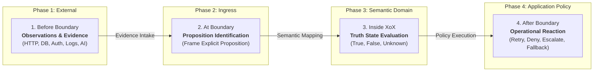

# XoX Semantic Boundary Model

This document establishes the conceptual model governing how information crosses from external systems, transports, and application environments into the XoX semantic domain, and how XoX truth evaluations cross back into application-level policy decisions.

---

## 1. Core Principle & The Boundary Problem

> **External systems produce observations, transport states, records, and evidence. XoX evaluates whether a specific proposition is established as `True`, `False`, or `Unknown`. The boundary model prevents transport and evidence states from being confused with the truth value of a developer decision.**

In modern software systems, developers regularly interact with APIs, databases, networks, authentication layers, and AI toolchains. These systems do not directly produce XoX truth values; they emit HTTP status codes, missing database rows, network timeouts, null fields, error objects, and model probabilities. 

When developers conflate these operational signals directly with truth values (e.g., treating a network timeout or a null pointer directly as `Unknown` or `False`), logic collapses, auditability is destroyed, and brittle failure modes emerge.

The XoX Semantic Boundary Model defines the strict lifecycle, conceptual separations, and invariant rules required whenever data enters or leaves the XoX semantic domain.

---

## 2. The Four Lifecycle Phases

Information crossing into and out of XoX follows a four-phase lifecycle:

### Phase 1: Before Boundary (External Observation & State)
- **Responsibility**: External systems, adapters, infrastructure, or evidence producers provide observations, responses, payloads, or claims.
- **Governing Rule**: External representations, status codes, and container states do not automatically determine XoX semantic meaning.

### Phase 2: At Boundary (Ingress & Proposition Framing)
- **Responsibility**: The application or adapter explicitly defines the proposition being evaluated and identifies the evidence relevant to that proposition.
- **Governing Rule**: Boundary crossing must preserve the fundamental distinction between the state of the evidence and the truth state of the proposition.

### Phase 3: Inside XoX (Semantic Representation & Evaluation)
- **Responsibility**: XoX represents, combines, and evaluates the adopted `True`, `False`, and `Unknown` semantic values across logical operations.
- **Governing Rule**: `Unknown` indicates solely that the proposition is not yet established as `True` or `False`. It never represents the underlying transport error, timeout, null container, or retry event itself.

### Phase 4: After Boundary (Egress & Application Policy)
- **Responsibility**: Application-layer business logic decides what operational action or workflow branch to execute based on the evaluation result.
- **Governing Rule**: XoX preserves epistemic uncertainty but never prescribes application policy (e.g., retry, deny, fallback, escalation, clarification, refusal). Operational reactions belong entirely to the application layer.

---

## 3. Essential Boundary Distinctions

To maintain semantic integrity, boundary adapters and developers must strictly uphold eight fundamental distinctions:

| ID | Distinction | External / Operational State | XoX Semantic State |
| :--- | :--- | :--- | :--- |
| **`BOUNDARY-EVIDENCE-TRUTH-01`** | **Evidence State vs. Proposition Truth** | Completeness, presence, or arrival of data payloads. | Truth status of the explicit proposition tested. |
| **`BOUNDARY-CAUSE-UNKNOWN-01`** | **Cause of Uncertainty vs. `Unknown`** | Network timeout, socket disconnect, permission error. | The proposition remains unverified (`Unknown`). |
| **`BOUNDARY-TRANSPORT-SEMANTIC-01`** | **Transport Status vs. Semantic Truth** | HTTP 200, HTTP 503, RPC failure, connection reset. | Factual claim verified (`True`), refuted (`False`), or inconclusive (`Unknown`). |
| **`BOUNDARY-CONTAINER-SEMANTIC-01`** | **Container State vs. `Unknown`** | `None`, `null`, `Optional.empty`, missing dictionary key. | Epistemic truth value of the underlying statement. |
| **`BOUNDARY-ERROR-SEMANTIC-01`** | **Exception/Error vs. XoX Value** | Thrown runtime exception, error envelope, fault code. | Explicit evaluation of whether evidence establishes the proposition. |
| **`BOUNDARY-PROBABILITY-SEMANTIC-01`** | **Probability vs. Epistemic State** | 35% model confidence, token entropy, likelihood score. | Definite factual establishment vs. unestablished fact. |
| **`BOUNDARY-POLICY-SEMANTIC-01`** | **Application Policy vs. Semantic Value** | Deny access, retry query, request MFA, log alert. | Evaluation outcome (`Unknown`, `False`, `True`). |
| **`BOUNDARY-BOOL-XOX-01`** | **Ordinary `Bool` vs. XoX Domain** | Two-valued binary flags (`true` / `false`). | Three-valued tri-state logic preserving epistemic uncertainty. |

---

## 4. Real-World Boundary Domains

The boundary model applies consistently across disparate technical domains:

### 4.1 HTTP & API Boundaries
- **Core Question**: *Did the external authorization service establish that this action is authorized?*
- **Boundary Distinctions**:
  - `HTTP 200 OK`: Transport succeeded, but the body payload may confirm (`True`), deny (`False`), or indicate pending evaluation (`Unknown`).
  - `HTTP 500 / 503 / 504`: Transport failed or timed out. The proposition `"Action is authorized"` remains unestablished (`Unknown`), not `False`.
  - `Application Reaction`: Application security policy decides whether to fail-closed (deny), retry, or prompt the user.

### 4.2 Database & Persistence Boundaries
- **Core Question**: *Is the required customer entitlement established by stored records?*
- **Boundary Distinctions**:
  - `Row Exists`: May supply affirmative (`True`) or negative (`False`) evidence depending on column values.
  - `No Row Found`: May mean entitlement is affirmatively non-existent (`False`) in a closed-world schema, or unverified (`Unknown`) in an open-world/federated schema.
  - `Null Field`: Indicates missing attribute data, leaving propositions depending on that field unverified (`Unknown`).
  - `Query Error`: Transport/storage failure that prevents verification.

### 4.3 Authentication & Authorization Boundaries
- **Core Question**: *Is this principal authorized for the requested operation?*
- **Boundary Distinctions**:
  - `Credential Present`: Syntactic transport token provided.
  - `Verification Failure`: Cryptographic refutation (`False`) vs. policy server unavailable (`Unknown`).
  - `Policy Lookup Inconclusive`: Policy engine cannot reach PDP (`Unknown`).
  - `Egress Policy`: The application policy chooses safe fallback (e.g., deny access) without redefining `Unknown` as `False`.

### 4.4 Distributed Systems & Consensus Boundaries
- **Core Question**: *Is the observed state sufficiently established for this distributed decision?*
- **Boundary Distinctions**:
  - `Replica Quorum Response`: Quorum reached verifying state (`True` or `False`).
  - `Network Partition / Stale Read`: Observation stale or unconfirmed (`Unknown`).
  - `Conflicting Observations`: Split-brain or divergent logs leaving the proposition unresolved (`Unknown`).
  - `Egress Policy`: Application consensus policy decides whether to block, defer, or trigger leader election.

### 4.5 AI & Agent Tooling Boundaries
- **Core Question**: *Has the external tool result required for the agent's decision been established?*
- **Boundary Distinctions**:
  - `Model Confidence / Entropy`: Internal heuristic scores (must never be treated as XoX `Unknown`).
  - `Tool Invocation Success`: Tool ran without crash (transport success).
  - `External-State Verification`: Tool output verifies fact (`True`), refutes fact (`False`), or returns incomplete observation (`Unknown`).
  - `Egress Policy`: Agent planner decides whether to prompt the user, execute an alternative tool, or abort.

---

## 5. Mandatory Boundary Invariant Rules

Every boundary adapter and developer interface must enforce the following ten invariants:

1. **No Automatic Failure-to-Unknown**: A boundary adapter must not assign `Unknown` merely because an operation failed.
2. **Timeout Is Cause, Not Truth**: A timeout may cause a proposition to remain unestablished, but the timeout itself is an external transport event, not `Unknown`.
3. **Absence Is Not Automatic Unknown**: Missing data or row absence may be affirmative negative evidence in closed domains; absence must not blindly become `Unknown` without domain context.
4. **No Null-Unknown Synonymy**: `None`, `null`, or empty containers must not be treated as synonyms for `Unknown`.
5. **No Exception Catch-All to Unknown**: A thrown exception must not silently collapse into `Unknown` unless an explicit proposition evaluation confirms the evidence is genuinely unresolved.
6. **Transport Success Does Not Imply True**: A successful network response (e.g., HTTP 200) does not imply that the underlying proposition is `True`.
7. **Transport Failure Does Not Imply False**: A failed network connection or server error does not imply that the underlying proposition is `False`.
8. **No Probability-to-Unknown Conversion**: Model confidence scores, probabilities, or hallucination heuristics must never be converted directly into XoX `Unknown`.
9. **No Silent Egress Collapse**: XoX tri-state values must not silently collapse into standard `bool` when crossing back into general application code without explicit boundary conversion.
10. **Policy Remains Explicit**: Operational actions (retry, deny, fallback, escalate, clarify) must remain strictly external application logic executed after evaluation.

---

## 6. Core Boundary Questions for Developers

When designing or reviewing a boundary crossing, developers should answer these nine questions:

1. **Proposition Definition**: What factual proposition is actually being evaluated?
2. **Evidence Identification**: What observations, payloads, or evidence are available?
3. **Affirmative Conditions**: Which observations definitively establish `True`?
4. **Refutation Conditions**: Which observations definitively establish `False`?
5. **Unresolved Conditions**: Which situations leave the proposition genuinely unresolved (`Unknown`)?
6. **Infrastructure Separation**: Which states are transport or infrastructure failures rather than semantic truth states?
7. **Policy Separation**: Which reactions belong to application policy rather than XoX semantics?
8. **Domain Justification**: Is standard two-valued `bool` sufficient, or has the application explicitly entered the XoX tri-state domain?
9. **Information Preservation**: What decision-relevant information or auditability would be lost by prematurely collapsing the result?

---

## 7. Mandatory Failure Modes & Anti-Patterns

A boundary implementation is defective if it exhibits any of the following anti-patterns:

- **Anti-Pattern 1 (Timeout Collapse)**: `timeout -> Unknown` without identifying an explicit proposition.
- **Anti-Pattern 2 (Null Equivalence)**: `None / null -> Unknown` by syntactic convenience.
- **Anti-Pattern 3 (Transport Error as False)**: `HTTP 500 / 503 -> False` (confusing server error with negative verification).
- **Anti-Pattern 4 (Transport Success as True)**: `HTTP 200 -> True` (confusing transport delivery with factual verification).
- **Anti-Pattern 5 (Blind Missing Row Mapping)**: `missing database row -> Unknown` without considering closed-world domain semantics.
- **Anti-Pattern 6 (Catch-All Exception Masking)**: `except Exception -> Unknown` as a generic catch-all.
- **Anti-Pattern 7 (Confidence Mapping)**: `confidence < 0.8 -> Unknown` (treating probabilistic score as epistemic uncertainty).
- **Anti-Pattern 8 (Hardcoded Deny Policy)**: Encoding `Unknown -> Deny` directly inside the semantic conversion layer.
- **Anti-Pattern 9 (Hardcoded Retry Policy)**: Encoding `Unknown -> Retry` directly inside the semantic conversion layer.
- **Anti-Pattern 10 (Implicit Ingress Promotion)**: Implicitly promoting external `bool` variables to XoX without explicit boundary framing.
- **Anti-Pattern 11 (Implicit Egress Coercion)**: Implicitly coercing XoX tri-state values to boolean values upon returning to caller code.

---

## 8. API-Level Expectations

The boundary model scales across the three XoX API levels defined in [API_LEVELS.md](file:///home/ssr/Desktop/XoX/docs/01_developer_model/API_LEVELS.md):

- **`CORE` Level**:
  - Focuses on clear proposition framing and direct tri-state (`True`, `False`, `Unknown`) evaluation.
  - Zero provenance, tracking, or authority engine overhead.
  - Mandatory separation between external evidence and internal XoX state remains fully enforced.
- **`SAFE` Level**:
  - Future extensions may introduce formal evidence-quality requirements, freshness timeouts, policy guarding, or provenance validation.
  - Does not alter baseline tri-state semantics.
- **`SEMANTIC` Level**:
  - Future extensions may provide explicit distributed context propagation, causal lineage, and framework orchestration across boundary crossings.
  - Strictly reserved for advanced architectural needs.

---

## 9. Developer Testability & Transfer Invariants

Conforming to this boundary model ensures that independent developers can:
1. Distinguish an operational transport failure (e.g., timeout) from the truth value `Unknown`.
2. Distinguish absent container data (`None`/`null`) from unverified propositions.
3. Formulate the explicit proposition before assigning any XoX state.
4. Keep post-evaluation application policies cleanly separated from truth evaluation.
5. Reject model confidence thresholds as XoX `Unknown`.
6. Transfer the identical boundary crossing discipline across HTTP, database, authorization, distributed, and AI agent domains.
