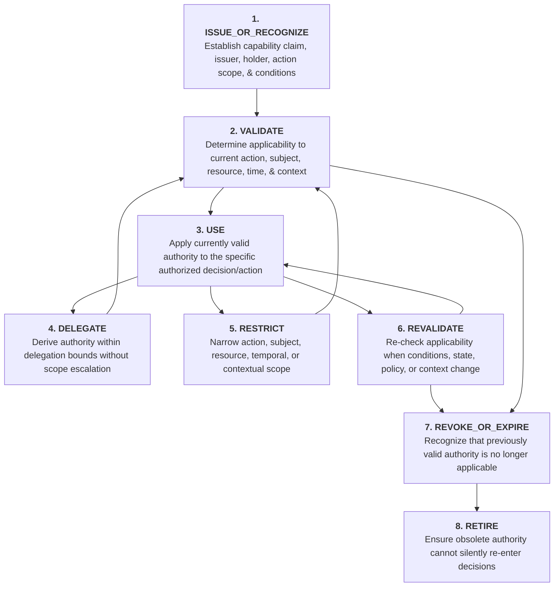

# XoX Capability & Authority Lifecycle Model

This document establishes the conceptual lifecycle model governing decision-relevant capabilities, permissions, authorities, and delegated rights across the XoX semantic boundary, keeping authority distinct from truth, identity, provenance, and application policy without prescribing concrete runtime, token, cryptographic, or serialization mechanisms.

---

## 1. Core Principle & The Capability Lifecycle Problem

> **Sensitive decisions depend not only on what is believed to be true about reality, but on whether a specific actor, component, or process is currently authorized to perform a specific class of action under stated conditions. Authority can be issued, recognized, validated, delegated, restricted, revalidated, expired, revoked, and retired. XoX requires a conceptual capability lifecycle that keeps authority distinct from truth, identity, and policy, ensuring that stale, missing, or mis-scoped authority can never be treated as silently valid.**

In real-world software architecture, systems constantly make authorization and capability decisions:
- An API gateway accepts a cryptographically signed token and forwards a request.
- A database client uses a connection credential to access multiple tables across distinct schemas.
- A user permissions cache holds granted roles while administrative role assignments are updated.
- A distributed microservice delegates sub-tasks across downstream services using forwarded context.
- An AI agent possesses tool invocation access but acts on behalf of a human principal with restricted rights.

When systems blur the boundaries between credentials, identity, truth, and authority, severe architectural failures occur:
- Possessing a well-formed credential or valid signature is mistaken for having authority over a specific resource.
- Authenticating an identity (proving *who* an actor is) is silently treated as authorization (proving *what* the actor may do).
- A factual proposition being `True` is confused with an actor having the authority to execute an action based on that truth.
- A capability granted yesterday is reused today after roles, policies, or context have changed.
- Delegating a task to a downstream service accidentally grants broader authority than the caller held.
- An inconclusive authorization check (`Unknown`) is silently coerced into an allow or deny inside semantic evaluation.

The XoX Capability Lifecycle Model defines the conceptual boundaries, stages, governing rules, and failure modes necessary to reason soundly about authority and permissions.

---

## 2. Conceptual Lifecycle Stages

The lifecycle of decision-relevant capabilities and authorities spans eight distinct conceptual stages:

### Stage 1: ISSUE_OR_RECOGNIZE
- **Purpose**: Establish that a capability or permission claim exists, identifying its asserted issuer, holder/subject, target resource, action scope, and validity conditions.
- **Conceptual Invariant**: Recognizing that a capability claim exists does not mean the capability is currently valid, active, or sufficient for a requested action.

### Stage 2: VALIDATE
- **Purpose**: Determine whether the capability is applicable to the exact requested action, subject, resource, temporal boundary, and contextual environment.
- **Conceptual Invariant**: Validation assesses applicability against current criteria. A capability valid for one action or resource is not valid for another.

### Stage 3: USE
- **Purpose**: Apply a currently validated capability to authorize the specific decision, query, or operation it covers.
- **Conceptual Invariant**: Using a capability consumes or exercises authority strictly within its validated scope.

### Stage 4: DELEGATE
- **Purpose**: Transfer or derive authority to another actor or component strictly within allowable delegation rules.
- **Conceptual Invariant**: Delegated authority must never exceed the authority of the delegating source (no silent scope escalation).

### Stage 5: RESTRICT
- **Purpose**: Explicitly narrow action types, subject access, resource targets, temporal limits, or contextual conditions.
- **Conceptual Invariant**: Restriction reduces or specializes authority; it cannot synthesize new or broader permissions.

### Stage 6: REVALIDATE
- **Purpose**: Re-evaluate capability applicability when decision-relevant conditions, operational context, system state, policy rules, or time boundaries change.
- **Conceptual Invariant**: Prior validation does not guarantee current validity across state or context shifts.

### Stage 7: REVOKE_OR_EXPIRE
- **Purpose**: Recognize and record that a previously valid capability has reached its expiration boundary or has been explicitly revoked.
- **Conceptual Invariant**: Revocation and expiration represent authority state transitions; they do not alter the truth of historical events or unrelated factual propositions.

### Stage 8: RETIRE
- **Purpose**: Purge or tombstone obsolete, expired, or revoked authority representations so they cannot re-enter downstream evaluation.
- **Conceptual Invariant**: Retired capabilities must never be resurrected or treated as cached valid authority.

---

## 3. Essential Capability Distinctions

To avoid authority confusion and privilege escalation, systems must strictly maintain twelve conceptual distinctions:

| Distinction | Left Concept | Right Concept | Core Architectural Insight |
| :--- | :--- | :--- | :--- |
| **Capability Existence vs. Capability Validity** | A claim, token, or grant record is present in memory or payload. | The capability meets all conditions required to authorize an action. | Possession of a capability object does not prove the grant is currently legitimate or active. |
| **Capability Validity vs. Proposition Truth** | An actor holds the valid right to execute an action. | A factual statement about the world is `True`. | Having permission to update a record does not make the updated content factually true. |
| **Source Identity vs. Authority** | Verifying *who* an entity or component is. | Establishing *what* that entity is permitted to do. | Knowing an actor's cryptographic identity does not grant them administrative authority. |
| **Authentication vs. Authorization** | Confirming the authenticity of an actor's claimed identity. | Evaluating whether an authenticated actor has permission for a specific action. | A successfully authenticated user may have zero permission on the requested target. |
| **Historical Authority vs. Current Authority** | An actor held valid permission at some prior time $T_0$. | An actor holds valid permission at the present decision time $T_{\text{now}}$. | Past authorization cannot be blindly assumed to persist across policy or role changes. |
| **Delegation vs. Scope Escalation** | Deriving a bounded subset of authority to act on behalf of a principal. | Expanding permissions beyond what the delegating principal possesses. | A delegated capability can only narrow or match the parent grant, never widen it. |
| **Restriction vs. Revocation** | Narrowing the scope, conditions, or targets of an active capability. | Completely terminating the validity of a capability. | A restricted capability remains usable within its narrowed envelope; revoked authority is dead. |
| **Capability Provenance vs. Capability Applicability** | The verifiable chain of issuance, signatures, and delegations. | Whether the capability covers the exact action and resource requested. | Perfect cryptographic lineage cannot authorize an out-of-scope operation. |
| **Freshness vs. Authority** | How recently a capability or permission cache entry was created or fetched. | Whether the granting mandate and validity conditions remain in effect. | A freshly fetched credential may be unauthorized; a cached rule may still be authoritative. |
| **Semantic Unknown vs. Authorization Policy Reaction** | The epistemic state where authority validity cannot be conclusively determined. | The application decision (allow, deny, retry, escalate) chosen in response to `Unknown`. | Semantic evaluation outputs `Unknown`; application policy decides how to handle that uncertainty. |
| **Authority to Decide vs. Evidence About Reality** | Holding the mandate to make an authoritative determination or action. | Empirical observations or facts describing the state of the world. | Being authorized to declare a system healthy does not prevent physical hardware from failing. |
| **Credential Possession vs. Right to Perform Action** | Holding a physical token, API key, certificate, or bearer string. | Meeting all jurisdictional, scope, and contextual criteria for the current action. | A bearer token for Service A does not grant the right to execute operations on Service B. |

---

## 4. Invariant Rules of the Capability Lifecycle

Every XoX-conforming architecture must adhere to the following fourteen invariant rules:

1. **Existence Does Not Imply Validity**: A capability claim is not automatically valid merely because it exists or is syntactically well-formed.
2. **Authority Is Orthogonal to Truth**: A valid capability does not by itself make an unrelated proposition `True`.
3. **Authentication Is Not Authorization**: Authenticating an issuer or holder does not by itself establish current authorization for a requested action.
4. **Scope Boundedness**: A capability is applicable only within its declared or otherwise valid action, subject, resource, temporal, and contextual scope.
5. **No Scope Escalation**: Delegation must not silently broaden authority.
6. **Derived Authority Bound**: Derived or delegated authority must not exceed the authority from which it originates.
7. **Mandatory Revalidation**: A previously valid capability must be revalidated when decision-relevant assumptions, context, time bounds, or state conditions change.
8. **No Historical Inertia**: Historical validity does not automatically establish current authority.
9. **State Transition Separation**: Expiration and revocation must be treated as authority state changes, not proposition falsity in unrelated domains.
10. **Missing Authority Is Not Proposition Falsity**: Missing or invalid authority does not automatically mean the underlying factual proposition is `False`.
11. **No Silent Unknown Coercion**: An `Unknown` authorization state must not silently become allow or deny inside semantic evaluation.
12. **Policy Separation**: Allow, deny, retry, escalate, request approval, or defer remain application policy reactions external to pure semantic evaluation.
13. **Provenance Does Not Confer Authority**: Capability provenance may support validation but does not itself confer authority beyond the original grant.
14. **Credential Possession Is Not Action Right**: Possession of a credential or token must not be confused with applicability to the requested action.

---

## 5. Catalog of Capability Failure Modes

Architectural failures arising from violating capability lifecycle invariants:

| ID | Failure Mode | Mechanism of Failure | Impact |
| :--- | :--- | :--- | :--- |
| **FAIL-CAP-01** | **Signed Token Treated as Omnipotent** | Accepting a valid signature as blanket authorization for any arbitrary action. | Privilege escalation across unvalidated actions. |
| **FAIL-CAP-02** | **Authenticated User Treated as Authorized** | Conflating successful identity verification with permission to perform sensitive operations. | Unauthorized access to restricted domain entities. |
| **FAIL-CAP-03** | **Revoked Authority Reused from Cache** | Reusing a cached validation result after the underlying capability has been revoked. | Execution of unauthorized actions using dead authority. |
| **FAIL-CAP-04** | **Delegation Scope Escalation** | A sub-agent or downstream service derives permissions broader than its parent grant. | Security boundary breach via intermediate delegation. |
| **FAIL-CAP-05** | **Resource Scope Confusion** | Authority valid for Resource $A$ is accepted for operations on Resource $B$. | Cross-tenant or cross-resource data corruption. |
| **FAIL-CAP-06** | **Action Type Confusion (Read/Write)** | Treating a read-only capability as sufficient authorization for state mutation. | Unauthorized data modification or destruction. |
| **FAIL-CAP-07** | **Capability Provenance Treated as Semantic Truth** | Treating the authentic origin of an assertion as proof that the assertion is factually true. | Epistemic corruption by mistaking mandate for fact. |
| **FAIL-CAP-08** | **Token Possession as Blind Authority** | Granting execution rights based solely on presenting a token without context or scope checks. | Exploitation via leaked or stolen credentials. |
| **FAIL-CAP-09** | **Expiration Coerced to Proposition False** | Treating an expired token as proof that an underlying factual statement is false. | Distortion of domain logic and historical facts. |
| **FAIL-CAP-10** | **Authorization Unknown Coerced to Allow** | Silently proceeding with an action when authority validity could not be conclusively determined. | Accidental privilege bypass under partial failure. |
| **FAIL-CAP-11** | **Authorization Unknown Coerced to Deny in Semantic Core** | Hardcoding a deny policy inside semantic truth evaluation rather than surfacing `Unknown`. | Loss of epistemic clarity and denial of retry/fallback options. |
| **FAIL-CAP-12** | **Stale Policy Reuse** | Reusing a cached authorization decision after global security policy has been updated. | Non-compliance with updated administrative rules. |
| **FAIL-CAP-13** | **Delegation Chain Scope Dropping** | Stripping restrictive filters during intermediate delegation steps. | Amplified downstream authority. |
| **FAIL-CAP-14** | **Ghost Capability Survival** | Revoked or expired capabilities surviving across restarts or serialization boundaries. | Uncontrolled re-entry of obsolete permissions. |
| **FAIL-CAP-15** | **Issuer Identity Confused with Authority** | Assuming that a high-profile entity automatically possesses the normative right to grant specific capabilities. | Forgery of authority via prestigious but unauthorized issuers. |

---

## 6. Real-World Engineering Scenarios

### 6.1 HTTP / API Gateway
- **Scenario**: An API gateway receives a cryptographically valid bearer token signed by an Identity Provider (IdP).
- **Core Question**: Does credential acceptance establish only identity/authentication, or does it also prove authorization for the requested resource and action?
- **Lifecycle Analysis**: Token validation establishes identity and credential authenticity (`ISSUE_OR_RECOGNIZE`). However, authorization (`VALIDATE`) requires evaluating whether the token's claims, roles, and scopes match the requested HTTP method (action) and URI path (resource) under current system policy.

### 6.2 Database & Storage Access
- **Scenario**: A service account holds valid read permissions on schema `analytics` and attempts to execute a query against schema `financial_ledger` using the same connection credentials.
- **Core Question**: How is resource and action scope preserved across capability use?
- **Lifecycle Analysis**: Credential possession establishes database connection rights, but each query execution requires checking resource scope (`RESTRICT` / `VALIDATE`). Authority over `analytics` cannot be applied to `financial_ledger`.

### 6.3 Dynamic Role & Policy Authorization
- **Scenario**: A user was authorized to approve financial transfers yesterday, but their administrative role was altered or revoked this morning.
- **Core Question**: When must prior authorization be revalidated?
- **Lifecycle Analysis**: When decision-relevant context or operational conditions change, prior validation results cannot be assumed valid. The system must trigger `REVALIDATE` before executing any sensitive transfer, ensuring historical authority does not override present policy.

### 6.4 Distributed Systems & Service Meshes
- **Scenario**: Microservice $A$ delegates an order-processing request to Microservice $B$, which further calls Inventory Service $C$, caching intermediate authorization tokens across nodes.
- **Core Question**: How are scope narrowing, revocation, and stale authority kept conceptually visible?
- **Lifecycle Analysis**: When $A$ calls $B$, it must apply `RESTRICT` and `DELEGATE` so that $B$ only receives authority needed for order processing, not $A$'s full authority envelope. Distributed nodes must check expiration and revalidation criteria, ensuring that cached tokens are `RETIRED` upon revocation.

### 6.5 AI & Agent Tooling
- **Scenario**: An AI assistant has access to a generic `execute_sql` tool, but the user prompting the assistant only has read access to public customer data.
- **Core Question**: How does the system distinguish tool availability, agent possession of credentials, current authorization, and application policy?
- **Lifecycle Analysis**: Tool availability means the agent has the mechanical capability to invoke the tool. Credential possession means the connection is active. However, the agent's effective authority is bounded by the delegating user's rights (`DELEGATE` / `RESTRICT`). Attempting a write or querying private tables exceeds validated authority, regardless of tool availability.

---

## 7. API Level Expectations

| Level | Capability Expectations & Architectural Guidance |
| :--- | :--- |
| **CORE** | <ul><li>Provides foundational semantic reasoning where authorization claims can be modeled as explicit propositions (`True`, `False`, `Unknown`).</li><li>Does not impose heavy capability frameworks, cryptographic machinery, or runtime infrastructure.</li><li>Keeps ordinary local XoX usage minimal, lightweight, and dependency-free.</li></ul> |
| **SAFE** | <ul><li>Requires explicit capability validation, clear action/resource scoping, freshness awareness, and auditable separation of authority from application policy for sensitive operations.</li><li>Defines the conceptual requirement for authority validation without prescribing concrete token or wire protocols.</li></ul> |
| **SEMANTIC** | <ul><li>Enables rich delegated authority modeling, distributed capability lineage, cryptographic provenance integration, and dynamic context-sensitive applicability.</li><li>Preserves full conceptual compatibility with CORE and SAFE invariants without fixing premature implementations today.</li></ul> |

---

## 8. Developer Reasoning Checklist

When evaluating or designing capability-aware logic, ask the following eleven questions:

1. **Exact Action**: What exact action is being authorized (e.g., read, write, delete, delegate)?
2. **Subject / Actor**: For which specific subject, user, service, or agent is authority being claimed?
3. **Resource / Target**: For which exact resource, entity, table, or scope does this capability apply?
4. **Conditions & Context**: Under what temporal, environmental, or contextual conditions is this capability valid?
5. **Issuer Identity**: Who asserted or issued this capability claim?
6. **Issuer Authority**: Does the issuer's identity actually possess the mandate to grant this specific capability?
7. **Delegation Lineage**: Has this capability been delegated, forwarded, or transformed across components?
8. **Scope Integrity**: Was the capability scope narrowed, preserved, or accidentally widened during delegation?
9. **Invalidation Triggers**: Could revocation, expiration, state changes, or policy updates have invalidated prior authority?
10. **Truth vs. Authority**: Is the application evaluating factual truth about reality, authorization to act, or both?
11. **Policy on Unknown**: If authority validity is `Unknown`, which application policy determines the operational reaction (deny, retry, escalate)?

---

## 9. Developer Testability Criteria

An independent developer should be able to verify their system against these testable criteria:

- [ ] **Distinguish Authentication from Authorization**: Verify that valid user credentials do not automatically grant permission for unassigned actions.
- [ ] **Distinguish Possession from Applicability**: Verify that presenting a token valid for Resource $A$ fails validation when used against Resource $B$.
- [ ] **Separate Authority from Truth**: Verify that an authorized user asserting an invalid fact produces an authorized action with a `False` proposition, not automatic truth.
- [ ] **Detect Delegation Scope Escalation**: Verify that deriving a child capability with broader permissions than the parent grant is rejected.
- [ ] **Identify Revalidation Requirements**: Verify that cached authorization decisions are invalidated when role or policy changes occur.
- [ ] **Distinguish Historical from Current Authority**: Verify that a capability valid at $T_0$ is re-checked or rejected at $T_1$ if its validity window has elapsed.
- [ ] **Keep Unknown Distinct from Policy**: Verify that when authority evaluation is inconclusive (`Unknown`), the semantic core reports `Unknown` rather than hardcoding an application fallback.
- [ ] **Cross-Domain Transferability**: Verify that the conceptual model applies consistently across HTTP APIs, database queries, distributed microservices, and AI tool invocations.
