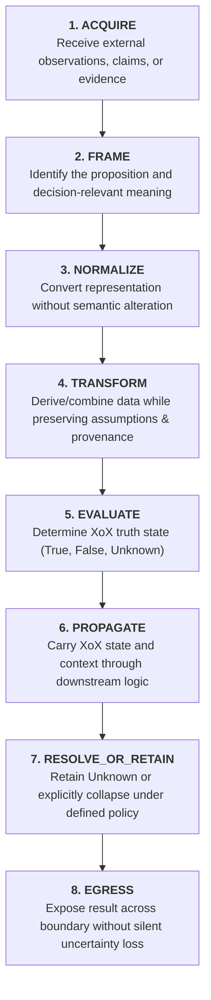
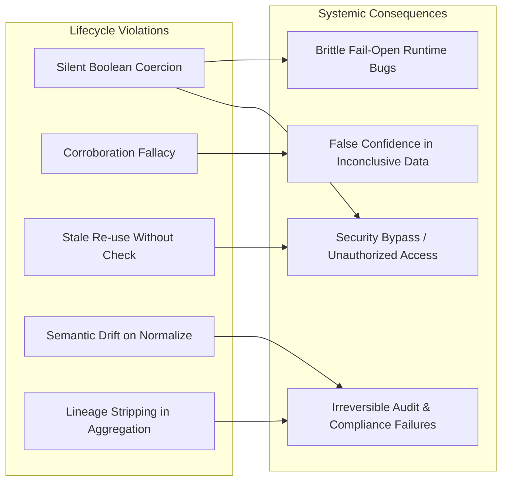
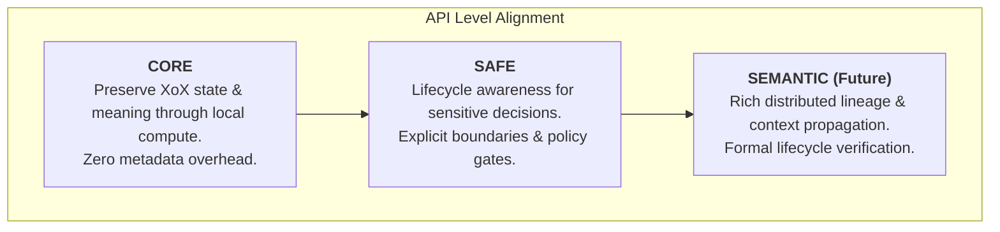

# XoX Data Lifecycle Model

This document establishes the conceptual lifecycle model governing how decision-relevant data, observations, and evidence enter, transform within, and leave the XoX semantic domain, while preserving proposition meaning, provenance, freshness relevance, explicit loss of information, and strict policy separation without prescribing concrete runtime, storage, or wire mechanisms.

---

## 1. Core Principle & The Data Lifecycle Problem

> **Decision-relevant information does not remain static. It is acquired, normalized, transformed, aggregated, cached, copied, evaluated, consumed, and sometimes collapsed or discarded. XoX requires a lifecycle model that makes semantic information preservation and explicit loss transparent so that transformations cannot silently alter what a developer or system is justified in concluding.**

In production engineering, data undergoes continuous lifecycles across diverse infrastructure boundaries:
- Raw network payloads are deserialized and normalized into domain objects.
- Multiple records from distinct databases are merged, joined, or compressed.
- Intermediate results are cached in local memory or distributed key-value stores.
- External claims are forwarded, re-signed, or converted between schema formats.
- Evaluations are performed in one tier and serialized across HTTP/RPC to another.

When systems perform these transitions implicitly, critical semantic assumptions decay without detection:
- A change in data encoding silently distorts the underlying proposition being evaluated.
- A duplicated cache record is mistaken for corroborating independent evidence.
- An aggregation pipeline drops lineage metadata needed to verify data authority.
- An inconclusive evaluation (`Unknown`) is coerced to `False` or dropped during JSON serialization.
- A historically valid observation is blindly trusted as proof of a current real-time state.

The XoX Data Lifecycle Model provides the conceptual framework and governing rules to ensure that every stage in the data lifecycle explicitly accounts for semantic meaning, evidence validity, and epistemic uncertainty.

---

## 2. Conceptual Lifecycle Stages

The lifecycle of decision-relevant information across the XoX boundary spans eight distinct conceptual stages:

### Stage 1: ACQUIRE
- **Purpose**: Ingest external observations, sensory readings, API responses, database records, or cryptographic claims.
- **Semantic Characteristics**: External input exists strictly as candidate evidence. It does not possess intrinsic XoX truth state until framed.

### Stage 2: FRAME
- **Purpose**: Explicitly identify the target proposition under consideration and define the decision-relevant meaning of the acquired evidence relative to that proposition.
- **Semantic Characteristics**: Translates uncontextualized payloads into a structured assertion about reality (e.g., mapping an HTTP body to `"User has permission P at time T"`).

### Stage 3: NORMALIZE
- **Purpose**: Standardize syntax, data types, units, or structural representations across heterogeneous sources.
- **Semantic Characteristics**: Must be semantically neutral. Changing character encoding, date formats, or unit scales must not alter the truth conditions of the framed proposition.

### Stage 4: TRANSFORM
- **Purpose**: Derive new composite structures, join relational tables, aggregate multi-source records, or summarize observations.
- **Semantic Characteristics**: Derivation can introduce new assumptions or shed peripheral data. Decision-relevant provenance, contributing sources, and prerequisite conditions must remain explicit.

### Stage 5: EVALUATE
- **Purpose**: Apply logical predicates and evidence criteria to determine the XoX semantic state (`True`, `False`, or `Unknown`) for the framed proposition.
- **Semantic Characteristics**: Produces an epistemic truth determination based strictly on available evidence and defined invariants.

### Stage 6: PROPAGATE
- **Purpose**: Pass the evaluated XoX state and its necessary decision-relevant context through downstream application logic, pipeline stages, or service tiers.
- **Semantic Characteristics**: Downstream computation must preserve tri-state logic (`True`, `False`, `Unknown`) without implicit boolean coercion or loss of context.

### Stage 7: RESOLVE_OR_RETAIN
- **Purpose**: Maintain `Unknown` throughout ongoing computation, or explicitly resolve/collapse it only when an applicable, authorized policy or fallback rule governs the decision.
- **Semantic Characteristics**: `Unknown` cannot be resolved by data flow alone. Resolution is an explicit application-level or policy-governed choice.

### Stage 8: EGRESS
- **Purpose**: Transmit the evaluation outcome across system boundaries (e.g., returning an API response, writing to legacy storage, rendering a UI).
- **Semantic Characteristics**: Egress adapters must not silently collapse `Unknown` to `False` or omit uncertainty flags for serialization convenience.

---

## 3. Essential Lifecycle Distinctions

To avoid semantic corruption, systems and developers must strictly maintain ten core lifecycle distinctions:

| Distinction | Left Concept | Right Concept | Core Architectural Insight |
| :--- | :--- | :--- | :--- |
| **Representation Change vs. Semantic Change** | Altering syntax, schema format, or data encoding (e.g., JSON to Protobuf). | Modifying the truth conditions, scope, or assertion of the proposition. | Re-encoding data must never alter what the data asserts about reality. |
| **Data Transformation vs. Proposition Re-evaluation** | Mutating or combining records (e.g., string slicing, joining rows). | Re-executing logical evaluation against updated evidence. | Transforming a data container does not recalculate whether its contents remain true. |
| **Copying vs. Establishing New Evidence** | Duplicating, caching, or echoing an existing record across nodes. | Ingesting an independent observation from a distinct source. | $N$ identical copies of an unverified claim remain a single unverified claim. |
| **Aggregation vs. Authority** | Merging $M$ signals into a summary metric or consensus structure. | Holding canonical mandate or entitlement to establish truth. | Merging low-authority observations cannot synthesize high-authority proof. |
| **Cache Age vs. Truth** | The elapsed time since a record was stored or refreshed. | Whether the framed proposition currently holds true. | A fresh cache entry may store a superseded fact; a stale cache entry may store an eternal truth. |
| **Provenance Preservation vs. Truth Preservation** | Retaining the record of origin and transformation steps. | Maintaining the validity of the logical truth assignment. | Perfect audit lineage cannot make a false observation true. |
| **Semantic Information Loss vs. Ordinary Compression** | Discarding distinctions required to correctly evaluate a proposition. | Reducing payload size while preserving all decision-relevant attributes. | Optimizing storage is permitted only if proposition truth conditions remain fully testable. |
| **Unknown Retention vs. Operational Retry** | Preserving epistemic inconclusiveness across execution branches. | Repeating a network call or query in hope of acquiring definitive evidence. | Retrying is an operational strategy; `Unknown` is the truth state pending new evidence. |
| **Explicit Collapse vs. Silent Coercion** | Documented, policy-driven mapping of `Unknown` to a fallback action. | Automatic, implicit casting of `Unknown` to `False` by language or transport runtimes. | Coercion hides uncertainty; explicit collapse documents and audits operational risk. |
| **Historical Fact vs. Current-State Proposition** | Verified record that proposition $P$ held at past timestamp $T_0$. | Assertion that proposition $P$ holds at current timestamp $T_{\text{now}}$. | Past verification does not establish current reality without explicit temporal invariants. |

---

## 4. Mandatory Lifecycle Invariants & Rules

All XoX-conformant architectures must enforce twelve fundamental rules:

1. **Representation Invariance**: Changing representation (serialization, formatting, schema migration) must not silently alter proposition meaning or truth conditions.
2. **Copying Is Not Corroboration**: Copying, replicating, or caching data does not create new, independent evidence.
3. **No Automatic Elevation**: Transforming, pipeline-processing, or routing data through intermediary systems does not increase its semantic authority or confidence.
4. **Transparent Aggregation**: Aggregation pipelines must not obscure or discard decision-relevant provenance, contributing sources, or underlying assumptions.
5. **Freshness Sensitivity**: Cached data must not silently be treated as current when temporal freshness is an assumption of the proposition.
6. **Assumption Invalidation Demands Re-evaluation**: Any lifecycle transformation that invalidates or modifies the assumptions under which an evaluation was made requires explicit re-evaluation rather than blind reuse.
7. **Explicit Provenance Loss**: When provenance is decision-relevant, any transformation that discards lineage metadata must make that loss explicit to downstream consumers.
8. **Survival of Unknown**: `Unknown` must survive intermediate transformations, data flows, and computations unless the proposition is legitimately re-evaluated or an explicit, authorized collapse policy is applied.
9. **No Silent Egress Coercion**: Serialization, transport, and egress boundaries must never silently coerce tri-state XoX values to two-valued booleans.
10. **Temporal Non-Equivalence**: A historically correct observation or assertion does not automatically establish the truth of a current-state proposition.
11. **Essential Information Preservation**: Removing data attributes for convenience, performance, or compression must not eliminate information necessary for sound downstream truth evaluation.
12. **Operational Separation**: Operational actions (such as network retries, cache refreshes, or polling) are application behaviors, not semantic truth resolutions.

---

## 5. Lifecycle Failure Modes

When lifecycle rules are violated, predictable failure modes arise across engineering systems:

- **`LIFECYCLE-COPY-EVIDENCE-01` (Corroboration Fallacy)**: A signed claim is replicated across three database nodes; downstream logic treats the three identical reads as three independent sources confirming the fact.
- **`LIFECYCLE-NORMALIZE-DRIFT-01` (Semantic Normalization Drift)**: Ingesting string `"0"` or empty array `[]` and coercing it to `False` during normalization, converting a missing value into an affirmative negative claim.
- **`LIFECYCLE-AGGREGATION-STRIP-01` (Lineage Stripping)**: An aggregation service calculates `avg(rating)` but drops source node IDs; downstream fraud filters cannot evaluate source legitimacy.
- **`LIFECYCLE-CACHE-TRUTH-01` (Timestamp Conflation)**: A cache refresh timestamp $T_{\text{cache}}$ is treated as proof that the underlying remote resource was verified true at $T_{\text{cache}}$.
- **`LIFECYCLE-STALE-REUSE-01` (Stale Re-evaluation Skip)**: An authorization check evaluated at login is reused hours later for a privileged operation after user permissions were revoked in the identity store.
- **`LIFECYCLE-SERIALIZE-DROP-01` (Serialization Truncation)**: An internal `Unknown` state is serialized to a standard boolean JSON field as `false`, silently turning inconclusive knowledge into a negative assertion.
- **`LIFECYCLE-LEGACY-COERCE-01` (Storage Coercion)**: A database column lacking tri-state support casts `Unknown` to `FALSE` upon row insertion.
- **`LIFECYCLE-ELEVATION-HOP-01` (Pipeline Elevation Fallacy)**: Assuming an unverified sensor reading gained trustworthiness because it passed through an enterprise message broker and an ETL pipeline.
- **`LIFECYCLE-HISTORICAL-PROOF-01` (Historical Proof Misuse)**: Using a valid receipt from yesterday as current proof of account balance without checking intervening debit transactions.
- **`LIFECYCLE-RETRY-SUCCESS-01` (Retry Conflation)**: Treating the successful HTTP 200 return of a retry loop as `True` for a domain proposition when the payload body actually reported inconclusive findings.
- **`LIFECYCLE-COMPRESS-LOSS-01` (Destructive Compression)**: Truncating precision or dropping qualifying metadata during compression, making it impossible to evaluate edge-case boundary conditions.
- **`LIFECYCLE-ASSUMPTION-DRIFT-01` (Skipped Re-evaluation)**: Mutating an entity's billing country without re-evaluating whether the previously evaluated tax-exemption proposition remains valid.

---

## 6. Real-World Engineering Scenarios

### 6.1 HTTP & API Gateway Lifecycle
- **Scenario**: A microservice fetches an entitlement claim via REST, normalizes JSON to an internal struct, caches it in Redis for 10 minutes, and reuses it across subsequent user requests.
- **Lifecycle Analysis**:
  - *Representation vs. Semantic*: Parsing JSON into an in-memory object is a pure representation change. It must preserve field semantics exactly.
  - *Freshness Requirement*: The cached claim reflects the proposition `"User was entitled at T_fetch"`. If the downstream request evaluates `"User is entitled right now"`, freshness tolerance must be explicitly defined by policy.
  - *Re-evaluation Trigger*: If the user switches tenants or updates credentials, the previous evaluation assumptions are invalidated; the proposition must be re-evaluated via fresh fetch rather than cache reuse.

### 6.2 Database Migration & Replication Lifecycle
- **Scenario**: A database migration alters column types from nullable integer to non-null with a default value of `0`. Read replicas asynchronously replicate these rows and are queried for financial auditing.
- **Lifecycle Analysis**:
  - *Preserving Meaning vs. Invalidation*: Replacing `NULL` (meaning `"Unrecorded/Unknown"`) with `0` silently converts epistemic uncertainty into an affirmative zero balance. This is a severe semantic change masquerading as a schema optimization.
  - *Replication*: Reading from an asynchronous replica copies data; it does not generate independent corroboration. If read-after-write consistency is required, downstream evaluation must account for replication lag assumptions.

### 6.3 Authentication & Authorization Lifecycle
- **Scenario**: An OAuth token is validated, establishing `"User has Scope S"`. The token is stored in a session store and relied upon for 8 hours while administrative roles are altered upstream.
- **Lifecycle Analysis**:
  - *Historical vs. Current*: The token proves that the Identity Provider asserted Scope S at issuance time $T_0$. It does not establish that the user maintains Scope S at $T_{\text{now}}$.
  - *Policy Boundary*: The application security policy must explicitly define whether the decision permits historical token validity or mandates real-time revocation checks.

### 6.4 Distributed Consensus & Aggregation Lifecycle
- **Scenario**: Three distributed monitoring agents report network link status. A coordinator aggregates these reports into a cluster health status.
- **Lifecycle Analysis**:
  - *Preserving Lineage*: The aggregation stage must retain which specific agents reported and at what timestamps. If two agents report reachable and one reports unreachable, aggregating to a single boolean `true` destroys the contested evidence.
  - *Evaluation*: Downstream cluster managers must receive the explicit state (`Unknown` or contested), allowing cluster policy to trigger diagnostics rather than blindly proceeding.

### 6.5 AI & Autonomous Agent Tooling Lifecycle
- **Scenario**: An autonomous agent executes an external API tool to inspect server metrics, generates a textual summary, stores the summary in vector memory, and retrieves it later to make an automated remediation decision.
- **Lifecycle Analysis**:
  - *Distinguishing Evidence from Synthesis*: The raw tool output is primary evidence; the model's textual summary is a lossy transformation containing generated inferences.
  - *Lineage in Vector Memory*: Vector embeddings and summary retrieval must preserve the distinction between direct tool observations and model-derived claims.
  - *Freshness & Truth*: Before executing destructive remediation, the agent cannot treat the retrieved summary as current truth; it must evaluate whether the proposition `"Server is currently failing"` requires a fresh tool invocation.

---

## 7. API Level Expectations

The conceptual lifecycle model applies across API levels without imposing premature implementation constraints:

### CORE Expectations
- **Local Soundness**: Ordinary local computation, boolean-to-XoX lifting, and standard logical operations must preserve XoX semantic states and proposition meaning.
- **Minimal Overhead**: CORE must not require complex lifecycle metadata, distributed context tracking, or heavy object wrappers.

### SAFE Expectations
- **Controlled Boundaries**: In sensitive domains (authorization, financial decisions, destructive agent actions), SAFE patterns require explicit boundary validation, clear freshness gates, and disciplined collapse policies.
- **No Premature Mechanism**: SAFE defines expectations for explicit transformation and collapse without fixing concrete storage or tracking engines in this specification.

### Future SEMANTIC Horizons
- **Extended Lineage**: Future SEMANTIC levels may explore distributed context propagation, formal lineage graphs, and automated re-evaluation triggers.
- **Specification Boundary**: This document establishes the semantic requirements such future systems must satisfy without adopting speculative primitives or unverified runtime machinery today.

---

## 8. Developer Testability & Verification Criteria

An independent software developer, architect, or auditor should be able to verify lifecycle correctness by validating seven criteria:

1. **Representation vs. Semantic Independence**: Verify that converting data between formats (JSON, Protobuf, memory structs) produces zero alteration in the evaluated proposition's truth value.
2. **Freshness Re-evaluation Gate**: Verify that systems evaluating time-sensitive propositions explicitly check validity windows and trigger re-evaluation when cached assumptions expire.
3. **No Corroboration by Replication**: Verify that duplicating or broadcasting a record across multiple nodes or caches does not increment evidence counts or inflate decision confidence.
4. **Lineage Preservation in Aggregation**: Verify that data aggregation pipelines preserve sufficient contributing source metadata whenever downstream policy requires provenance verification.
5. **Continuous Survival of Unknown**: Verify that `Unknown` values pass through transformations, filters, and intermediate data structures without being silently converted to `False` or dropped.
6. **Temporal Scope Distinction**: Verify that application logic explicitly distinguishes between a historical log (`"Verified True at T_0"`) and a current assertion (`"True at T_now"`).
7. **Cross-Domain Conceptual Transfer**: Verify that the lifecycle stages (Acquire $\rightarrow$ Frame $\rightarrow$ Normalize $\rightarrow$ Transform $\rightarrow$ Evaluate $\rightarrow$ Propagate $\rightarrow$ Resolve/Retain $\rightarrow$ Egress) apply consistently across HTTP APIs, database migrations, authorization engines, distributed clusters, and AI agent memory.
