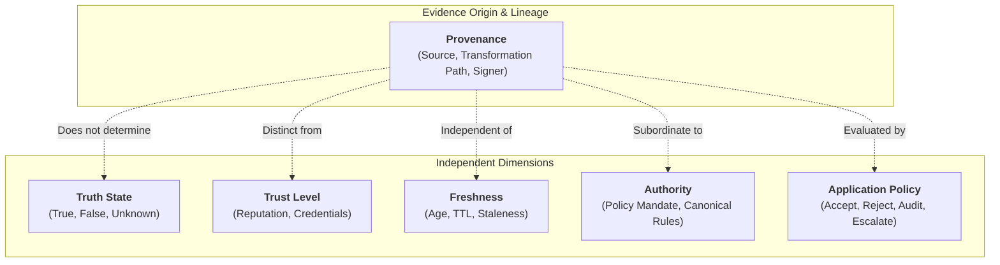

# XoX Provenance Model

This document establishes the conceptual model governing how origin, transformation, and lineage metadata relate to XoX semantic truth evaluation, without prematurely defining concrete Python, Rust, or PyO3 data structures.

---

## 1. Core Principle & The Provenance Problem

> **Provenance describes where decision-relevant information originated, how it was transformed, and who asserted it. Provenance is not truth, trust, freshness, or authority. Valid provenance alone never makes a statement `True`, and missing provenance does not automatically make a proposition `Unknown`.**

In professional software architectures, decisions often depend on data acquired from upstream microservices, database replicas, identity providers, cryptographic signatures, or external agent tools. Developers intuitively recognize that knowing *where* data came from is vital for safety, auditing, and compliance.

However, developers frequently fall into dangerous cognitive shortcuts:
- Assuming that because an assertion comes from a trusted identity or signed payload, the proposition it asserts must be `True`.
- Assuming that if provenance metadata is absent, the proposition's truth value must automatically be `Unknown`.
- Assuming that a fresh cryptographic signature implies the underlying real-world claim is still accurate.

The XoX Provenance Model provides the conceptual framework to reason rigorously about origin and transformation metadata while strictly preserving XoX semantic boundaries.

---

## 2. Essential Provenance Distinctions

To prevent cognitive conflation, boundary adapters and developers must strictly distinguish provenance from related operational concepts:

| Distinction | Provenance Realm | Independent Dimension | Key Insight |
| :--- | :--- | :--- | :--- |
| **Provenance vs. Truth** | Who asserted the claim or where it was recorded. | Whether the factual proposition is actually `True`, `False`, or `Unknown`. | A trusted source can assert a falsehood; an untrusted source can assert a truth. |
| **Provenance vs. Trust** | The factual record of origin and custody. | The developer's or system's confidence in the source. | Provenance records identity; trust assigns subjective or policy credibility to that identity. |
| **Provenance vs. Freshness** | Origin and generation timestamp. | Elapsed time relative to the validity window. | Fresh provenance can carry outdated or false data; stale provenance may still record immutable truths. |
| **Provenance vs. Authority** | Origin identity (e.g., Service A). | Mandate or entitlement to decide normative truth. | Asserting a claim is distinct from holding canonical authority to establish policy. |
| **Provenance vs. Transport Metadata** | Semantic origin and transformation history. | Network hop info, IP addresses, TLS session IDs. | Transport delivery headers (e.g., HTTP headers) identify packet transit, not semantic evidence lineage. |
| **Provenance vs. Application Policy** | Metadata about information history. | Business rules deciding whether to accept data. | Policy may demand high-quality provenance, but that demand is external to XoX truth logic. |
| **Missing Provenance vs. `Unknown`** | Absence of origin or lineage headers. | Inconclusive factual state of the proposition. | Missing origin metadata does not automatically make a proposition unestablished if domain evidence exists. |
| **Conflicting Provenance vs. Conflicting Evidence** | Contradictory origin claims (e.g., two claimed authors). | Contradictory factual observations (e.g., sensor A says 10, sensor B says 50). | Conflicting lineage is a metadata defect; conflicting evidence is an epistemic evaluation challenge. |

---

## 3. Mandatory Provenance Invariants & Rules

Every boundary adapter, service interface, and developer workflow must conform to ten fundamental provenance invariants:

1. **Descriptive Role**: Provenance describes where decision-relevant information originated or how it was transformed.
2. **Provenance Is Not Truth**: Valid or authenticated provenance does not by itself establish that a proposition is `True`.
3. **Missing Provenance Is Not Unknown**: Missing provenance metadata does not automatically establish `Unknown` unless the proposition itself requires verified provenance.
4. **Untrusted Provenance Is Not False**: Untrusted provenance does not automatically establish `False`.
5. **Freshness Is Independent of Truth**: Fresh provenance may still contain false or incorrect information.
6. **Staleness Is Independent of Truth**: Stale provenance may still accurately describe historically true facts.
7. **Authority and Provenance Are Distinct**: Holding provenance identity (e.g., an assertion ID) does not confer canonical semantic authority.
8. **Source Identity vs. Correctness**: Authenticating source identity (e.g., valid signature) does not guarantee source correctness.
9. **Transport Authenticity Is Not Semantic Truth**: Transport-layer authenticity (e.g., mTLS, signed tokens) proves packet integrity, not semantic factuality.
10. **Policy Evaluates Provenance**: Application policy may require specific provenance guarantees to proceed, but this operational requirement is not intrinsic XoX logic.

---

## 4. Provenance in Real-World Engineering Domains

### 4.1 HTTP & Microservice APIs
- **Core Question**: *Does knowing which service returned the data establish the proposition, or only identify the evidence source?*
- **Boundary Reality**: A JSON response signed by the User Management Service proves that Service A produced the payload. It does not automatically prove the proposition `"User email is verified"` is `True` if the underlying database state is corrupted or unverified.

### 4.2 Database & Persistence Layers
- **Core Question**: *Does a row's origin, migration history, or replication path matter to the decision?*
- **Boundary Reality**: A database row replicated from an asynchronous read-replica identifies where the record was read. If the proposition requires current account balance, provenance reveals that the read is from a replica, allowing application policy to decide whether to read-your-writes or evaluate the state.

### 4.3 Authentication & Authorization Systems
- **Core Question**: *Does a signed authorization record prove the action is currently authorized, or only identify who asserted it?*
- **Boundary Reality**: A signed JWT or SAML assertion proves that the Identity Provider asserted certain claims at timestamp $T_0$. It does not guarantee that the user has not been revoked at timestamp $T_1$. Provenance provides the claim chain; authorization logic evaluates the proposition against current revocation state.

### 4.4 Distributed Systems & Consensus
- **Core Question**: *Can a value be trusted for the current decision if its replica, version, or transformation lineage is unclear?*
- **Boundary Reality**: In a multi-leader or partition-tolerant store, provenance tracks which node version vector generated an observation. Loss of provenance means the lineage is ambiguous, which application consensus logic uses to determine whether conflict resolution is needed.

### 4.5 AI & Agent Tooling
- **Core Question**: *Does an agent know whether a claimed fact came from a verified external tool result, model-generated text, cached data, or an unverified source?*
- **Boundary Reality**: An agent receives a claim `"Server X is offline"`. Provenance identifies whether this string originated from an explicit exit code of a ping tool (`verified tool execution`), a hallucinated model summary, or a cached report. The agent uses provenance to avoid confusing model imagination with verified external state.

---

## 5. Core Provenance Questions for Developers

When designing or auditing data ingress with provenance, developers must answer these nine questions:

1. **Information Scope**: What specific data or evidence is being used to evaluate this proposition?
2. **Origin Identification**: Where did that information originally originate?
3. **Transformation History**: Was the information transformed, aggregated, cached, or relayed along the path?
4. **Sufficiency for Decision**: Is the available provenance complete enough for the specific decision being made?
5. **Lineage Depth**: Does the provenance identify the immediate source only, or the full transformation history?
6. **Freshness Relevance**: Is freshness or temporal validity relevant to the proposition being evaluated?
7. **Authority Requirements**: Does the decision require canonical authority from a specific governing entity?
8. **Consequence of Provenance Loss**: Would loss of provenance change what the application policy is permitted to conclude?
9. **Impact of Missing Provenance**: Does missing provenance leave the proposition genuinely unresolved (`Unknown`), or does domain context still establish truth?

---

## 6. Mandatory Failure Modes & Anti-Patterns

A system or example is defective if it exhibits any of the following anti-patterns:

- **Anti-Pattern 1 (Trusted Source as Truth)**: `trusted source -> True` (assuming a reputable source cannot be wrong).
- **Anti-Pattern 2 (Signature as Truth)**: `signed payload -> True` (confusing cryptographic authenticity of transit with factuality of contents).
- **Anti-Pattern 3 (Unknown Source as Unknown)**: `unknown source -> Unknown` automatically without evaluating whether the evidence itself is definitive.
- **Anti-Pattern 4 (Missing Provenance as Unknown)**: `missing provenance -> Unknown` by generic rule when domain facts are self-evident.
- **Anti-Pattern 5 (Stale Provenance as False)**: `stale provenance -> False` (confusing expired cache with factual refutation).
- **Anti-Pattern 6 (Fresh Provenance as True)**: `fresh provenance -> True` (confusing recently minted data with verified truth).
- **Anti-Pattern 7 (Provenance as Authority)**: Treating an upstream service identifier as granting canonical decision authority.
- **Anti-Pattern 8 (Transport TLS as Truth)**: Treating mTLS / transport encryption as evidence of semantic proposition truth.
- **Anti-Pattern 9 (Discarding Cache Origin)**: Stripping cache provenance when the downstream decision strictly depends on freshness guarantees.
- **Anti-Pattern 10 (Opaque Aggregation)**: Aggregating multiple sources into a single value while erasing which sources contributed to the result.
- **Anti-Pattern 11 (Policy Embedded in Provenance)**: Embedding application acceptance thresholds directly into provenance data structures.

---

## 7. API-Level Expectations

The provenance model scales across the three XoX API levels defined in [API_LEVELS.md](file:///home/ssr/Desktop/XoX/docs/01_developer_model/API_LEVELS.md):

- **`CORE` Level**:
  - Focuses on simple tri-state evaluation without requiring provenance structures or metadata wrappers.
  - Developers must understand the conceptual rule that source identity is not truth.
  - Zero performance or cognitive overhead from tracking provenance where unnecessary.
- **`SAFE` Level**:
  - May introduce auditable evidence retention, freshness thresholds, and explicit provenance checking for sensitive decisions.
  - Provides structured provenance inspection without changing baseline tri-state semantics.
- **`SEMANTIC` Level**:
  - Future extensions may support distributed causal lineage, verifiable graph transformation proofs, and cross-framework semantic tracing.
  - Strictly opt-in for high-assurance or distributed multi-agent architectures.

---

## 8. Developer Testability & Transfer Invariants

Conforming to this provenance model ensures that independent developers can:
1. Explain why valid provenance does not make a proposition `True`.
2. Explain why a valid cryptographic signature does not guarantee factual truth.
3. Explain why missing provenance does not automatically force `Unknown`.
4. Distinguish freshness (temporal validity) from provenance (origin lineage).
5. Distinguish canonical authority from source identity.
6. Transfer identical provenance reasoning across HTTP, database, identity, distributed, and AI agent domains.
