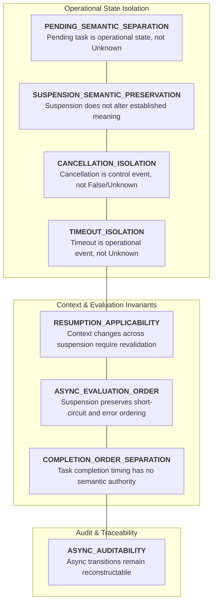
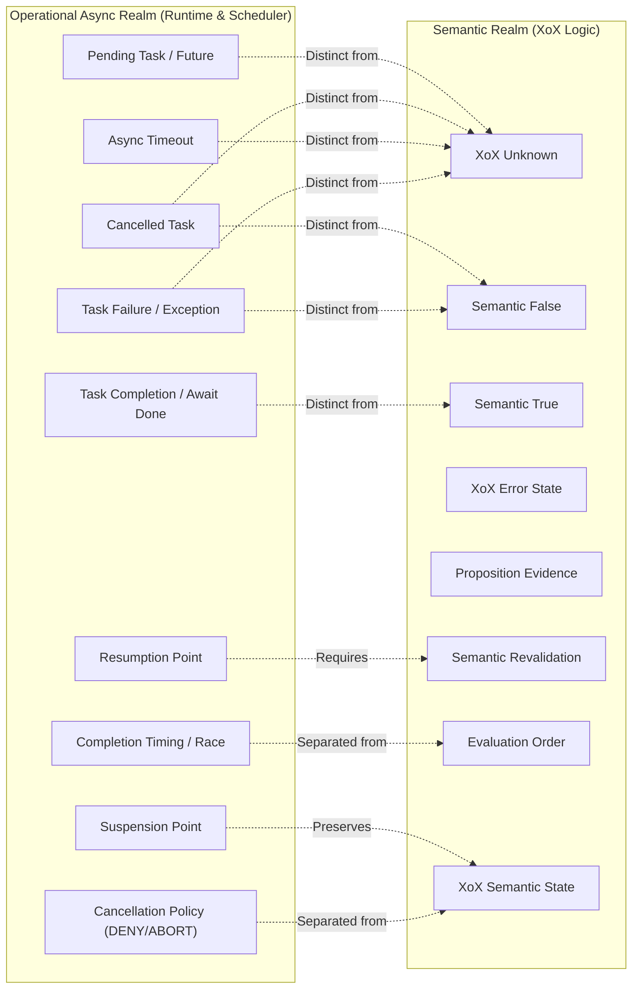
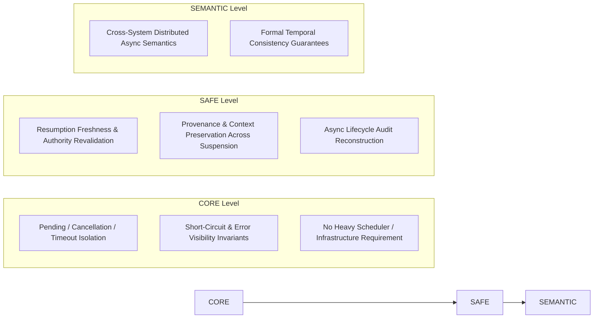

# XoX Conceptual Asynchronous Execution Model

This document establishes the minimum conceptual asynchronous execution contract for XoX, defining how awaiting, suspension, resumption, cancellation, timeout, task failure, delayed completion, and interleaving preserve semantic meaning across asynchronous boundaries without fabricating `Unknown`, weakening deterministic observable behavior, or converting operational scheduling states into proposition truth.

---

## 1. Core Principle & The Asynchronous Problem

> **Asynchronous execution introduces temporal suspension between operation invocation and completion; it does not introduce new semantic truth values. A pending task, cancelled operation, timeout, scheduler delay, or task failure is an operational execution state, never XoX `Unknown`, `False`, or `True`. Semantic meaning survives across suspension and resumption boundaries without distortion, and scheduler mechanics have no authority over proposition truth.**

In asynchronous runtimes, systems interface across non-blocking boundaries where execution pauses while awaiting I/O, external network responses, database queries, or background jobs. In production environments, semantic integrity is compromised when runtime scheduling phenomena are conflated with logical propositions:
- A pending task, in-flight future, or uncompleted promise is automatically mapped to `Unknown`.
- A cancelled task is treated as proposition `False` or domain `Unknown`.
- An asynchronous timeout is silently converted to `Unknown` to keep evaluation moving.
- Task execution failures or unhandled exceptions inside async workers are caught and mapped to `False`.
- Successful task completion or `await` resolution is automatically assumed to establish proposition `True`.
- Speculative async execution evaluates unselected short-circuit branches and leaks side effects or errors into observable execution.
- Context (such as authority, credential validity, or freshness) changes during suspension, but the resumed task reuses stale context without revalidation.
- Temporal completion ordering or scheduler non-determinism is allowed to dictate logical proposition priority.
- Application cancellation or retry policies (`DENY`, `FALLBACK`) overwrite historical evaluation states.

The XoX Conceptual Asynchronous Execution Model sets strict invariants guaranteeing that operational time, task state, and scheduler scheduling never compromise logical correctness.

---

## 2. Asynchronous Execution Dimensions

The XoX asynchronous execution contract spans eight foundational dimensions:

| Dimension | Description | Invariant Guarantee |
| :--- | :--- | :--- |
| **`PENDING_SEMANTIC_SEPARATION`** | Pending, in-flight, or awaiting execution remains an operational state. | A pending task never synthesizes XoX `Unknown`. |
| **`SUSPENSION_SEMANTIC_PRESERVATION`** | Suspension and resumption do not alter established semantic meaning. | Pausing an execution flow preserves established proposition truth unchanged. |
| **`CANCELLATION_ISOLATION`** | Cancellation remains an operational control event. | Aborting an in-flight operation never becomes `False` or `Unknown`. |
| **`TIMEOUT_ISOLATION`** | Asynchronous timeout remains an operational failure or event under [ERROR_MODEL.md](file:///home/ssr/Desktop/XoX/docs/03_runtime/ERROR_MODEL.md). | Exceeding a deadline never intrinsically synthesizes `Unknown` or `False`. |
| **`RESUMPTION_APPLICABILITY`** | Context drift during suspension requires applicability checks upon resumption. | Changed authority, freshness, or assumptions trigger revalidation rather than stale reuse. |
| **`ASYNC_EVALUATION_ORDER`** | Suspension preserves adopted observable evaluation order and short-circuit masking. | Speculative async execution never leaks effects or errors from skipped branches. |
| **`COMPLETION_ORDER_SEPARATION`** | Task completion order or scheduler interleaving carries no intrinsic semantic authority. | The first task to finish has no automatic evidence priority over subsequent completions. |
| **`ASYNC_AUDITABILITY`** | Decision-relevant suspension, resumption, cancellation, and timeout remain reconstructable. | Async lifecycle transitions leave auditable traces under [AUDIT_CONTRACT.md](file:///home/ssr/Desktop/XoX/docs/02_semantic_boundary/AUDIT_CONTRACT.md). |

---

## 3. Essential Conceptual Distinctions

Clear conceptual boundaries must be maintained across asynchronous task states and semantic propositions:

1. **Pending task versus `Unknown`**: A pending task represents incomplete work in time; `Unknown` indicates proposition truth is unestablished from evidence.
2. **Delayed result versus `Unknown`**: Late-arriving data is an operational latency concern, not domain epistemic uncertainty.
3. **Cancelled task versus `False`**: Cancelling an operation aborts execution; it does not logically refute the proposition.
4. **Cancelled task versus `Unknown`**: An aborted task yielded no result; it must not be synthesized into an established `Unknown` state.
5. **Timeout versus `Unknown`**: An elapsed deadline is an operational fault under [ERROR_MODEL.md](file:///home/ssr/Desktop/XoX/docs/03_runtime/ERROR_MODEL.md), not semantic uncertainty.
6. **Task failure versus `False`**: An unhandled async exception indicates execution breakdown, not logical proposition refutation.
7. **Task failure versus `Unknown`**: An execution crash cannot be swallowed into a default `Unknown` value.
8. **Scheduler delay versus proposition uncertainty**: A slow scheduler queue is an infrastructure condition, not lack of evidence.
9. **Task completion versus proposition truth**: A task successfully finishing execution proves only that it returned a result, not that a proposition is `True`.
10. **Suspension versus semantic state change**: Yielding execution does not alter or re-evaluate established semantic values.
11. **Resumption versus semantic revalidation**: Resuming execution wakes a task; revalidation checks whether contextual assumptions remain valid.
12. **Resumption versus re-evaluation**: Resuming execution continues an in-flight computation; re-evaluation computes a fresh proposition from new evidence.
13. **Completion order versus evaluation order**: The order in which asynchronous tasks finish has no bearing on defined logical evaluation order.
14. **Completion order versus evidence priority**: Arrival order does not grant priority over evidence with stronger provenance or authority.
15. **Concurrent availability versus async semantics**: Having data ready concurrently does not bypass defined semantic evaluation rules.
16. **Task handle/state versus proposition state**: An async task handle (e.g., pending, running, finished) is scheduler state, distinct from XoX truth values.
17. **External state changed while suspended versus evaluator nondeterminism**: A changed observation upon resumption reflects external environment evolution, not engine nondeterminism.
18. **Async retry versus task resumption**: A retry initiates a new operational attempt; resumption continues an existing suspended computation.
19. **Cancellation policy versus XoX semantic value**: Defensive application policies upon cancellation (e.g., `DENY`) remain policy, not proposition truth.
20. **Timeout policy versus XoX semantic value**: Fallback actions triggered by timeout remain application mitigation policy.

---

## 4. Normative Asynchronous Execution Rules

1. **Pending, scheduled, sleeping, suspended, blocked, or awaiting execution states are not XoX `Unknown`.**
2. **Cancellation is not XoX `False` or `Unknown`.**
3. **Async timeout is not intrinsically XoX `Unknown` or `False`.**
4. **Task failure remains an error under [ERROR_MODEL.md](file:///home/ssr/Desktop/XoX/docs/03_runtime/ERROR_MODEL.md) rather than a semantic value.**
5. **Successful task completion does not establish proposition truth unless the completed result is explicitly evaluated as evidence for that proposition.**
6. **Suspension must not silently rewrite an already established XoX value.**
7. **If decision-relevant evidence, freshness, authority, assumptions, proposition framing, or external context changes during suspension, resumed use may require revalidation or re-evaluation.**
8. **A delayed external response may represent new evidence acquired later; difference from an earlier observation is not automatically evaluator nondeterminism.**
9. **Async execution must preserve adopted observable evaluation order where XoX semantics defines it.**
10. **Short-circuited operands remain unevaluated even if an async runtime could schedule them speculatively.**
11. **An implementation must not make effects or errors from semantically skipped work observable.**
12. **Actually evaluated async failures must remain visible and cannot be swallowed into semantic fallback.**
13. **Task completion order has no intrinsic semantic meaning unless ordering is explicitly part of the proposition or evidence model.**
14. **Scheduler order has no intrinsic authority to choose among semantic results.**
15. **Cancellation, retry, fallback, abort, escalation, defer, or compensation remain application/runtime policy.**
16. **Async state crossing serialization boundaries remains subject to [SERIALIZATION_MODEL.md](file:///home/ssr/Desktop/XoX/docs/03_runtime/SERIALIZATION_MODEL.md).**
17. **Async resumption after interruption remains subject to [RECOVERY_MODEL.md](file:///home/ssr/Desktop/XoX/docs/03_runtime/RECOVERY_MODEL.md).**
18. **Async failures remain subject to [ERROR_MODEL.md](file:///home/ssr/Desktop/XoX/docs/03_runtime/ERROR_MODEL.md).**
19. **Cross-language async boundaries remain subject to [INTEROP_MODEL.md](file:///home/ssr/Desktop/XoX/docs/03_runtime/INTEROP_MODEL.md).**
20. **XoX-controlled observable behavior remains compatible with [DETERMINISM.md](file:///home/ssr/Desktop/XoX/docs/03_runtime/DETERMINISM.md).**
21. **Decision-relevant async transitions remain reconstructable where required by [AUDIT_CONTRACT.md](file:///home/ssr/Desktop/XoX/docs/02_semantic_boundary/AUDIT_CONTRACT.md).**
22. **Async implementation mechanisms may differ while preserving adopted semantic distinctions.**

---

## 5. Prohibited Failure Modes

The following asynchronous execution failure modes violate the XoX contract:

1. **Pending future automatically represented as `Unknown`**: Treating an unresolved task or in-flight promise as tri-state `Unknown`.
2. **Cancelled task represented as `False`**: Converting a cancelled task into a negative domain proposition.
3. **Cancelled task represented as `Unknown`**: Converting an aborted task into domain uncertainty.
4. **Timeout converted to `Unknown`**: Intercepting deadline expiration and manufacturing `Unknown`.
5. **Task exception converted to `False`**: Catching an async worker panic or exception and treating it as proposition refutation.
6. **Task exception converted to `Unknown`**: Swallowing async errors to return fallback `Unknown` states.
7. **Successful `await` completion automatically recorded as `True`**: Assuming that an async function completing without fault proves the predicate is `True`.
8. **Scheduler delay interpreted as insufficient evidence**: Treating slow queue execution as lack of evidence for a proposition.
9. **Resumed task reuses stale semantic state after authority changed**: Resuming execution and using cached authority tokens that were revoked while suspended.
10. **Resumed task reuses stale result after freshness expired**: Resuming after long suspension and reusing expired evaluations without revalidation.
11. **External state changes during suspension and runtime reports semantic nondeterminism**: Misattributing external environment drift to engine evaluator inconsistency.
12. **Short-circuited async operand is started speculatively and its side effect becomes visible**: Starting an unnecessary async task whose I/O or state modification leaks into the system.
13. **Short-circuited async operand raises after being speculatively scheduled**: Leaking an unhandled error from an async task that should have been masked by short-circuit evaluation.
14. **Completion order changes semantic combination even though order is not decision-relevant**: Combining independent async inputs based on scheduler arrival rather than deterministic rules.
15. **First task to complete is treated as authoritative evidence solely because it completed first**: Prioritizing evidence based on network latency rather than declared provenance/authority.
16. **Cancel policy `DENY` recorded as semantic `False`**: Storing a defensive authorization denial triggered by cancellation as proven proposition `False`.
17. **Timeout fallback recorded as semantic `Unknown`**: Recording an operational timeout fallback policy as genuine domain uncertainty.
18. **Async retry confused with continuation of the original observation**: Treating a retried network request as the same observation instead of a distinct historical event.
19. **Foreign async binding maps pending/null/error state to `Unknown`**: Crossing language FFI and translating foreign async sentinels into `Unknown`.
20. **Agent waits on tool call and marks proposition `Unknown` merely because tool has not returned yet**: An AI agent harness recording domain `Unknown` while a tool task is still in-flight.

---

## 6. Real-World Asynchronous Scenarios

### 6.1 Pending API Request
- **Scenario**: A service issues an async request to fetch evidence for an eligibility check; the request is currently awaiting I/O.
- **Contract Expectation**: The runtime reports the task as pending. It does not synthesize XoX `Unknown`. The application cannot evaluate the proposition until evidence arrives or an explicit policy decision is taken.

### 6.2 Asynchronous Timeout
- **Scenario**: An awaited database query exceeds its 500ms timeout budget.
- **Contract Expectation**: The runtime raises an operational timeout error under [ERROR_MODEL.md](file:///home/ssr/Desktop/XoX/docs/03_runtime/ERROR_MODEL.md). The engine must not convert the timeout into `Unknown` or `False`.

### 6.3 Task Cancellation
- **Scenario**: A user aborts a long-running decision request before async sub-tasks complete.
- **Contract Expectation**: The in-flight tasks are cancelled. The cancellation is treated as a control event. The runtime does not record `False` or `Unknown` as the final proposition outcome.

### 6.4 Async Short-Circuit Evaluation
- **Scenario**: In an async expression `left OR right`, `left` evaluates asynchronously to `True`.
- **Contract Expectation**: `right` is short-circuited and not semantically evaluated. Even if the underlying runtime initiated `right` speculatively, any side effects or errors produced by `right` must remain completely suppressed and unobservable.

### 6.5 Authority Drift During Suspension
- **Scenario**: An async task acquires authority evidence, then suspends for several seconds awaiting secondary I/O. During suspension, the user's capability token is revoked.
- **Contract Expectation**: Upon resumption, the engine or application boundary detects changed authority state. The task cannot blindly reuse the old authority token.

### 6.6 Freshness Expiry During Suspension
- **Scenario**: An evaluation is cached with a 1-second freshness window. The task suspends for 2 seconds.
- **Contract Expectation**: Upon resumption, the cached result is recognized as stale. Resumption requires revalidation or re-evaluation rather than direct reuse.

### 6.7 Completion Race Separation
- **Scenario**: Two evidence-gathering tasks are spawned concurrently. Run A finishes Task 1 first; Run B finishes Task 2 first.
- **Contract Expectation**: Unless temporal sequence is an explicit part of the proposition model, the deterministic semantic combination of the two inputs is identical regardless of completion order.

### 6.8 AI / Agent Tool Call Lifecycle
- **Scenario**: An LLM agent invokes an async tool that remains pending for 10 seconds, then times out or is cancelled.
- **Contract Expectation**: The agent harness keeps pending, timeout, and cancellation states distinct from proposition uncertainty (`Unknown`). Mitigation policies (retry, escalate) remain application policy.

---

## 7. API Level Expectations

### 7.1 CORE Level
- Enforces strict separation of pending, cancelled, timed out, and failed task states from `True`, `False`, and `Unknown`.
- Guarantees that async execution never weakens short-circuit masking, deterministic evaluation order, or evaluated error visibility.
- Must not require event loops, thread pools, cancellation frameworks, audit logs, or distributed schedulers.

### 7.2 SAFE Level
- Requires decision-relevant freshness, provenance, authority tokens, and audit context to survive or be revalidated across suspension points.
- Remains purely conceptual and mechanism-neutral; does not mandate specific async runtimes (e.g., Tokio, asyncio), task executors, or cancellation token types.

### 7.3 SEMANTIC Level
- Future extension point for distributed asynchronous contracts, cross-system temporal coordination, and multi-node event semantics.
- Subject to separate formal adoption and out of scope for baseline engine runtime.

---

## 8. Developer Evaluation Questions

When designing async workflows, reviewing async code, or integrating task schedulers, developers must ask:

1. **Is this proposition `Unknown`, or is the operation merely still pending?**
2. **Did the task fail, or did the proposition evaluate `False`?**
3. **Was the task cancelled, or was a semantic result established?**
4. **Did a timeout occur, or was `Unknown` actually established from evidence?**
5. **Did relevant evidence, freshness, authority, assumptions, or context change while suspended?**
6. **Does resumption require revalidation or re-evaluation?**
7. **Was this operand semantically required to execute?**
8. **Could speculative scheduling expose an effect or error from work that short-circuit semantics says should not occur?**
9. **Am I assigning meaning to task completion order that belongs only to the scheduler?**
10. **Does later completion represent new evidence rather than nondeterministic evaluation?**
11. **Am I treating retry as continuation when it actually acquires a new observation?**
12. **Is application cancellation/retry/fallback policy being confused with XoX semantics?**

---

## 9. Developer Testability Criteria

An implementation conforms to this asynchronous execution model if an independent developer can verify:

- **Pending Task Isolation**: Tests confirm that awaiting in-flight tasks never produces `Unknown` prior to resolution.
- **Cancellation & Timeout Isolation**: Tests confirm that cancelled or timed-out async operations raise operational events/errors and never synthesize `False` or `Unknown`.
- **Async Short-Circuit Suppression**: Tests confirm that when the left branch of an async expression short-circuits, any side effects or errors from the right branch remain completely unobservable.
- **Evaluated Error Visibility**: Tests confirm that unhandled exceptions in evaluated async branches surface immediately as errors.
- **Resumption Context Revalidation**: Tests confirm that tasks resuming after token revocation or freshness expiration detect stale state and do not blindly reuse expired context.
- **Completion Order Independence**: Tests confirm that varying async task completion order produces identical, deterministic semantic outcomes.
