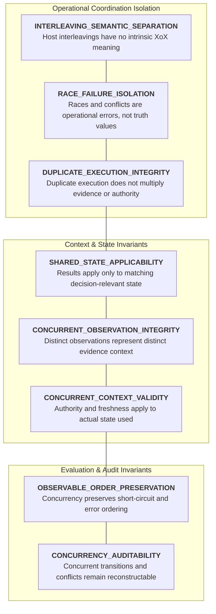
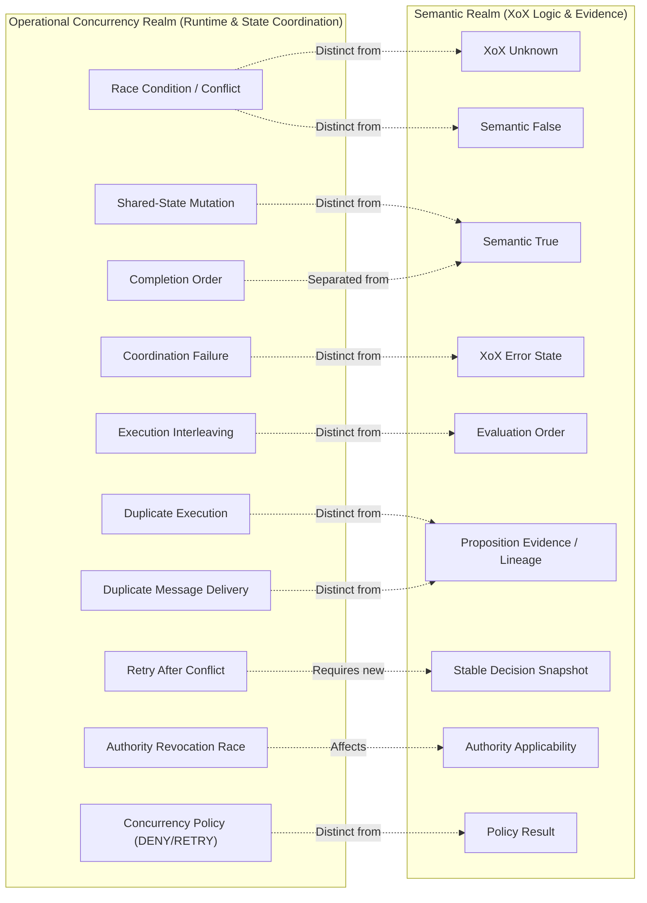
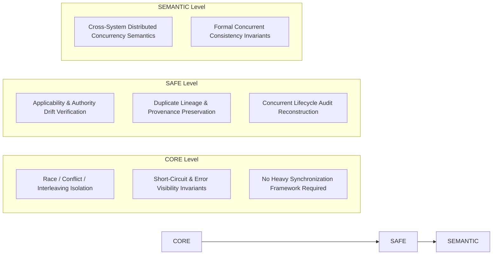

# XoX Conceptual Concurrency Model

This document establishes the minimum conceptual concurrency contract for XoX, defining how multiple simultaneous or overlapping computations, shared state, races, interleavings, duplicate work, and concurrent observations preserve semantic meaning without fabricating `Unknown`, weakening deterministic observable behavior, converting operational coordination states into proposition truth, or bypassing adopted async, recovery, error, interop, provenance, authority, or audit guarantees.

---

## 1. Core Principle & The Concurrency Problem

> **Concurrency allows multiple evaluations, observations, updates, or policies to overlap in time; it does not introduce new semantic truth values. A race condition, coordination conflict, synchronization failure, interleaving variation, or concurrent mutation is an operational state-coordination phenomenon, never XoX `Unknown`, `False`, or `True`. Host scheduling and race outcomes have no intrinsic semantic authority, and shared-state mutations invalidate result applicability without altering historical proposition truth.**

In concurrent, multi-threaded, multi-task, or distributed host environments, multiple computations execute concurrently or interleave across shared resources, caches, databases, queues, and external services. In production systems, semantic integrity is compromised when operational concurrency phenomena are conflated with logical propositions:
- A data race, write conflict, or lock acquisition failure is automatically mapped to `Unknown`.
- A concurrent update rejection or optimistic lock conflict is silently treated as proposition `False`.
- Two concurrent observations of evolving external state differ, and the runtime misreports evaluator non-determinism instead of recognizing distinct observation contexts.
- A cached `True` evaluation is reused after concurrent mutation has changed the underlying decision-relevant state.
- An authorization token validated in one execution thread is reused after concurrent revocation.
- Duplicate message deliveries or duplicated concurrent tool calls are counted as independent corroborating evidence.
- The first concurrent operation to complete is granted automatic semantic authority.
- Concurrent execution speculatively runs unselected short-circuit branches and leaks side effects or errors into observable execution.
- A concurrency control policy decision (such as `DENY` or `RETRY`) is recorded as proposition truth.

The XoX Conceptual Concurrency Model sets strict invariants ensuring that physical execution overlap, race conditions, coordination conflicts, and interleavings never distort logical correctness.

---

## 2. Concurrency Dimensions

The XoX concurrency contract spans eight foundational dimensions:

| Dimension | Description | Invariant Guarantee |
| :--- | :--- | :--- |
| **`INTERLEAVING_SEMANTIC_SEPARATION`** | Host execution interleavings and scheduling sequences have no intrinsic semantic meaning. | Different valid interleavings produce identical XoX-controlled semantic outcomes. |
| **`SHARED_STATE_APPLICABILITY`** | A semantic evaluation applies only to the decision-relevant state under which it was established. | Concurrent mutation invalidates applicability for future decisions without rewriting history. |
| **`RACE_FAILURE_ISOLATION`** | Race conditions, coordination conflicts, and synchronization failures remain operational failures. | Coordination breakdowns remain errors under [ERROR_MODEL.md](file:///home/ssr/Desktop/XoX/docs/03_runtime/ERROR_MODEL.md) and never synthesize `Unknown` or `False`. |
| **`CONCURRENT_OBSERVATION_INTEGRITY`** | Differing concurrent observations reflect genuinely distinct evidence contexts. | Environmental state changes across workers are treated as distinct inputs, not engine non-determinism. |
| **`DUPLICATE_EXECUTION_INTEGRITY`** | Executing identical computations concurrently does not fabricate independent evidence. | Duplicate execution or message redelivery preserves a single provenance lineage. |
| **`OBSERVABLE_ORDER_PRESERVATION`** | Concurrency must not alter XoX-defined observable evaluation, short-circuit, effect, or error order. | Concurrent implementations never expose side effects or errors from semantically skipped branches. |
| **`CONCURRENT_CONTEXT_VALIDITY`** | Decision-relevant authority, freshness, provenance, and assumptions remain bound to the state actually used. | Concurrent revocation or expiry invalidates applicability rather than synthesizing proposition refutation. |
| **`CONCURRENCY_AUDITABILITY`** | Decision-relevant concurrent observations, conflicts, retries, and state transitions remain reconstructable. | Concurrent execution lifecycles leave auditable traces under [AUDIT_CONTRACT.md](file:///home/ssr/Desktop/XoX/docs/02_semantic_boundary/AUDIT_CONTRACT.md). |

---

## 3. Essential Conceptual Distinctions

Clear conceptual boundaries must be maintained between operational concurrency phenomena and semantic propositions:

1. **Race condition versus `Unknown`**: A race condition is an operational timing conflict; `Unknown` represents unestablished proposition truth due to incomplete domain evidence.
2. **Concurrent update conflict versus `False`**: A conflict between concurrent writes indicates coordination failure; it does not logically refute a proposition.
3. **Coordination failure versus `Unknown`**: Inability to coordinate shared state is an operational failure under [ERROR_MODEL.md](file:///home/ssr/Desktop/XoX/docs/03_runtime/ERROR_MODEL.md), not semantic uncertainty.
4. **Different observations versus evaluator nondeterminism**: Two workers observing differing external states reflect distinct environmental inputs, not non-deterministic engine logic.
5. **Shared-state mutation versus semantic mutation**: Mutating shared storage invalidates future context applicability; it does not alter the historical truth of an already established evaluation.
6. **Execution interleaving versus evaluation order**: The order in which host threads interleave instructions has no authority over XoX-defined logical evaluation order.
7. **Completion order versus semantic authority**: The first concurrent computation to finish has no automatic authority over subsequent completions.
8. **Duplicate execution versus duplicate evidence**: Running the same computation multiple times produces redundant evaluations, not multiple corroborating witnesses.
9. **Duplicate message versus independent corroboration**: Receiving the same message multiple times from a queue represents duplicate delivery of a single provenance lineage, not independent corroboration.
10. **Retry after conflict versus continuation**: Retrying after a concurrency conflict initiates a new observation under new state, rather than continuing the prior observation.
11. **Concurrent read versus stable snapshot of decision-relevant context**: Reading live shared state while it mutates introduces race hazards; a decision requires a stable, consistent snapshot of decision-relevant context.
12. **Historical state versus current shared state**: A proposition evaluated against historical state remains true of that historical state, even if current shared state has changed.
13. **Stale cache versus `False`**: A cached evaluation whose freshness expired or whose basis mutated is inapplicable, not logically `False`.
14. **Authority race versus proposition truth**: Losing an authority race affects the caller's right to act, not the objective truth of the underlying proposition.
15. **Revocation race versus semantic refutation**: Revoking a capability concurrently invalidates authority applicability; it does not refute the proposition being evaluated.
16. **Conflicting updates versus contradictory proposition evidence**: Conflicting state mutations reflect write contention; contradictory evidence reflects opposing domain facts.
17. **Host data race versus XoX contradiction**: An unsynchronized host memory access is an execution fault, not a logical contradiction within XoX logic.
18. **Concurrency control policy versus semantic result**: An operational policy decision (e.g., abort, reject, retry, merge) is runtime control flow, not a semantic truth value.
19. **Implementation synchronization versus XoX semantics**: Concrete synchronization constructs are implementation details; XoX semantics defines the invariant observable behavior.
20. **Concurrency versus async**: Concurrency addresses simultaneous or overlapping execution across shared state; async addresses suspension, resumption, and temporal latency across execution boundaries.

---

## 4. Normative Concurrency Rules

1. **Concurrency does not add new XoX truth states.**
2. **A race, coordination conflict, synchronization failure, or concurrent mutation is not intrinsically XoX `Unknown` or `False`.**
3. **Different host interleavings may be permitted only when they preserve XoX-controlled observable semantic behavior required by [DETERMINISM.md](file:///home/ssr/Desktop/XoX/docs/03_runtime/DETERMINISM.md).**
4. **Concurrency must not expose effects or errors from work that XoX semantics says is unevaluated or skipped.**
5. **Concurrent execution must not change adopted short-circuit semantics.**
6. **If two evaluations observe genuinely different decision-relevant state or evidence, they are not equivalent semantic inputs merely because they originated from the same source code.**
7. **A result established against one shared-state context cannot be assumed applicable after decision-relevant state changes.**
8. **Freshness, authority, provenance, assumptions, and proposition framing remain subject to current applicability under concurrent mutation.**
9. **Concurrent authority revocation or scope change does not make an unrelated proposition `False`; it changes authority applicability.**
10. **A coordination or race failure remains an error under [ERROR_MODEL.md](file:///home/ssr/Desktop/XoX/docs/03_runtime/ERROR_MODEL.md).**
11. **Duplicate execution does not automatically create additional independent evidence.**
12. **Duplicate delivery does not automatically increase confidence, authority, or truth.**
13. **Operational idempotence does not itself establish semantic equivalence, truth, or freshness.**
14. **The first concurrent operation to finish has no intrinsic semantic authority.**
15. **Host scheduling/interleaving has no intrinsic evidence priority.**
16. **Retry after a concurrent conflict may acquire a new observation or context and must not be silently treated as the identical original evaluation.**
17. **If concurrent work cannot preserve the decision-relevant context needed for valid semantic reuse, the system must expose insufficiency/conflict or perform explicit revalidation/re-evaluation rather than fabricate a semantic value.**
18. **Concurrency policy such as serialize, retry, reject, merge, compensate, defer, or escalate remains application/runtime policy.**
19. **Concurrent values crossing async boundaries remain subject to [ASYNC_MODEL.md](file:///home/ssr/Desktop/XoX/docs/03_runtime/ASYNC_MODEL.md).**
20. **Concurrent values crossing language/process boundaries remain subject to [INTEROP_MODEL.md](file:///home/ssr/Desktop/XoX/docs/03_runtime/INTEROP_MODEL.md).**
21. **Persisted/transferred concurrent state remains subject to [SERIALIZATION_MODEL.md](file:///home/ssr/Desktop/XoX/docs/03_runtime/SERIALIZATION_MODEL.md).**
22. **Interrupted concurrent work remains subject to [RECOVERY_MODEL.md](file:///home/ssr/Desktop/XoX/docs/03_runtime/RECOVERY_MODEL.md).**
23. **Concurrent failures remain subject to [ERROR_MODEL.md](file:///home/ssr/Desktop/XoX/docs/03_runtime/ERROR_MODEL.md).**
24. **Decision-relevant concurrent state changes remain reconstructable where required by [AUDIT_CONTRACT.md](file:///home/ssr/Desktop/XoX/docs/02_semantic_boundary/AUDIT_CONTRACT.md).**
25. **Implementation synchronization mechanisms may differ while preserving adopted XoX-visible semantics.**

---

## 5. Prohibited Failure Modes

The following concurrency failure modes violate the XoX contract:

1. **Data race automatically represented as `Unknown`**: Mapping an uncoordinated read/write collision to logical uncertainty.
2. **Write conflict automatically represented as `False`**: Converting an optimistic concurrency collision or database write conflict into a negative domain proposition.
3. **Lock/synchronization failure converted to `Unknown`**: Swallowing synchronization acquisition failure to return a fallback `Unknown`.
4. **Two concurrent observations differ and runtime reports evaluator nondeterminism despite different state**: Misidentifying environmental state evolution across concurrent workers as engine non-determinism.
5. **Stale cached `True` reused after concurrent state mutation**: Reusing a cached decision after concurrent writes mutated the decision-relevant state upon which it was based.
6. **Authorization validated in one thread/task and reused after concurrent revocation**: Executing an action using an authorization check performed prior to a concurrent revocation event.
7. **Duplicate message counted as two independent pieces of evidence**: Incrementing evidence count or confidence when the same message is delivered twice across a queue.
8. **Duplicate execution treated as stronger truth**: Treating the identical result from two concurrent executions of the same code as independent corroborating proof.
9. **First request to finish becomes authoritative**: Choosing between conflicting evaluations based on physical completion latency rather than declared authority and provenance.
10. **Scheduler order changes semantic result when order is not decision-relevant**: Permitting thread interleaving to alter the output of an operation whose semantics is order-independent.
11. **Host race exposes side effect from semantically skipped work**: Running short-circuited branches in parallel and allowing their side effects to persist into the shared environment.
12. **Host race surfaces error from semantically skipped work**: Surfacing an exception from a concurrently evaluated branch that XoX logical short-circuiting declared skipped.
13. **Two concurrent updates conflict and are labeled logical contradiction without proposition-level evidence analysis**: Treating physical write contention as formal domain contradiction.
14. **Retry after conflict is treated as same observation despite new external state**: Silently attaching the provenance of an initial conflicted read to a subsequent retry that observed new state.
15. **Concurrency control policy `DENY` becomes semantic `False`**: Recording an operational rate-limit, lock contention rejection, or lock-out policy as a proven `False` proposition.
16. **Conflict fallback becomes `Unknown`**: Translating an operational concurrency fallback branch directly into tri-state `Unknown`.
17. **Successful synchronization becomes semantic `True`**: Assuming that successfully acquiring a coordination barrier or lock proves a domain proposition is `True`.
18. **Foreign runtime maps race/conflict sentinel to `Unknown`**: Interop FFI boundary translating foreign lock error codes or conflict status into XoX `Unknown`.
19. **Recovered concurrent state is treated as current without applicability checks**: Replaying in-flight concurrent state during recovery without validating whether current shared state still matches.
20. **Agent executes duplicate tool calls concurrently and treats duplicate identical responses as independent corroboration**: An AI agent harness dispatching redundant tool executions and treating identical answers as multiple distinct validations.

---

## 6. Real-World Concurrency Scenarios

### 6.1 Shared Cache
- **Scenario**: Worker A reads a cached `True` result while Worker B concurrently updates the underlying decision-relevant data in storage.
- **Contract Expectation**: The consumer must verify current applicability (freshness, validity, context) rather than blindly assuming the cached representation remains valid for new decisions.

### 6.2 Authorization Revocation
- **Scenario**: Thread A validates an authorization capability for a high-privilege action. Concurrently, Thread B processes an administrative revocation of that capability before Thread A executes the action.
- **Contract Expectation**: The runtime preserves authority applicability as distinct from proposition truth. The action must fail due to revoked authority applicability, without recording the proposition itself as `False`.

### 6.3 Concurrent Database Update
- **Scenario**: Two operations concurrently attempt incompatible updates to the same record, triggering a conflict.
- **Contract Expectation**: The conflict is handled as an operational coordination/state conflict under [ERROR_MODEL.md](file:///home/ssr/Desktop/XoX/docs/03_runtime/ERROR_MODEL.md), not as an intrinsic XoX domain contradiction or semantic `False`.

### 6.4 Duplicate Queue Delivery
- **Scenario**: A message broker delivers the same evidence-bearing message twice due to network retransmission.
- **Contract Expectation**: Duplicate delivery retains a single provenance lineage. The duplicate message does not automatically multiply evidence weight or synthesize independent corroboration.

### 6.5 Concurrent Evidence Requests
- **Scenario**: Two concurrent requests query the same external API endpoint, but observe different state because the external environment changed between queries.
- **Contract Expectation**: The two observations are treated as distinct inputs/contexts reflecting real-world temporal change, rather than engine evaluator non-determinism.

### 6.6 Short-Circuit Under Parallelism
- **Scenario**: In an expression `A OR B`, a parallel runtime starts evaluation of both `A` and `B` concurrently. `A` returns `True`.
- **Contract Expectation**: `B` is semantically short-circuited. Any side effects or errors produced by `B` during concurrent execution must remain strictly suppressed and unobservable.

### 6.7 Recovery
- **Scenario**: A process crashes during concurrent multi-step processing and subsequently recovers in-flight state after another process has modified the shared environment.
- **Contract Expectation**: Recovery preserves historical execution records under [RECOVERY_MODEL.md](file:///home/ssr/Desktop/XoX/docs/03_runtime/RECOVERY_MODEL.md) but requires verification of current state applicability before re-executing or committing decisions.

### 6.8 AI / Agent Duplicate Tool Calls
- **Scenario**: An AI agent harness accidentally launches the same verification tool twice concurrently, and both instances return the identical answer.
- **Contract Expectation**: The harness must avoid treating the two identical results as two independent pieces of corroborating evidence, maintaining accurate provenance linkage.

---

## 7. API Level Expectations

### 7.1 CORE Level
- Enforces strict separation of race conditions, coordination conflicts, synchronization failures, and scheduling states from `True`, `False`, and `Unknown`.
- Guarantees that concurrent execution never weakens XoX-controlled observable evaluation order, short-circuit masking, or evaluated error visibility.
- Must not require provenance graphs, authority infrastructure, audit storage, distributed coordination, or named synchronization models.

### 7.2 SAFE Level
- Requires preservation or revalidation of decision-relevant provenance, freshness, authority, assumptions, context, and duplicate lineage across concurrent boundaries.
- Remains purely conceptual and mechanism-neutral; does not prescribe locks, transactions, actors, atomics, isolation levels, or synchronization frameworks.

### 7.3 SEMANTIC Level
- Future extension point for distributed concurrency contracts, multi-node consistency invariants, and cross-system semantic coordination.
- Subject to separate formal adoption and out of scope for baseline engine runtime.

---

## 8. Developer Evaluation Questions

When designing concurrent workflows, reviewing concurrent code, or handling shared state, developers must ask:

1. **Is this a semantic `Unknown`, or did concurrent coordination merely fail?**
2. **Did the proposition evaluate `False`, or did an update conflict occur?**
3. **Did these evaluations observe the same decision-relevant state?**
4. **Did shared state change between observation and use?**
5. **Is this result still fresh and applicable?**
6. **Was authority revoked or narrowed concurrently?**
7. **Are these two messages independent evidence or duplicate delivery of the same observation?**
8. **Did duplicate execution actually produce independent observations?**
9. **Am I assigning semantic importance to completion or scheduler order?**
10. **Could concurrency expose an effect or error from work XoX semantics says should be skipped?**
11. **Is retry after conflict actually a new observation/context?**
12. **Am I confusing a synchronization mechanism with a semantic guarantee?**
13. **Is a conflict-handling policy being recorded as `True`, `False`, or `Unknown`?

---

## 9. Developer Testability Criteria

An implementation conforms to this concurrency model if an independent developer can verify:

- **Race & Conflict Isolation**: Tests confirm that race conditions, update conflicts, and lock failures raise operational errors under [ERROR_MODEL.md](file:///home/ssr/Desktop/XoX/docs/03_runtime/ERROR_MODEL.md) and never synthesize `Unknown` or `False`.
- **Stale State Invalidation**: Tests confirm that cached evaluations detect shared-state mutations and require revalidation before reuse.
- **Authority Drift Detection**: Tests confirm that concurrent capability revocation prevents unauthorized actions without altering proposition truth.
- **Duplicate Lineage Integrity**: Tests confirm that duplicate execution or redelivered messages maintain a single provenance identity rather than inflating evidence counts.
- **Completion Order Independence**: Tests confirm that varying worker completion order produces identical, deterministic semantic outcomes when order is not decision-relevant.
- **Short-Circuit Effect & Error Suppression**: Tests confirm that parallel branch evaluation never leaks observable side effects or errors from semantically skipped operands.
- **Retry Context Differentiation**: Tests confirm that retrying after a concurrency conflict records a distinct observation context rather than continuing the prior snapshot.
- **Cross-Domain Conceptual Transfer**: Tests confirm that concurrency invariants transfer cleanly across caches, databases, queues, authorization layers, foreign runtimes, and AI agents.
