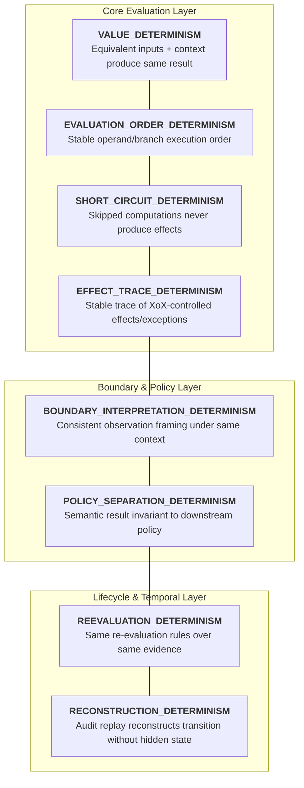
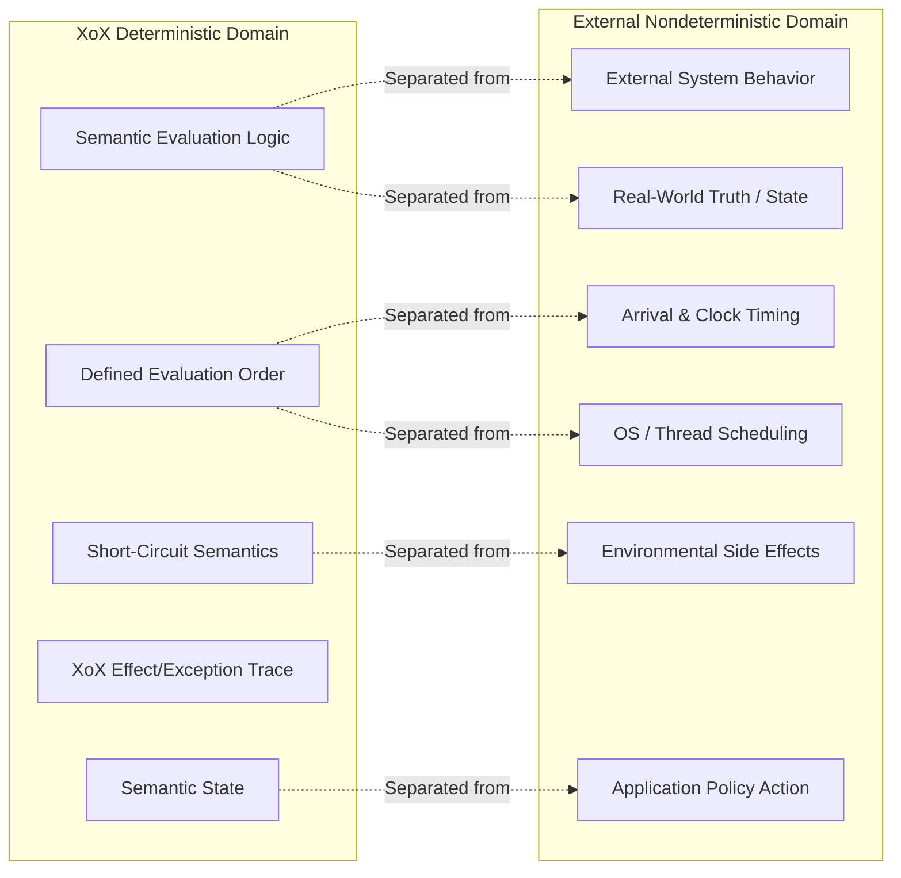
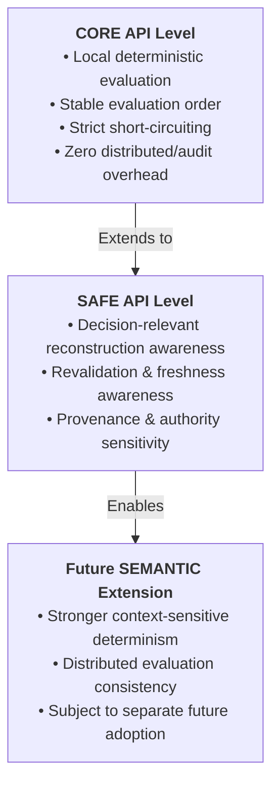

# XoX Runtime Determinism Contract

This document establishes the conceptual runtime determinism contract for XoX, defining what observable behaviors must remain stable for identical semantic inputs and equivalent decision-relevant context, while strictly separating deterministic XoX evaluation from legitimate nondeterminism in external systems, scheduling, timing, and host environments.

---

## 1. Core Principle & The Determinism Problem

> **Equivalent XoX semantic inputs evaluated under equivalent decision-relevant context must produce predictable, stable observable behavior. Determinism applies strictly to behavior XoX defines and controls; it does not promise or assume determinism for external systems, network timing, physical clocks, or host environments.**

External events become semantically meaningful only relative to an explicit proposition and applicable evidence/domain assumptions:
- **Timeout is not intrinsically `Unknown`.**
- **HTTP success is not intrinsically `True`.**
- **HTTP failure is not intrinsically `False`.**
- **Database row absence is not intrinsically `False` or `Unknown`.**
- **Database row presence is not intrinsically `True`.**

In production systems, evaluations often become unpredictable or unreplayable when:
- Hidden evaluation-order differences (e.g., hash table iteration, non-deterministic collection traversal) alter computed results or traces.
- Short-circuit behavior is inconsistently applied, causing side effects or exceptions to appear or disappear depending on runtime implementation details.
- External environmental nondeterminism (network latency, retry timing, clock drift, remote service changes) is conflated with evaluator nondeterminism.
- Semantic evaluation results (`True`, `False`, `Unknown`) are conflated with downstream application policy reactions (`ALLOW`, `DENY`, `RETRY`, `ESCALATE`).
- Replay or audit reconstruction attempts to fabricate deterministic history without possessing sufficient decision-relevant inputs.
- Caching mechanisms reuse stale evaluations across non-equivalent decision-relevant contexts under the guise of determinism.

The XoX Runtime Determinism Contract defines the exact boundary where runtime stability is guaranteed and where external nondeterminism is recognized and preserved.

---

## 2. Determinism Dimensions

XoX runtime determinism spans eight fundamental dimensions:

| Dimension | Description | Invariant Guarantee |
| :--- | :--- | :--- |
| **`VALUE_DETERMINISM`** | Equivalent semantic inputs under equivalent relevant context produce the same XoX result. | No runtime implementation detail may alter the resulting semantic value. |
| **`EVALUATION_ORDER_DETERMINISM`** | Operand and branch evaluation order is stable wherever order affects observable behavior. | Operand evaluation order is strictly defined and invariant across runs. |
| **`SHORT_CIRCUIT_DETERMINISM`** | Skipped computations remain skipped consistently and cannot produce effects or exceptions. | When short-circuiting triggers, bypassed expressions yield zero side effects or errors. |
| **`EFFECT_TRACE_DETERMINISM`** | For equivalent evaluated paths, the observable sequence of XoX-controlled effects or exceptions remains stable. | The sequence and identity of internal runtime events and exceptions are deterministic. |
| **`BOUNDARY_INTERPRETATION_DETERMINISM`** | The same external observation is interpreted consistently when proposition framing and relevant context are equivalent. | Adapter mapping from external observation to semantic evidence is deterministic. |
| **`POLICY_SEPARATION_DETERMINISM`** | Semantic evaluation does not change merely because downstream application policy differs. | Evaluator logic is decoupled from application decision thresholds or fallback logic. |
| **`REEVALUATION_DETERMINISM`** | Given the same new evidence and valid assumptions, re-evaluation follows the same semantic rules as initial evaluation. | Temporal progression does not alter foundational deduction rules. |
| **`RECONSTRUCTION_DETERMINISM`** | When sufficient decision-relevant inputs and ordering are available, an audit reconstruction can explain the same semantic transition without inventing hidden state. | Historical replays reproduce the exact semantic transition given recorded inputs. |

---

## 3. Essential Conceptual Distinctions

Developers, integrators, and runtime designers must maintain strict boundaries between internal deterministic evaluation and external realities:

| Distinction | Deterministic Realm (XoX Controlled) | Nondeterministic / External Realm (Observed) | Key Invariant |
| :--- | :--- | :--- | :--- |
| **Semantic Determinism vs. External-System Determinism** | Deductive evaluation of facts, propositions, and uncertainty within XoX. | State, availability, and responses of third-party APIs, DBs, and services. | XoX guarantees its own logic, never the constancy of external systems. |
| **Deterministic Evaluation vs. Deterministic Arrival Time** | The semantic result computed from a concrete batch/stream of evidence. | The physical arrival timestamp or packet order over a network. | Evaluator behavior is deterministic given input; message arrival is not. |
| **Deterministic Result vs. Fixed Real-World Truth** | Consistency of output for given input propositions and context. | The actual state of the external physical or business universe. | Output is conditionally deterministic on inputs; reality may change independently. |
| **Evaluation Order vs. OS Scheduling** | Defined lexical and operand evaluation sequencing inside XoX expressions. | Thread preemption, core allocation, and fiber/task interleaving. | OS thread scheduling variation must not alter logical evaluation order. |
| **Short-Circuit Semantics vs. Speculative Execution** | Logical bypassing of unevaluated branches and suppression of their effects. | Compiler/CPU speculative branch prediction or internal pipelining. | Internal runtime optimizations must never expose skipped branch effects. |
| **Runtime Effect Trace vs. Environmental Effects** | Controlled trace of XoX warnings, diagnostics, and semantic state transitions. | Out-of-band network I/O, disk writes, or hardware telemetry. | XoX contracts only govern runtime-controlled semantic effect traces. |
| **Replayable Semantic Inputs vs. Replayable World State** | The exact set of propositions, evidence payloads, and context passed to XoX. | The full historical state of the entire external execution environment. | Replay requires capturing decision-relevant inputs, not frozen world state. |
| **Same Value vs. Same Provenance** | Equivalence of payload content (e.g., identical JSON structure). | The historical origin, authority chain, and signatures attached to the value. | Identical values with different provenance may yield different validity. |
| **Same Semantic State vs. Same Application Action** | The tri-state semantic outcome (`True`, `False`, `Unknown`). | The operational side effect (e.g., HTTP 403, alert dispatch, human review). | Application actions vary by policy; the underlying semantic state does not. |
| **Determinism vs. Caching** | The guarantee that equivalent inputs yield identical results upon evaluation. | The storage optimization of skipping re-evaluation. | Determinism defines evaluation correctness; it does not permit stale caching. |
| **Determinism vs. Freshness** | Mathematical consistency of evaluation over provided evidence. | The temporal validity and expiration threshold of external evidence. | Deterministic evaluation over expired evidence is correct logic on stale data. |
| **Determinism vs. Concurrency Safety** | Invariance of semantic evaluation results across execution environments. | Absence of data races, deadlocks, and memory corruption under concurrency. | Concurrency safety is a prerequisite; it does not replace semantic determinism. |

---

## 4. Core Invariants & Rules

1. **Implementation Independence**: Equivalent XoX semantic inputs under equivalent decision-relevant context must not produce different XoX results solely because of runtime implementation variation.
2. **Defined Evaluation Order**: Evaluation order must be strictly defined wherever different ordering could alter values, effect traces, exceptions, or downstream semantic state.
3. **Strict Short-Circuit Isolation**: Short-circuit behavior must be stable across platforms; skipped operands must contribute no observable XoX-controlled effects or exceptions.
4. **Policy Decoupling**: Determinism must preserve the strict distinction between semantic evaluation results (`True`/`False`/`Unknown`) and downstream application policy reactions.
5. **External Boundary Realism**: External observation timing, network delivery, remote service behavior, and wall-clock progression are not automatically controlled or assumed deterministic by XoX.
6. **Evidence Evolution**: External nondeterminism may change the evidence available to a later evaluation without rendering the semantic evaluator itself nondeterministic.
7. **Retry Semantics**: Retrying an operation may produce different evidence because the external world changed; this does not violate XoX semantic determinism.
8. **Representation Equivalence**: Equivalent evidence representations (e.g., equivalent key order, canonical encodings) must not produce different semantic results due to irrelevant serialization details.
9. **Context Non-Equivalence**: A changed proposition, assumption, context, freshness requirement, or evidence set is not an equivalent semantic input and may legitimately produce a different result.
10. **Anti-Staleness**: Determinism must never be used to justify reusing cached, stale evaluations after decision-relevant context has changed.
11. **Immutability of Historical Evaluation**: Application policy changes must not retroactively change the semantic evaluation result previously produced for a historical event.
12. **Honest Audit Reconstruction**: Audit reconstruction must not infer or fabricate deterministic semantic history from incomplete inputs when decision-relevant evidence is missing.
13. **Concurrency Non-Interference**: Concurrency and asynchronous execution may introduce scheduling variation, but concurrency implementations must not alter adopted semantic evaluation results or observable effect traces.
14. **Bounded Scope**: Determinism applies strictly and exclusively to behavior XoX defines or controls.

---

## 5. Failure Modes & Anti-Patterns

| Anti-Pattern / Failure Mode | Root Cause | Impact | Mitigation / Contract Requirement |
| :--- | :--- | :--- | :--- |
| **Iteration Order Dependency** | Relying on nondeterministic map/hash iteration order during evaluation. | Same expression produces different results across runs or runtimes. | Semantic evaluation and traces must remain invariant to internal collection iteration order (e.g., via canonical sorting or order-invariant reduction). |
| **Unstable Operand Evaluation** | Left-to-right evaluation order not guaranteed for expressions with effects. | Exposes different side effects or intermediate states depending on compiler/runtime. | Fix left-to-right operand evaluation order as a strict runtime invariant. |
| **Leaky Short-Circuiting** | Short-circuited operand is evaluated speculatively or partially executes. | Unexpected exceptions or effects emerge on branches that should be bypassed. | Guarantee complete suppression of bypassed subexpressions. |
| **Reordered Exception Masking** | Runtime reorders sub-evaluations, altering which exception or error is raised first. | Inconsistent exception traces across environments. | Require deterministic evaluation order for error and exception generation. |
| **Policy-As-Truth Collapse** | Application default-deny policy transforms `Unknown` into `False` in logs. | Downstream auditors mistake operational policy for semantic refutation. | Maintain strict boundary between tri-state evaluation and policy mapping. |
| **Retry Mislabeled as Nondeterminism** | Retry returns fresh external data; developer blames XoX for instability. | Confusion between changing world state and evaluator determinism. | Distinguish new evidence evaluation from replaying identical evidence. |
| **Clock Shift Blamed on Runtime** | Wall-clock advancement alters temporal validity check. | Developer assumes evaluator is nondeterministic across timestamps. | Treat temporal context as an explicit input to time-dependent propositions. |
| **Stale Cache Replay** | Cache returns past evaluation despite changed security or business context. | Security vulnerabilities and invalid state transitions. | Validate context equivalence before reusing any evaluated semantic outcome. |
| **Encoding-Induced Divergence** | Minor formatting differences (e.g., JSON key ordering) change semantic parsing. | Identical payloads evaluated differently across platforms. | Semantic interpretation must remain invariant to irrelevant representation formatting differences. |
| **Fabricated Replay** | Replay engine guesses missing historical context to produce deterministic result. | False audit trail that masks missing historical evidence. | Reconstruction engines must report missing decision-relevant inputs as reconstruction insufficiency rather than fabricating history or assigning arbitrary semantic states. |
| **Arrival Order Confusion** | Distributed packet arrival order assumed to dictate semantic evaluation order. | Race conditions and inconsistent multi-node state. | Separate external arrival sequence from internal deterministic evaluation order. |
| **AI Tool Drift Blamed on XoX** | LLM/tool output varies between calls; blamed on XoX evaluation engine. | Inability to isolate nondeterministic model output from deductive logic. | Model AI output as external, volatile evidence; XoX evaluation remains deterministic. |
| **Concurrent Execution Race** | Internal evaluator shared state or scheduling race alters semantic results. | Nondeterministic evaluation results under concurrent workloads. | Runtime implementations must guarantee that concurrency and scheduling variations do not alter semantic evaluation results or observable effect traces. |
| **Overzealous Optimization** | Compiler reorders operations based on algebraic equivalence, altering trace. | Observable side-effect or exception sequence diverges from specification. | Optimizations must preserve exact observable effect and exception traces. |

---

## 6. Real-World Scenarios & Domain Transfer

### 6.1 Local CORE Evaluation
- **Scenario**: A tri-state boolean expression (e.g., `A AND (B OR C)`) is evaluated repeatedly on a local machine with identical input values.
- **Contract Expectation**: Value outcome, operand evaluation order (left-to-right), short-circuit bypass, and raised exceptions must be 100% stable across runs, platforms, and compiler optimization levels.

### 6.2 HTTP / External API
- **Scenario**: An application evaluates the proposition `PaymentSettled = True` against external API observations. The first attempt encounters a network timeout; a subsequent retry receives an HTTP `200 OK` response containing `{"settled": true}`.
- **Contract Expectation**: 
  - The network timeout is an external transport event, not intrinsically `Unknown`. Depending on available prior evidence, the proposition `PaymentSettled` may remain unestablished (`Unknown`) due to missing evidence.
  - The HTTP `200 OK` status is a transport success, not intrinsically `True`. The payload `{"settled": true}` provides the actual evidence that evaluates the proposition to `True`.
  - These are two distinct deterministic evaluations over different evidence sets. Each evaluation is fully deterministic relative to its available inputs and context.

### 6.3 Database Transactions
- **Scenario**: An application evaluates the proposition `UserAccountActive = True` by querying a database table. In Run 1, the query returns 0 rows. In Run 2, after an external transaction commits, the query returns 1 row with `status = "active"`.
- **Contract Expectation**:
  - In Run 1, zero rows is evidence whose semantic interpretation depends on explicit domain assumptions (e.g., under a closed-world assumption over complete user records, absent record may mean `False`; under an open-world partial replica, it may mean `Unknown`).
  - In Run 2, the retrieved row provides evidence confirming the proposition as `True`.
  - Database row absence is not intrinsically `False` or `Unknown`, and row presence is not intrinsically `True`. Changed database state produces different evidence over time, not evaluator nondeterminism.

### 6.4 Distributed Systems & Replicas
- **Scenario**: Responses from three quorum replicas arrive in order `[R1, R2, R3]` on Node A, but `[R2, R1, R3]` on Node B.
- **Contract Expectation**: Network arrival order is external nondeterminism. If evaluation depends on quorum composition, the semantic interpretation layer must ensure aggregation rules remain invariant to external message arrival order.

### 6.5 Authorization & Policy Separation
- **Scenario**: An authorization query evaluates a permission proposition as `Unknown` due to an unreachable authority service. Service A applies a "default-deny" policy (`DENY`); Service B applies a "break-glass allow" policy (`ALLOW`).
- **Contract Expectation**: The semantic evaluation in both services is identically `Unknown`. The differing downstream actions are application policies, not divergent semantic evaluations.

### 6.6 AI & Agent Tooling
- **Scenario**: An autonomous agent invokes an external LLM tool twice with identical prompts, receiving slightly different structured completions.
- **Contract Expectation**: The external LLM is nondeterministic. XoX evaluates each tool output deterministically according to declared schema and validation rules, without asserting that the tool itself is deterministic.

---

## 7. API Level Expectations

### CORE
- Requires deterministic local XoX evaluation, fixed evaluation order, and predictable short-circuit semantics.
- Operates purely in-memory with zero overhead; must not require audit, provenance, authority, async, or distributed machinery.

### SAFE
- In addition to CORE guarantees, requires conceptual awareness of decision-relevant context, provenance, freshness, revalidation, and reconstruction for sensitive decisions.
- Does not fix or promise concrete tracking implementations, storage layouts, or serialization formats.

### SEMANTIC (Future Extension)
- Reserved as an extension point for future standards that may define stronger determinism rules across distributed or context-sensitive evaluation.
- Does not adopt or depend on unadopted runtime primitives, profiles, or concrete mechanisms in this baseline.

---

## 8. Developer Decision Framework & Testability

### 8.1 Key Questions for Developers
When designing or auditing runtime interactions, developers must ask:
1. **Input Equivalence**: Are the semantic inputs and context truly equivalent, or did subtle environmental parameters change?
2. **Context vs. Evidence**: Did the proposition context change, or did only the external evidence payload change?
3. **Origin of Variation**: Is observed variation caused by XoX evaluation logic or by external environmental state?
4. **Order Sensitivity**: Could lexical or operand evaluation order alter the computed value, effect trace, or raised exceptions?
5. **Short-Circuit Verification**: Does short-circuiting consistently suppress all side effects and errors on unneeded branches?
6. **Policy Conflation**: Is downstream application policy being mistakenly treated as a semantic evaluation result?
7. **Cache Validity**: Is a cached evaluation being reused across non-equivalent or stale contexts?
8. **Reconstruction Sufficiency**: Does the audit log contain all decision-relevant inputs required to reconstruct the exact transition?
9. **Concurrency Non-Interference**: Could concurrent runtime execution or thread scheduling alter the semantic result or observable trace?

### 8.2 Developer Testability Checklist
An independent developer or test suite should be able to:
- [ ] Distinguish semantic evaluator nondeterminism from changing external world evidence.
- [ ] Predict local evaluation order, exception priority, and short-circuit suppression.
- [ ] Explain why retries with varying evidence do not violate XoX determinism.
- [ ] Verify that differing application policies do not alter recorded semantic tri-state values.
- [ ] Detect when changes in freshness or context invalidate past evaluation equivalence.
- [ ] Verify that runtime concurrency and scheduling variations do not alter evaluation results or effect traces.
- [ ] Verify that audit replays without complete decision-relevant inputs report insufficiency rather than fabricating outcomes.
- [ ] Apply the determinism model consistently across APIs, databases, distributed nodes, authorization, and AI tools.
