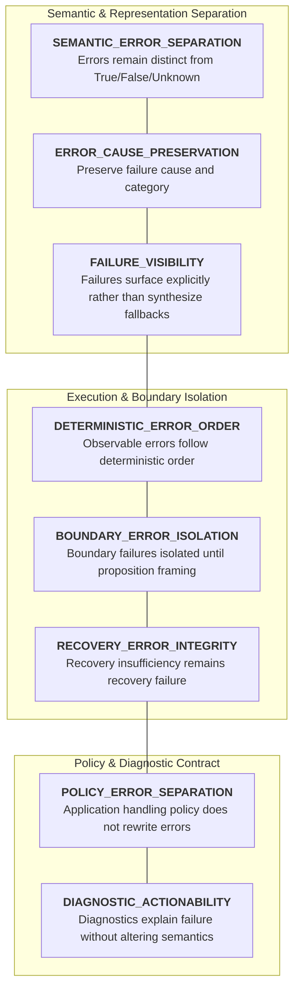
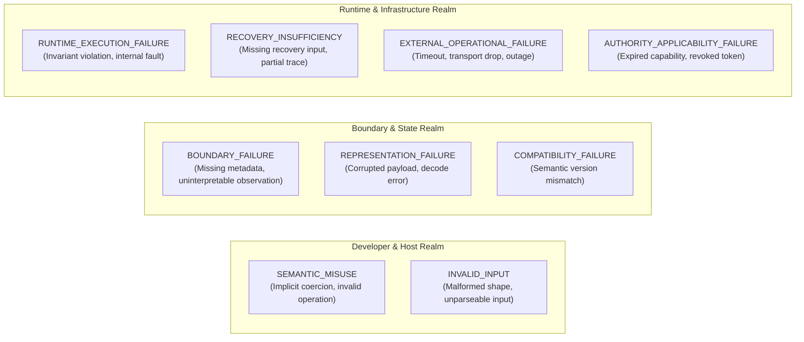
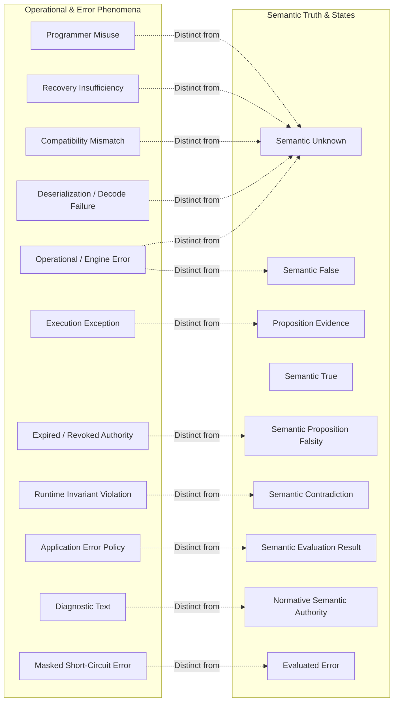
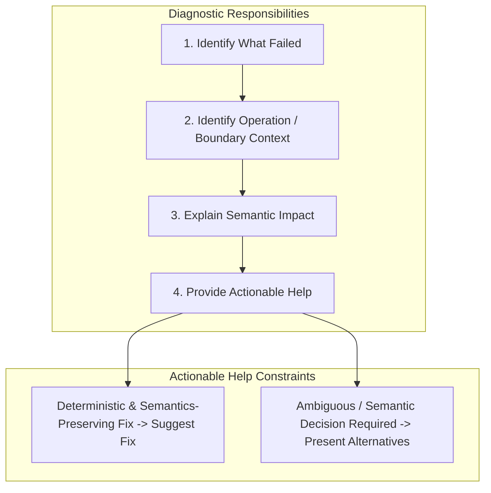
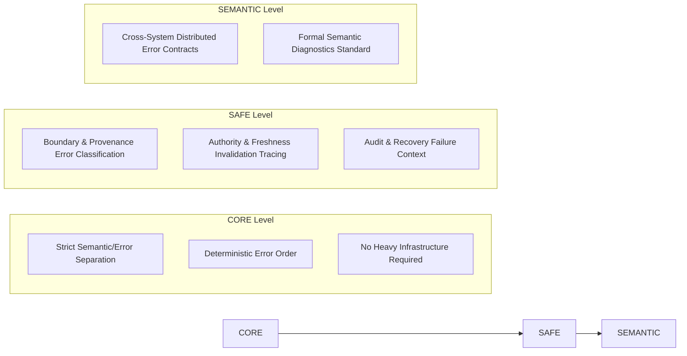

# XoX Conceptual Error Model

This document establishes the conceptual runtime error contract for XoX, defining how runtime errors, exceptions, invalid states, boundary failures, misuse, incompatibility, and operational faults remain strictly distinct from XoX semantic values (`True`, `False`, `Unknown`), authority, policy, or successful recovery.

---

## 1. Core Principle & The Error Problem

> **Errors are not semantic truth values. A parser failure, invalid serialized value, API timeout, stale capability, impossible host conversion, violated runtime invariant, incompatible version, missing recovery input, or programmer misuse can prevent XoX from producing or safely reusing a semantic result. If such failures are collapsed into `True`, `False`, `Unknown`, policy outcomes, or silent fallbacks, developers lose the ability to distinguish uncertainty about a proposition from failure of the machinery used to evaluate it.**

In production systems and runtime environments, semantic integrity is compromised when runtime execution failures are conflated with logical propositions:
- Network timeouts, connection drops, and service outages are silently caught and converted to `Unknown`.
- Database query failures or missing records are caught and translated into proposition `False`.
- Deserialization corruption or schema mismatch is mapped to a default `Unknown` state to avoid raising exceptions.
- Implicit coercions (such as treating host `null`, `None`, or unparseable input as `False` or `Unknown`) mask severe developer misuse.
- Authorization revocation or token expiry is silently reported as proposition `False` on business predicates.
- Short-circuit optimization alters observable error emergence, or runtime evaluation order nondeterministically surfaces arbitrary branch failures.
- Application error mitigation policies (`RETRY`, `DENY`, `FALLBACK`) overwrite underlying error categories or rewrite historical evaluation records.

The XoX Conceptual Error Model ensures that logical truth evaluation is decoupled from operational machinery health, boundary availability, and execution invariants.

---

## 2. Error Dimensions

The XoX error contract spans eight foundational dimensions:

| Dimension | Description | Invariant Guarantee |
| :--- | :--- | :--- |
| **`SEMANTIC_ERROR_SEPARATION`** | Errors remain outside and distinct from the semantic value domain (`True`, `False`, `Unknown`). | Operational failure never produces a valid tri-state logical value. |
| **`ERROR_CAUSE_PRESERVATION`** | The error surface preserves sufficient cause and category metadata. | Developers can distinguish uncertainty from boundary, operational, or misuse faults. |
| **`FAILURE_VISIBILITY`** | Failures preventing valid semantic interpretation surface explicitly. | The runtime never fabricates silent fallback semantic values. |
| **`DETERMINISTIC_ERROR_ORDER`** | Observable error sequences conform to deterministic evaluation order. | Evaluation order and short-circuit suppression are fully predictable. |
| **`BOUNDARY_ERROR_ISOLATION`** | External boundary failures remain isolated from domain interpretation. | Raw boundary errors are not conflated with domain proposition evidence. |
| **`RECOVERY_ERROR_INTEGRITY`** | Recovery insufficiency, corruption, or mismatch remain explicit failures. | Recovery never manufactures synthetic truth or masks corrupted state as `Unknown`. |
| **`POLICY_ERROR_SEPARATION`** | Application handling policies (retry, abort, fallback) remain separate from error states. | Error mitigation decisions do not mutate semantic or error categories. |
| **`DIAGNOSTIC_ACTIONABILITY`** | Diagnostics communicate failure cause, impact, and actionability. | Diagnostic help suggests only deterministic, semantics-preserving fixes. |

---

## 3. Conceptual Error Categories

XoX classifies runtime failures into nine distinct conceptual categories:

| Category | Conceptual Scope | Typical Manifestations |
| :--- | :--- | :--- |
| **`SEMANTIC_MISUSE`** | Violation of semantic contract or misuse of language primitives. | Implicit Bool coercion, collapsing `Unknown` without boundary, invalid operand combination. |
| **`INVALID_INPUT`** | Syntactically or structurally malformed data presented to an operation. | Unsupported value shapes, illegal argument domains, unparseable input buffers. |
| **`BOUNDARY_FAILURE`** | External boundary unable to supply framed, valid observation. | Missing boundary provenance, unavailable contextual metadata, untranslatable observation. |
| **`REPRESENTATION_FAILURE`** | Failure to encode, decode, or safely represent serialized state. | Persisted payload corruption, truncation, unrepresentable target serialization structure. |
| **`COMPATIBILITY_FAILURE`** | Inability of a reader or engine to preserve decision-relevant semantics. | Unsupported future wire version, mismatched schema invariants, migration requirement. |
| **`RUNTIME_EXECUTION_FAILURE`** | Violation of engine runtime invariants or execution-time crash. | Engine assertion failure, exhausted runtime resource, unexpected implementation bug. |
| **`RECOVERY_INSUFFICIENCY`** | Insufficient historical or state information to resume execution safely. | Missing recovery log segment, interrupted transaction record, partial checkpoint. |
| **`EXTERNAL_OPERATIONAL_FAILURE`** | Transient or persistent operational failure of external systems. | Network timeout, socket disconnect, database outage, third-party dependency crash. |
| **`AUTHORITY_APPLICABILITY_FAILURE`** | Invalidation, expiry, or mismatch of capability or authorization token. | Expired capability token, revoked permission scope, unauthorized caller context. |

---

## 4. Essential Conceptual Distinctions

Clear boundaries must be maintained across all error and semantic interpretations:

1. **Error versus `Unknown`**: `Unknown` indicates proposition truth is not established in the domain; an error indicates evaluation machinery failed before a valid semantic result existed.
2. **Error versus `False`**: `False` indicates a proposition is refuted by evidence; an error indicates an operation could not execute.
3. **External failure versus semantic result**: A network drop or database failure is an operational state, not a domain evaluation outcome.
4. **Invalid input versus proposition falsity**: Malformed syntax or shape is a contract violation, not an assertion that the evaluated predicate is `False`.
5. **Deserialization failure versus `Unknown`**: Unparseable payload represents data corruption, not legitimate domain uncertainty.
6. **Compatibility failure versus `Unknown`**: Schema or version incompatibility requires explicit migration/rejection, never silent fallback to `Unknown`.
7. **Recovery insufficiency versus `Unknown`**: Inability to reconstruct state must halt or request recovery input, not masquerade as `Unknown`.
8. **Expired/revoked authority versus unrelated proposition `False`**: Lack of authority prevents evaluation authorization; it does not refute the proposition under inspection.
9. **Programmer misuse versus user-domain uncertainty**: API misuse (e.g., implicit coercion) is a software bug, not epistemic uncertainty.
10. **Runtime invariant failure versus semantic contradiction**: An engine crash or broken invariant is a software fault, not a formal logical contradiction.
11. **Exception occurrence versus proposition evidence**: Catching an exception does not constitute evidence regarding domain facts.
12. **Error cause versus application handling policy**: Why an error occurred is distinct from how the application chooses to respond (retry, escalate, fallback).
13. **Diagnostic message versus normative semantic authority**: Diagnostic suggestions are advisory tools, not authoritative semantic declarations.
14. **Recoverable operational failure versus successful semantic recovery**: Resuming a process after crash does not retroactively prove earlier failed evaluations succeeded.
15. **Masked error via short-circuit versus swallowed evaluated error**: A branch skipped by short-circuit never evaluates and produces no error; an evaluated branch that raises must never have its error silently suppressed.
16. **First observable error versus unordered implementation accident**: In deterministic evaluation, the first error is strictly dictated by execution order, not collection traversal accidents.

---

## 5. Normative Error Rules

1. **Errors are not members of the XoX `True`/`False`/`Unknown` value domain.**
2. **`Unknown` means proposition truth is not established, not that evaluation machinery failed.**
3. **`False` means the proposition evaluated `False`, not that an operation failed.**
4. **Timeout, network failure, dependency outage, parse error, decode error, corruption, incompatibility, and missing recovery information must not become `Unknown` automatically.**
5. **Programmer misuse must fail visibly rather than silently coerce or collapse semantics.**
6. **Invalid representation must fail as representation error rather than synthesize a semantic value.**
7. **Compatibility failure must remain explicit when faithful semantics cannot be preserved.**
8. **Recovery insufficiency must remain explicit and must not be converted into `Unknown`.**
9. **Authority expiry, revocation, or scope mismatch must remain authority/applicability state and must not automatically rewrite unrelated propositions as `False`.**
10. **Where evaluation order is observable, error ordering must follow adopted deterministic evaluation order.**
11. **A short-circuited expression that is not evaluated must not surface its potential error.**
12. **An expression that is evaluated and fails must not have its error silently swallowed merely to preserve a convenient semantic value.**
13. **Application error policy such as retry, fallback, abort, escalate, log, or ignore is separate from XoX semantic state.**
14. **Diagnostics may explain the failure but must not become normative authority or redefine semantics.**
15. **A help suggestion may be offered only when the fix is deterministic and semantics-preserving; otherwise diagnostics should present alternatives or explain the required decision.**
16. **Successful handling of an error does not retroactively establish that the failed proposition evaluation succeeded.**
17. **Errors crossing serialization or recovery boundaries remain subject to [SERIALIZATION_MODEL.md](file:///home/ssr/Desktop/XoX/docs/03_runtime/SERIALIZATION_MODEL.md) and [RECOVERY_MODEL.md](file:///home/ssr/Desktop/XoX/docs/03_runtime/RECOVERY_MODEL.md).**
18. **Error behavior controlled by XoX must remain compatible with [DETERMINISM.md](file:///home/ssr/Desktop/XoX/docs/03_runtime/DETERMINISM.md).**
19. **Decision-relevant errors and recovery actions must remain reconstructable where required by [AUDIT_CONTRACT.md](file:///home/ssr/Desktop/XoX/docs/02_semantic_boundary/AUDIT_CONTRACT.md).**
20. **Implementation details may differ, but supported implementations must preserve adopted semantic/error distinctions.**

---

## 6. Prohibited Failure Modes

The following failure modes violate the XoX error contract:

1. **Timeout converted to `Unknown`**: Converting an HTTP/database timeout to `Unknown` instead of surfacing operational failure.
2. **Database exception converted to `False`**: Treating a failed SQL query or connection error as `False` (e.g., assuming record does not exist).
3. **Invalid serialized value converted to `Unknown`**: Deserializing malformed bytes into `Unknown` to keep processing.
4. **Missing field converted to `Unknown`**: Treating missing mandatory payload fields as semantic uncertainty rather than input invalidity.
5. **Unsupported version silently treated as old semantics**: Silently degrading unrecognized protocol versions without reporting compatibility failure.
6. **Recovery insufficiency silently converted to `Unknown`**: Resuming from a damaged checkpoint and filling gaps with `Unknown`.
7. **Revoked credential recorded as proposition `False`**: Recording a permission check failure as `user_is_admin = False` when the auth service is unreachable or token expired.
8. **Programmer misuse auto-corrected through implicit coercion**: Coercing a non-boolean host object to `False` or `Unknown` instead of raising a misuse error.
9. **Evaluated exception swallowed to return a semantic fallback**: Catching an unhandled exception inside a predicate and returning a default value.
10. **Short-circuited branch error incorrectly surfaced**: Executing or inspecting unselected branches and raising errors that should have been masked.
11. **Optimizer changes which error occurs first**: Reordering expression branches during compilation such that the observable error sequence shifts.
12. **Unordered collection traversal changes first visible failure**: Iterating sets or maps without deterministic ordering, leading to fluctuating runtime errors.
13. **Application retry policy rewrites error as `Unknown`**: Treating transient retries as producing `Unknown` prior to completion.
14. **Application `DENY` after an error recorded as semantic `False`**: Recording a defensive authorization denial as a proven negative predicate.
15. **Successful retry overwrites historical record of prior failure**: Erasing previous operational error traces upon successful recovery.
16. **Diagnostic recommendation changes semantic behavior silently**: An IDE or runtime automated quick-fix that alters business logic semantics.
17. **AI agent interprets tool exception as semantic `False`**: An LLM agent treating tool crash or stack trace as negative evidence for a hypothesis.
18. **AI agent interprets malformed tool response as `Unknown` without proposition evaluation**: Treating unstructured JSON parse error as valid semantic uncertainty.
19. **Cross-language binding maps host exception/null to `Unknown`**: Binding boundary converting host `null` or raised exception into `Unknown`.
20. **Recovery layer catches corruption and returns a default XoX value**: Fault-tolerance layer intercepting corrupted state and generating `False` or `Unknown`.

---

## 7. Real-World Failure Scenarios

### 7.1 Local Evaluation & Short-Circuit Masking
- **Scenario**: In an expression `left OR right`, `left` evaluates to `True`, while evaluating `right` would trigger an execution error (e.g., division by zero or missing identifier).
- **Contract Expectation**: Because `left` is `True`, deterministic short-circuit evaluation terminates without evaluating `right`. The un-evaluated error is masked and must not be surfaced. Conversely, if `left` is `False`, `right` must evaluate, and its error must surface immediately rather than being coerced to `False` or `Unknown`.

### 7.2 Evaluated Exception
- **Scenario**: An expression requires evaluation of an operand that throws an unhandled runtime exception before a valid result is computed.
- **Contract Expectation**: The error surfaces visibly as a runtime execution failure. The runtime must never intercept the exception and fabricate `Unknown` or `False` to maintain flow.

### 7.3 HTTP / Remote API Failure
- **Scenario**: An external service times out while fetching evidence for an active decision.
- **Contract Expectation**: The failure is categorized as `EXTERNAL_OPERATIONAL_FAILURE`. It remains distinct from proposition truth until an explicit application boundary rule evaluates whether operational timeout constitutes specific domain evidence.

### 7.4 Database Connection Failure
- **Scenario**: A query checking user eligibility fails due to pool exhaustion or network partition.
- **Contract Expectation**: The database failure is exposed as an operational error. The engine must not infer that "0 records returned" means the user is ineligible (`False`) or that eligibility is `Unknown`.

### 7.5 Serialization & Deserialization Corruption
- **Scenario**: A persisted state file is corrupted on disk or serialized under an incompatible future format version.
- **Contract Expectation**: Deserialization raises `REPRESENTATION_FAILURE` or `COMPATIBILITY_FAILURE`. It must not fabricate default tri-state values to replace unreadable records.

### 7.6 Recovery Insufficiency
- **Scenario**: A node restarts after crash and discovers its local transaction log is truncated and missing decision-relevant records.
- **Contract Expectation**: The node raises `RECOVERY_INSUFFICIENCY`. It must not initialize missing states to `Unknown` and resume evaluation as if state were intact.

### 7.7 Authorization & Capability Expiry
- **Scenario**: A capability token verifying an actor's permission has expired or has a mismatched scope.
- **Contract Expectation**: The evaluation reports `AUTHORITY_APPLICABILITY_FAILURE`. This failure is preserved separately from the semantic truth of the underlying business proposition.

### 7.8 AI / Agent Tooling Failure
- **Scenario**: An LLM agent invokes a tool that crashes or returns unparseable output.
- **Contract Expectation**: The agent harness receives an operational/representation failure. It must not translate tool failure into logical `False` or domain `Unknown` without explicit evidence-framing evaluation.

---

## 8. Diagnostic Contract

Diagnostics bridge the gap between failure detection and developer resolution without compromising semantic boundaries.

### 8.1 Internal Engine Requirements
- Internal implementations may organize error types, hierarchies, and codes as appropriate for host runtime performance and platform standards.
- Concrete internal naming, error codes, and formatting are not constrained by this conceptual model.

### 8.2 Developer-Facing Diagnostic Requirements
- **Identify Failure**: Clearly state what operation failed and its conceptual category.
- **Locate Context**: Pinpoint the operation, expression, or boundary where the failure manifested.
- **Explain Impact**: Explain why the failure prevented valid semantic interpretation or state reuse.
- **Maintain Categorical Integrity**: Keep error reporting distinct from `True`, `False`, and `Unknown`.
- **Offer Semantics-Preserving Help**: Provide a direct correction suggestion *only* when the fix is deterministic and preserves exact semantics.
- **Present Alternatives**: When resolution involves design or policy choices, present the alternatives and the decision required rather than making an arbitrary choice.

### 8.3 Forbidden Diagnostic Behaviors
- Hiding semantic loss or data corruption behind vague, euphemistic messages.
- Suggesting a quick-fix that silently changes evaluation semantics or coerces tri-state values.
- Presenting application policy choices (e.g., fallback to `False`) as necessary semantic requirements.

---

## 9. API Level Expectations

### 9.1 CORE Level
- Enforces strict separation between XoX tri-state values and runtime/programmer errors.
- Enforces deterministic observable error ordering and predictable short-circuit masking.
- Must not require audit logs, distributed tracing, capability frameworks, or recovery infrastructure.

### 9.2 SAFE Level
- Distinguishes boundary, provenance, authority, freshness, recovery, and serialization failures for high-integrity and sensitive workflows.
- Requirements remain purely conceptual without mandating concrete exception hierarchies, specific error codes, logging frameworks, or persistent storage.

### 9.3 SEMANTIC Level
- Future extension point for standardized cross-system error contracts, distributed failure propagation, and cross-runtime diagnostic standards.
- Subject to future formal adoption and out of scope for baseline engine runtime.

---

## 10. Developer Evaluation Questions

When reviewing code, evaluating errors, or designing runtimes, developers must ask:

1. **Did the proposition evaluate to `Unknown`, or did the machinery fail before a valid semantic result existed?**
2. **Is this `False` because evidence refuted the proposition, or because an operation failed?**
3. **Did a boundary fail, or did boundary evidence establish a semantic state?**
4. **Is this representation invalid, incompatible, or merely semantically `Unknown`?**
5. **Is missing recovery information being mistaken for `Unknown`?**
6. **Did authority become inapplicable, or did an unrelated proposition evaluate `False`?**
7. **Was this branch actually evaluated, or should short-circuiting have suppressed its error?**
8. **Could implementation ordering change which error appears first?**
9. **Is the application choosing retry/abort/fallback, or is the semantic layer changing state?**
10. **Does the diagnostic suggestion preserve semantics?**
11. **Would another supported implementation preserve the same semantic/error distinction?**

---

## 11. Developer Testability Criteria

An implementation conforms to this error model if an independent developer can verify:

- **Semantic Separation**: Unit tests confirm that operational failures, missing data, and invalid inputs never produce `True`, `False`, or `Unknown`.
- **Short-Circuit Masking**: Tests confirm that errors in un-evaluated expression branches remain un-evaluated and unobservable.
- **Deterministic Ordering**: Tests confirm that multiple failing operations produce deterministic, ordered error outcomes conforming to evaluation rules.
- **Boundary & Recovery Isolation**: Tests confirm that network outages, schema mismatches, and truncated recovery logs raise explicit errors rather than falling back to default semantic values.
- **Diagnostic Fidelity**: Diagnostics explain causes and suggest fixes without silently rewriting business or logical semantics.
