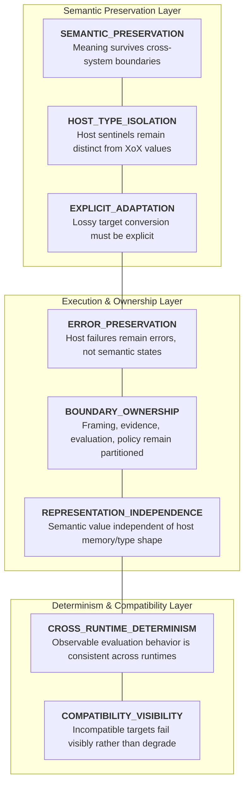
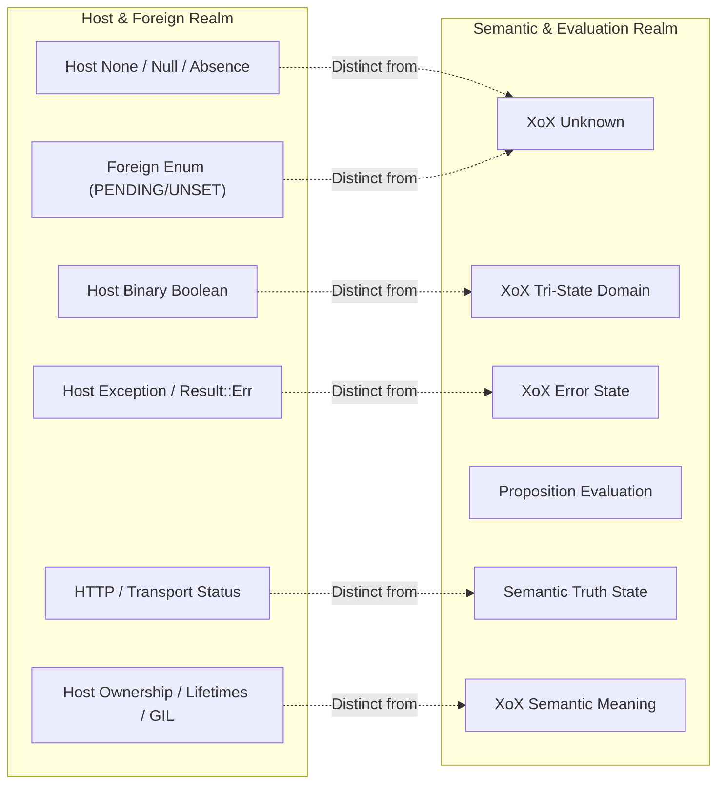
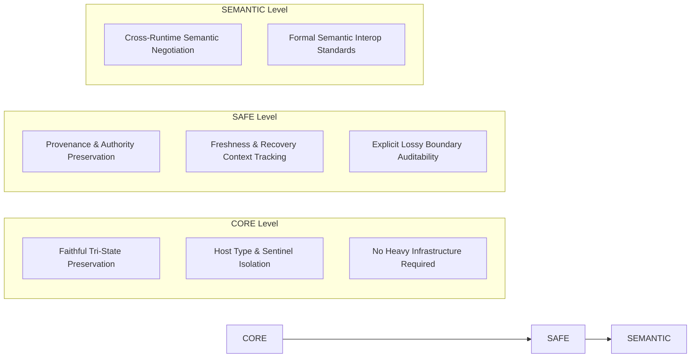

# XoX Conceptual Interoperability Model

This document establishes the minimum conceptual interoperability contract for XoX, defining how semantic meaning survives across language, process, FFI, API, storage, runtime, and host-type boundaries without collapsing `Unknown`, importing host sentinels, fabricating truth, weakening error semantics, or prematurely fixing Rust, Python, PyO3, or ABI implementation details.

---

## 1. Core Principle & The Interoperability Problem

> **Interoperability is the faithful exchange of semantic meaning across host environments; it is never the silent reinterpretation of foreign types as logical truth. XoX values (`True`, `False`, `Unknown`) cross language, process, FFI, and database boundaries safely only when semantic distinctions are preserved or when lossy adaptation is made explicit. Foreign sentinels, nulls, exceptions, absence markers, binary booleans, and status codes carry host-specific meaning and never intrinsically constitute XoX semantic values.**

When systems interface across languages and runtimes, semantic integrity is threatened by false analogies between host constructs and XoX tri-state logic:
- Python `None` or Rust `Option::None` is automatically converted to XoX `Unknown`.
- Database `NULL` or missing JSON fields are silently mapped to `Unknown`.
- Exceptions, network drops, or Rust `Result::Err` are caught and mapped to `Unknown` or `False`.
- Binary host booleans (`true`/`false`) are accepted where XoX tri-state logic is required, or XoX `Unknown` is silently collapsed to `false` for convenience.
- Successful FFI invocation or HTTP `200 OK` is treated as proof that a domain proposition is `True`.
- HTTP `404 Not Found` or foreign error codes are mapped to proposition `False`.
- Foreign enum states (such as `PENDING`, `UNSET`, or `UNDEFINED`) are treated as intrinsic XoX `Unknown`.
- Lossy boundaries strip decision-relevant provenance or authority while claiming semantic equivalence.

The XoX Conceptual Interoperability Model sets unambiguous invariants to guarantee that crossing a runtime, language, or system boundary never distorts semantic meaning.

---

## 2. Interoperability Dimensions

The XoX interoperability contract spans eight foundational dimensions:

| Dimension | Description | Invariant Guarantee |
| :--- | :--- | :--- |
| **`SEMANTIC_PRESERVATION`** | Equivalent XoX meaning survives supported interop boundaries without implicit reinterpretation. | Tri-state logic values maintain identical semantic meaning across foreign runtimes. |
| **`HOST_TYPE_ISOLATION`** | Host-language values, sentinels, and absence markers remain distinct from XoX truth values. | Python `None`, Rust `None`, null, and sentinels have no intrinsic XoX meaning. |
| **`EXPLICIT_ADAPTATION`** | When a foreign target cannot faithfully represent tri-state semantics, the loss or policy choice must be explicit. | Lossy conversion to binary booleans or host defaults is never silent. |
| **`ERROR_PRESERVATION`** | Host, runtime, and boundary failures remain errors under [ERROR_MODEL.md](file:///home/ssr/Desktop/XoX/docs/03_runtime/ERROR_MODEL.md). | Binding exceptions and FFI faults never synthesize `Unknown`, `False`, or `True`. |
| **`BOUNDARY_OWNERSHIP`** | Interoperability preserves clear ownership of framing, evidence, evaluation, and policy. | Crossing a boundary does not conflate transport reception with proposition evaluation. |
| **`REPRESENTATION_INDEPENDENCE`** | Different host representations encode equivalent semantics without making representation identity part of meaning. | Memory layout, class wrappers, or enum tags do not alter semantic truth values. |
| **`CROSS_RUNTIME_DETERMINISM`** | Supported implementations preserve adopted observable evaluation and error behavior. | Python, Rust, or foreign bindings exhibit identical short-circuit and evaluation ordering. |
| **`COMPATIBILITY_VISIBILITY`** | Inability of a target runtime to preserve semantics surfaces as an explicit incompatibility failure. | The runtime halts or rejects incompatible consumers instead of silently degrading. |

---

## 3. Essential Conceptual Distinctions

Clear boundaries must be maintained across host types, transport markers, and semantic states:

1. **XoX `Unknown` versus Python `None`**: `Unknown` indicates proposition truth is unestablished; `None` represents host object absence or uninitialized reference.
2. **XoX `Unknown` versus Rust `Option::None`**: `Unknown` is a valid tri-state logical value; `Option::None` indicates value absence in a type container.
3. **XoX `Unknown` versus database `NULL`**: `Unknown` is logical uncertainty in a proposition; `NULL` represents column value absence or missing database data.
4. **XoX `Unknown` versus missing field**: Missing payload keys represent incomplete data shape, not logical proposition uncertainty.
5. **XoX `Unknown` versus host exception**: An exception is a runtime execution failure, not an established logical state.
6. **XoX `Unknown` versus `Result::Err`**: An error result indicates operation failure, which must not be swallowed into `Unknown`.
7. **XoX `False` versus host failure**: A failed operation or non-zero exit code is an error, not logical refutation of a domain proposition.
8. **XoX Bool domain versus host boolean**: XoX logic is tri-state (`True`, `False`, `Unknown`); host booleans are strictly binary (`true`/`false`).
9. **Semantic value versus host representation**: The logical value is abstract; host memory layouts, objects, or primitive bytes are merely transport carriers.
10. **Boundary decode success versus proposition truth**: Successfully parsing a foreign payload does not establish that the proposition inside is `True`.
11. **Foreign enum case versus XoX state**: Business status enums (e.g., `PENDING`, `IN_REVIEW`) are external domain states, not intrinsic XoX logic values.
12. **Business state versus `Unknown`**: A workflow state indicating pending work is distinct from epistemic uncertainty about a proposition.
13. **Transport/API status versus semantic state**: HTTP `200`, `404`, or `500` describe protocol transport outcomes, not proposition truth values.
14. **FFI success versus semantic correctness**: A successful C ABI or foreign call execution proves only that the call returned without crashing.
15. **Interop compatibility versus serialization compatibility**: Interop covers live type/runtime boundary crossing; serialization covers persistence and wire encoding under [SERIALIZATION_MODEL.md](file:///home/ssr/Desktop/XoX/docs/03_runtime/SERIALIZATION_MODEL.md).
16. **Interop adaptation versus semantic collapse**: Controlled, explicit adaptation at a boundary is legitimate; silent loss of tri-state distinctions is prohibited collapse.
17. **Host conversion versus proposition evaluation**: Converting a data structure across FFI is a representation mapping, not the logical evaluation of a proposition.
18. **Host ownership/lifetime concern versus XoX semantic meaning**: Memory ownership, GC, reference counts, and lifetimes are runtime mechanics that do not affect semantic truth.
19. **Runtime exception mapping versus semantic conversion**: Mapping host exceptions across FFI must preserve them as errors, never convert them into semantic values.
20. **Representation fidelity versus current applicability**: A faithfully transferred foreign value may still be stale, unauthenticated, or inapplicable under current context.

---

## 4. Normative Interoperability Rules

1. **Interop must never infer XoX `Unknown` solely from a foreign `null`, `None`, missing value, absent `Option`, error `Result`, exception, timeout, or sentinel.**
2. **Interop must never infer semantic `False` solely from a host failure or unsuccessful operation.**
3. **A foreign boolean is not automatically a XoX value unless an explicit allowed Bool-to-XoX semantic boundary is invoked.**
4. **A XoX value must not silently collapse into a host boolean when `Unknown` is possible.**
5. **A foreign representation may faithfully carry XoX meaning only when the mapping is unambiguous within the declared interop contract.**
6. **Different host representations may encode the same XoX semantic value without becoming semantically distinct merely because their bytes or object shapes differ.**
7. **Host representation success does not establish proposition truth, freshness, authority, or applicability.**
8. **Host exceptions and binding failures remain errors under [ERROR_MODEL.md](file:///home/ssr/Desktop/XoX/docs/03_runtime/ERROR_MODEL.md).**
9. **Serialized or transferred XoX values crossing an interop boundary remain subject to [SERIALIZATION_MODEL.md](file:///home/ssr/Desktop/XoX/docs/03_runtime/SERIALIZATION_MODEL.md).**
10. **Recovered values crossing an interop boundary remain subject to [RECOVERY_MODEL.md](file:///home/ssr/Desktop/XoX/docs/03_runtime/RECOVERY_MODEL.md).**
11. **Interop must preserve deterministic observable evaluation behavior required by [DETERMINISM.md](file:///home/ssr/Desktop/XoX/docs/03_runtime/DETERMINISM.md).**
12. **Interop may adapt representation but must not silently change proposition framing, evidence meaning, semantic state, authority, provenance, or application policy.**
13. **If a foreign target cannot represent `Unknown` distinctly, native faithful interop is unavailable unless an explicit lossy adaptation/policy boundary is chosen.**
14. **Lossy adaptation must be distinguishable from faithful interop.**
15. **A host-language sentinel may be selected as part of a future concrete encoding only if its meaning is explicit and unambiguous in that contract; no sentinel has intrinsic XoX meaning.**
16. **Foreign API responses, status codes, database results, or tool outputs remain observations/evidence candidates, not intrinsic XoX values.**
17. **Interop must not make successful FFI/API call completion equivalent to semantic success.**
18. **Compatibility failure must surface when a foreign implementation cannot preserve a decision-relevant XoX distinction.**
19. **Implementation details such as memory ownership, lifetimes, GC, reference counting, GIL state, ABI, or object layout must not alter XoX semantic meaning.**
20. **Supported implementations may differ internally but must preserve adopted semantic/error distinctions at their observable boundary.**

---

## 5. Prohibited Failure Modes

The following interoperability failure modes violate the XoX contract:

1. **Python `None` automatically becomes `Unknown`**: Treating `None` return values as semantic `Unknown` instead of host absence or unassigned state.
2. **Rust `Option::None` automatically becomes `Unknown`**: Mapping absent optional fields directly into tri-state `Unknown`.
3. **Rust `Result::Err` automatically becomes `Unknown`**: Catching host operational errors and returning `Unknown`.
4. **Python exception automatically becomes `Unknown`**: Intercepting uncaught Python exceptions at the binding boundary and returning `Unknown`.
5. **Database `NULL` automatically becomes `Unknown`**: Translating SQL `NULL` directly to logical uncertainty without explicit proposition framing.
6. **Missing JSON/API field automatically becomes `Unknown`**: Assuming missing keys in structured payloads imply semantic uncertainty.
7. **Foreign `false` return value interpreted as semantic `False` when indicating operation failure**: Conflating C/POSIX error returns (`0`/`false`) with logical refutation.
8. **XoX `Unknown` converted to Python `False` for convenience**: Collapsing tri-state values into binary booleans in dynamic host scripts.
9. **XoX `Unknown` converted to Rust `false` for convenience**: Downgrading `Unknown` to binary `false` to satisfy boolean interface requirements.
10. **Bool host argument silently accepted where XoX is required**: Implicitly promoting host `bool` to XoX tri-state without an explicit boundary invocation.
11. **FFI call succeeds so application records semantic `True`**: Assuming that a call executing without crash proves the evaluated proposition is `True`.
12. **HTTP 200 automatically interpreted as `True`**: Equating successful transport transmission with positive domain truth.
13. **HTTP 404 automatically interpreted as `False`**: Equating missing endpoint or resource absence with proposition refutation.
14. **Foreign `PENDING`/`UNSET`/`UNKNOWN` enum automatically mapped to XoX `Unknown`**: Ingesting foreign domain enums as intrinsic XoX logical values without evaluation.
15. **Binding catches host exception and returns `Unknown`**: Swallowing FFI exceptions to return fallback `Unknown` states.
16. **Unsupported foreign representation silently drops `Unknown` state**: Discarding `Unknown` variants when serializing to binary-only foreign targets.
17. **Interop adapter strips decision-relevant provenance or authority scope while claiming semantic equivalence**: Discarding metadata across FFI while asserting full equivalence.
18. **Different language binding changes short-circuit/error ordering**: Executing expressions under differing evaluation orders across Python and Rust bindings.
19. **Cross-runtime numeric/string sentinel collision changes XoX meaning**: Overloading integer constants (e.g., `-1`, `0`, `1`) across runtimes such that sentinels collide with data.
20. **Foreign runtime restart causes stale recovered XoX value to be treated as current**: Reusing un-revalidated state across process restarts without freshness checks.

---

## 6. Real-World Interoperability Scenarios

### 6.1 Python Host Integration
- **Scenario**: A Python host function queries an external service and returns `None` when no record is found.
- **Contract Expectation**: The interop layer treats `None` as host absence. It does not automatically manufacture XoX `Unknown`. The application must explicitly evaluate whether absence constitutes domain evidence.

### 6.2 Rust Host Integration
- **Scenario**: A Rust host function returns `Option::None` or `Result::Err(e)` during an evaluation step.
- **Contract Expectation**: `Option::None` remains absence; `Result::Err` remains a runtime execution error. Neither is converted to `Unknown` or `False`.

### 6.3 Python to Rust FFI Boundary
- **Scenario**: A Python caller passes a native `bool` (`True`/`False`) into a Rust-backed core engine expecting a XoX tri-state value.
- **Contract Expectation**: The boundary rejects implicit promotion unless an explicit allowed Bool-to-XoX conversion boundary is invoked.

### 6.4 Rust to Python FFI Boundary
- **Scenario**: A Rust core engine returns a XoX `Unknown` value to a Python caller.
- **Contract Expectation**: The value crosses the boundary as a distinct, inspectable XoX `Unknown` entity. It does not degrade into Python `None`, `False`, or trigger an exception.

### 6.5 Database Integration
- **Scenario**: A database table contains a nullable boolean column with value `NULL`.
- **Contract Expectation**: `NULL` is treated as database-level data absence. It is not automatically converted to XoX `Unknown` without proposition-level interpretation.

### 6.6 HTTP / Web API Integration
- **Scenario**: An external API endpoint returns `HTTP 200 OK` with JSON payload `{"status": "PENDING"}`.
- **Contract Expectation**: `HTTP 200` represents transport success; `"PENDING"` is a foreign domain status. Neither represents an intrinsic XoX value until proposition evaluation occurs.

### 6.7 Plugin & Foreign Runtime Adaptation
- **Scenario**: A third-party legacy plugin accepts only binary boolean values (`true`/`false`), but the XoX engine holds `Unknown`.
- **Contract Expectation**: Native faithful interop is unavailable. The interop layer must report an incompatibility failure unless the caller selects an explicit, declared lossy policy boundary.

### 6.8 AI / Agent Tool Integration
- **Scenario**: An LLM agent tool returns `null`, raises an API error, or returns a custom string `"UNKNOWN"`.
- **Contract Expectation**: Tool `null` is representation absence; tool crash is an operational failure; `"UNKNOWN"` is raw text. None of these synthesize XoX `Unknown` without formal evidence interpretation.

---

## 7. API Level Expectations

### 7.1 CORE Level
- Enforces faithful preservation of `True`, `False`, and `Unknown` across all exposed bindings.
- Enforces strict isolation of host nullability, booleans, and exceptions from XoX logic values.
- Must not require provenance tracking, authority tokens, audit trails, or distributed protocol negotiation.

### 7.2 SAFE Level
- Preserves decision-relevant provenance, freshness timestamps, authority scopes, and audit context across interop boundaries.
- Remains purely conceptual and mechanism-neutral; does not mandate specific serialization formats, FFI frameworks, or storage backends.

### 7.3 SEMANTIC Level
- Future extension point for distributed cross-runtime semantic negotiation and multi-system formal interoperability standards.
- Subject to separate formal adoption and out of scope for baseline engine runtime.

---

## 8. Developer Evaluation Questions

When reviewing interop boundaries, writing language bindings, or integrating external runtimes, developers must ask:

1. **What does this foreign value mean in its own system?**
2. **Is it a semantic value, absence marker, error carrier, transport result, business state, or representation detail?**
3. **Am I explicitly evaluating a proposition, or merely converting host representation?**
4. **Could this host sentinel be confused with XoX `Unknown`?**
5. **Could a host failure be confused with semantic `False`?**
6. **Can the target represent all three XoX states faithfully?**
7. **If not, is this an explicit loss boundary rather than faithful interop?**
8. **Does successful call/parse/decode imply only representation success, not truth?**
9. **Did the boundary preserve decision-relevant context required for downstream reuse?**
10. **Will another supported runtime produce the same observable XoX semantic/error behavior?**
11. **Am I depending on Python/Rust runtime mechanics for meaning that should belong to XoX semantics?**

---

## 9. Developer Testability Criteria

An implementation conforms to this interoperability model if an independent developer can verify:

- **Host Sentinel Isolation**: Tests confirm that Python `None`, Rust `Option::None`, SQL `NULL`, and missing fields never automatically produce XoX `Unknown`.
- **Host Error Isolation**: Tests confirm that host exceptions and `Result::Err` remain errors and never synthesize `Unknown` or `False`.
- **Binary Type Isolation**: Tests confirm that native host booleans are rejected where XoX tri-state values are required unless an explicit conversion boundary is invoked.
- **Representation Independence**: Tests confirm that identical semantic states encoded across different host data structures evaluate with identical logical outcomes.
- **Deterministic Cross-Runtime Behavior**: Tests confirm that Python and Rust bindings execute expressions with identical short-circuit masking and observable error ordering.
- **Explicit Incompatibility**: Tests confirm that attempting to pass `Unknown` into a binary-only foreign consumer fails explicitly rather than silently coercing to `false`.
