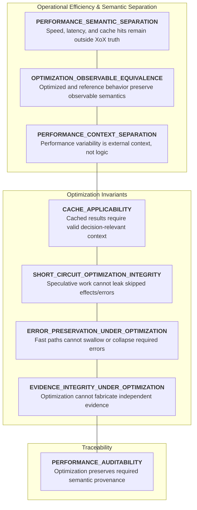
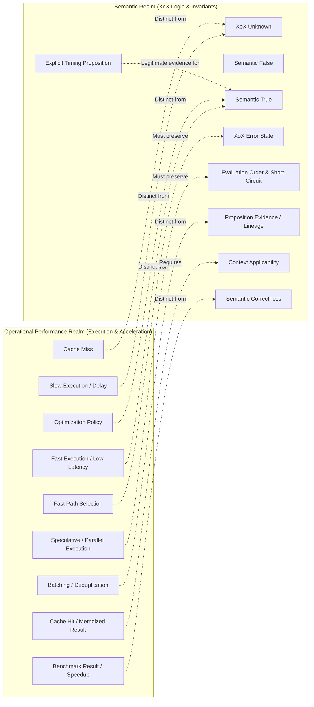
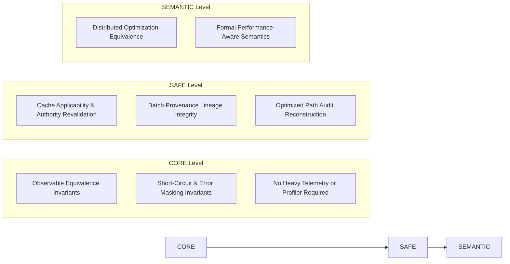

# XoX Conceptual Performance Model

This document establishes the minimum conceptual performance contract for XoX, defining how optimizations—including caching, memoization, batching, parallelism, vectorization, speculative execution, compilation choices, and fast paths—improve efficiency without changing semantic meaning, weakening guarantees, fabricating evidence, bypassing applicability checks, or making performance behavior itself part of XoX truth.

---

## 1. Core Principle & The Performance Problem

> **Performance characteristics reflect execution efficiency in time and physical resources; they do not introduce new XoX truth states. Fast execution, slow execution, latency variations, throughput, cache hits, cache misses, and fast-path selections are operational execution phenomena, never XoX `Unknown`, `False`, or `True`. An optimization is valid if and only if it preserves XoX-controlled observable semantics, suppresses effects and errors from semantically skipped work, and upholds decision-relevant context applicability.**

Performance optimizations intentionally alter how computations execute. Implementations may eliminate redundant calculations, reorder internal operations, precompute intermediate structures, reuse memoized results, batch requests across pipelines, evaluate operations concurrently, or choose optimized fast paths. In production systems, semantic integrity is compromised when performance optimizations distort logical propositions:
- A fast response is automatically assumed to prove proposition `True`.
- A slow or delayed response is silently converted to `Unknown`.
- A cache hit is treated as infallible proof without validating whether underlying context has changed.
- A cache miss is mapped to domain `Unknown`.
- A fast path bypasses freshness or authority revocation checks to shave off latency.
- Batching or parallel execution treats duplicate deliveries or redundant executions as independent corroborating evidence.
- Speculative execution evaluates unselected short-circuit branches and leaks side effects or errors into observable state.
- An optimized fast path swallows an expensive dependency error or collapses `Unknown` to `False` to maintain service-level objectives (SLOs).
- Benchmark success is claimed as formal proof of semantic correctness.

The XoX Conceptual Performance Model sets strict invariants ensuring that speed, efficiency, and optimization choices never compromise logical correctness or bypass adopted runtime and boundary contracts.

---

## 2. Performance Dimensions

The XoX performance contract spans eight foundational dimensions:

| Dimension | Description | Invariant Guarantee |
| :--- | :--- | :--- |
| **`PERFORMANCE_SEMANTIC_SEPARATION`** | Speed, latency, throughput, cache hits, and fast paths remain outside the XoX truth domain. | Faster execution never synthesizes XoX `True`, and slower execution never synthesizes `Unknown` or `False`. |
| **`OPTIMIZATION_OBSERVABLE_EQUIVALENCE`** | Optimized and reference implementations produce identical XoX-controlled observable semantics for equivalent inputs and context. | Optimization changes physical execution mechanics without altering logical outcomes or observable effects. |
| **`CACHE_APPLICABILITY`** | Cached, memoized, or precomputed results are reusable only while decision-relevant context remains valid. | Changed authority, expired freshness, or mutated underlying state invalidates cached result applicability. |
| **`SHORT_CIRCUIT_OPTIMIZATION_INTEGRITY`** | Speculative or parallel execution must not leak observable side effects or errors from semantically skipped work. | Work skipped by logical short-circuit semantics produces zero observable side effects, errors, or mutations. |
| **`EVIDENCE_INTEGRITY_UNDER_OPTIMIZATION`** | Batching, memoization, caching, and duplicate execution cannot fabricate independent evidence. | Optimized execution preserves singular provenance lineages and never amplifies evidence weight. |
| **`ERROR_PRESERVATION_UNDER_OPTIMIZATION`** | Fast paths must preserve required error visibility under [ERROR_MODEL.md](file:///home/ssr/Desktop/XoX/docs/03_runtime/ERROR_MODEL.md). | Latency optimizations cannot swallow evaluated errors or silently collapse `Unknown` into fallback values. |
| **`PERFORMANCE_CONTEXT_SEPARATION`** | Performance variations reflect operational execution context unless timing is explicitly framed as part of the proposition. | Latency differences across runs represent external operational variation under [DETERMINISM.md](file:///home/ssr/Desktop/XoX/docs/03_runtime/DETERMINISM.md). |
| **`PERFORMANCE_AUDITABILITY`** | Optimization must not erase decision-relevant provenance, authority, or applicability history where required. | Optimized lifecycles leave auditable traces under [AUDIT_CONTRACT.md](file:///home/ssr/Desktop/XoX/docs/02_semantic_boundary/AUDIT_CONTRACT.md). |

---

## 3. Essential Conceptual Distinctions

Clear conceptual boundaries must be maintained between operational performance mechanics and semantic propositions:

1. **Fast execution versus `True`**: Completing an operation in minimal time proves execution efficiency, not that a proposition is `True`.
2. **Slow execution versus `Unknown`**: High latency or slow queue execution indicates operational delay, not epistemic uncertainty.
3. **Performance failure versus semantic failure**: Failing to meet an operational latency target is an SLO/performance issue, distinct from proposition `False` or logic failure.
4. **Cache hit versus proposition truth**: Retrieving a stored value proves cached availability; it establishes truth only if the cached entry's context remains applicable.
5. **Cache miss versus `Unknown`**: Needing to compute a value because it is absent from cache is an operational cache miss, not proposition uncertainty.
6. **Memoization versus semantic authority**: Memoizing an evaluation caches an intermediate outcome; it confers no independent semantic authority.
7. **Precomputation versus current applicability**: Precomputing values in advance establishes historical results; current use requires validating that underlying state has not mutated.
8. **Batching versus independent evidence**: Processing multiple requests together in a batch optimizes throughput; it does not multiply evidence weight.
9. **Duplicate optimized work versus corroboration**: Redundantly executing optimized paths produces duplicate computations, not independent corroborating witnesses.
10. **Parallelism versus semantic ordering**: Executing sub-tasks in parallel changes physical instruction concurrency; it does not alter XoX logical evaluation order.
11. **Speculative work versus evaluated work**: Speculative execution anticipates potential paths; work that is semantically skipped must remain completely unobservable.
12. **Optimization reordering versus observable evaluation order**: Reordering internal instructions for CPU/compiler efficiency is permitted only if XoX-observable order and short-circuit masking are strictly preserved.
13. **Fast path versus weakened checks**: A fast path optimizes execution paths for common cases; it must never bypass security, authority, or freshness checks.
14. **Performance regression versus correctness regression**: Slower execution is a performance regression; producing an incorrect value or leaking an error is a correctness failure.
15. **Benchmark result versus semantic guarantee**: Benchmark numbers demonstrate empirical throughput; they do not establish formal semantic correctness guarantees.
16. **Timing observation versus proposition evidence**: Measuring latency records physical time; it is not evidence for an unrelated business proposition.
17. **Timing-based proposition versus unrelated proposition**: A timing observation is legitimate evidence for an explicitly framed proposition about deadlines or latency, but not for an unrelated business predicate.
18. **Implementation speedup versus semantic equivalence**: Increasing execution speed is an engineering improvement; it is acceptable only when semantic equivalence is preserved.
19. **Resource efficiency versus semantic collapse**: Reducing memory/CPU usage via optimization is valid; collapsing tri-state `Unknown` into `False` to save resources is invalid.
20. **Optimization policy versus XoX truth**: Policies governing caching, prefetching, batching, and worker scaling remain runtime operational policies, never domain truth.

---

## 4. Normative Performance Rules

1. **Performance characteristics do not add new XoX truth states.**
2. **Fast execution is not semantic `True`.**
3. **Slow execution is not semantic `Unknown` or `False`.**
4. **A cache hit does not establish proposition truth.**
5. **A cache miss does not establish `Unknown`.**
6. **Cached or memoized semantic results may be reused only when decision-relevant applicability remains valid.**
7. **Optimization must not bypass freshness, authority, provenance, framing, or context checks required by adopted contracts.**
8. **Optimized execution must preserve XoX-controlled observable value, effect, error, and short-circuit behavior for equivalent semantic inputs and equivalent decision-relevant context.**
9. **Internal computation may differ when the difference is not XoX-observable and does not weaken adopted guarantees.**
10. **Speculative execution may occur only if work that is semantically skipped produces no XoX-observable effect, error, state mutation, or evidence.**
11. **Optimization must not turn duplicate execution, batching, cache reuse, or memoization into independent evidence automatically.**
12. **A fast path cannot silently convert errors into fallback semantic values.**
13. **A fast path cannot silently collapse `Unknown`.**
14. **A fast path cannot bypass current authority applicability.**
15. **A precomputed historical result does not automatically remain currently applicable.**
16. **Optimization-induced retry or recomputation may observe new context and is not automatically the same semantic evaluation.**
17. **Performance variation does not violate [DETERMINISM.md](file:///home/ssr/Desktop/XoX/docs/03_runtime/DETERMINISM.md) when observable operational context differs.**
18. **For equivalent semantic inputs and equivalent decision-relevant observable context, optimization must preserve adopted deterministic XoX-visible behavior.**
19. **Timing may be valid evidence only when the explicitly framed proposition concerns timing, latency, responsiveness, deadline satisfaction, or another timing-sensitive property.**
20. **Timing has no intrinsic semantic meaning for unrelated propositions.**
21. **Performance policy such as cache, prefetch, batch, parallelize, degrade, prioritize, or shed work remains implementation/runtime policy.**
22. **Performance optimization must respect [RESOURCE_MODEL.md](file:///home/ssr/Desktop/XoX/docs/03_runtime/RESOURCE_MODEL.md) rather than converting resource savings into semantic meaning.**
23. **Async optimization remains subject to [ASYNC_MODEL.md](file:///home/ssr/Desktop/XoX/docs/03_runtime/ASYNC_MODEL.md).**
24. **Concurrent optimization remains subject to [CONCURRENCY_MODEL.md](file:///home/ssr/Desktop/XoX/docs/03_runtime/CONCURRENCY_MODEL.md).**
25. **Cross-language optimized paths remain subject to [INTEROP_MODEL.md](file:///home/ssr/Desktop/XoX/docs/03_runtime/INTEROP_MODEL.md).**
26. **Persisted cached/precomputed values remain subject to [SERIALIZATION_MODEL.md](file:///home/ssr/Desktop/XoX/docs/03_runtime/SERIALIZATION_MODEL.md).**
27. **Recovered optimized state remains subject to [RECOVERY_MODEL.md](file:///home/ssr/Desktop/XoX/docs/03_runtime/RECOVERY_MODEL.md).**
28. **Optimization failures remain subject to [ERROR_MODEL.md](file:///home/ssr/Desktop/XoX/docs/03_runtime/ERROR_MODEL.md).**
29. **Decision-relevant optimized-path history remains reconstructable where [AUDIT_CONTRACT.md](file:///home/ssr/Desktop/XoX/docs/02_semantic_boundary/AUDIT_CONTRACT.md) requires it.**
30. **No optimization is valid merely because it is faster; semantic preservation is the acceptance condition.**

---

## 5. Prohibited Failure Modes

The following performance failure modes violate the XoX contract:

1. **Fast response automatically treated as `True`**: Assuming a sub-millisecond execution response proves a predicate is `True`.
2. **Slow response automatically treated as `Unknown`**: Converting a high-latency query into domain epistemic uncertainty.
3. **Cache miss mapped to `Unknown`**: Returning tri-state `Unknown` when an entry is absent from an operational cache.
4. **Cache hit treated as proof**: Treating the presence of a cached record as infallible proof without verifying context applicability.
5. **Stale cached `True` reused because fast path skips revalidation**: Reusing a cached decision on a fast path after the underlying state has mutated.
6. **Memoized authorization result reused after revocation**: Skipping capability validation on an optimized path after the user's token was revoked.
7. **Batch of duplicate observations counted as independent corroboration**: Combining batched copies of the same message and treating them as multiple distinct evidence sources.
8. **Parallel fast path changes semantic combination order**: Reordering operand evaluations during parallel acceleration in a manner that alters non-commutative semantic outcomes.
9. **Speculative skipped branch leaks side effect**: Speculatively running a short-circuited expression branch whose mutations persist into shared state.
10. **Speculative skipped branch leaks error**: Surfacing an exception from a speculatively executed branch that logical short-circuiting declared skipped.
11. **Fast path swallows an evaluated error**: Catching an unhandled exception inside an optimized routine and returning a default value to maintain throughput.
12. **Fast path collapses `Unknown` to avoid expensive handling**: Forcing domain `Unknown` to `False` to avoid triggering secondary evaluation pipelines.
13. **Precomputed result reused after decision-relevant context changed**: Serving a precalculated proposition after its dependencies or assumptions have drifted.
14. **Optimization retry treated as identical evaluation despite new external observation**: Silently treating an optimization-triggered retry as the exact same observation despite environmental state changes.
15. **Benchmark success claimed as semantic correctness proof**: Citing high request throughput or low latency as evidence that semantic evaluation logic is correct.
16. **Performance regression treated as semantic failure without correctness change**: Marking an evaluation logically invalid solely because execution exceeded a soft latency target.
17. **Different latency across runs labeled evaluator nondeterminism**: Misreporting engine non-determinism when runs differed only in execution duration.
18. **Foreign optimized path maps performance sentinel to `Unknown`**: Interop FFI layer converting foreign timeout/slowdown sentinels directly into XoX `Unknown`.
19. **Resource-saving degraded mode weakens semantics**: Dropping precision or altering truth values under load to conserve CPU or memory.
20. **AI agent chooses fastest tool response as semantically authoritative**: An AI agent harness prioritizing tool responses based on network latency rather than declared evidence provenance and authority.

---

## 6. Real-World Performance Scenarios

### 6.1 Cached Authorization
- **Scenario**: A fast path checks a local memoization table for an authorization decision. Concurrently, the user's privilege capability was revoked in identity storage.
- **Contract Expectation**: Optimization must preserve current authority applicability. The fast path must validate that the cached authorization is still valid, rather than blindly reusing revoked permissions.

### 6.2 Memoized Proposition
- **Scenario**: A complex predicate evaluates to `True` and is memoized. A background worker subsequently mutates the decision-relevant database record upon which the predicate depends.
- **Contract Expectation**: Memoization preserves applicability rather than treating cache identity as truth. Future evaluations must detect context invalidation and recompute rather than serving stale `True`.

### 6.3 Parallel Short-Circuit
- **Scenario**: In an expression `A OR B`, a parallel execution runtime starts both `A` and `B` simultaneously to optimize latency. `A` returns `True`.
- **Contract Expectation**: `B` is semantically short-circuited. Any side effects, mutations, or errors produced by `B` during speculative execution must remain strictly suppressed and unobservable.

### 6.4 Batch Evidence
- **Scenario**: A high-throughput consumer receives a batch containing multiple duplicate deliveries of an evidence message due to queue retries.
- **Contract Expectation**: Batch processing must preserve singular provenance lineage under [PROVENANCE_MODEL.md](file:///home/ssr/Desktop/XoX/docs/02_semantic_boundary/PROVENANCE_MODEL.md). The duplicate messages do not multiply evidence weight or synthesize independent corroboration.

### 6.5 Fast Error Path
- **Scenario**: An optimized fast path encounters an expensive dependency failure and attempts to substitute `False` to maintain sub-5ms response SLOs.
- **Contract Expectation**: [ERROR_MODEL.md](file:///home/ssr/Desktop/XoX/docs/03_runtime/ERROR_MODEL.md) remains authoritative over latency goals. The failure must surface as an operational error rather than being disguised as semantic proposition `False`.

### 6.6 Timing Proposition
- **Scenario**: An application frames the explicit proposition: *"The payment gateway responded within the mandatory 250ms SLA window."*
- **Contract Expectation**: Because the proposition is explicitly about latency, physical timing observations legitimately participate as domain evidence. If execution took 300ms, the proposition legitimately evaluates to `False` from evidence.

### 6.7 Cross-Language Fast Path
- **Scenario**: A Rust engine implementation uses SIMD and zero-copy buffers, while a Python fallback uses standard iteration.
- **Contract Expectation**: Both implementations are fully valid if and only if they produce identical XoX-controlled observable semantics, error visibility, and short-circuit behavior for equivalent inputs.

### 6.8 AI / Agent Racing Tools
- **Scenario**: An AI agent harness dispatches three verification tool queries in parallel and selects whichever returns first to minimize response latency.
- **Contract Expectation**: Completion latency conveys zero semantic authority. The harness cannot prioritize evidence based on network speed unless the decision policy explicitly specifies first-response semantics.

---

## 7. Precision Requirements & Boundaries

To prevent semantic distortions while allowing aggressive engineering optimization:

1. **No timing identity required**: Optimized and reference implementations are not required to have identical execution time, instruction counts, memory allocations, or internal scheduler traces.
2. **Observable equivalence scoped to XoX semantics**: Observable equivalence concerns XoX-controlled value, effect, error, and short-circuit behavior, not implementation details outside the adopted semantic contract.
3. **Applicable caching is fully supported**: Caching, memoization, and precomputation are encouraged whenever decision-relevant context applicability, freshness, and authority are maintained.
4. **Speculation permitted under strict masking**: Speculative execution is valid provided that any work semantically skipped produces zero XoX-observable side effects, errors, or evidence leakage.
5. **Context-dependent timing evidence**: Timing observations have no intrinsic semantic meaning for general propositions, but may serve as legitimate evidence when the explicitly framed proposition directly concerns latency, deadlines, or responsiveness.
6. **No mandatory provenance infrastructure at CORE**: CORE forbids automatic evidence amplification from duplicate work without requiring full provenance graph infrastructure.
7. **No concrete performance targets**: The contract defines no latency numbers, throughput targets, hardware benchmarks, compiler choices, or algorithmic implementations.

---

## 8. API Level Expectations

### 8.1 CORE Level
- Requires optimization not to alter `True`, `False`, or `Unknown` meaning, short-circuit semantics, or required error visibility.
- Permits caching, memoization, batching, and fast paths when XoX-visible semantics remain correct.
- Must not require persistent performance telemetry, provenance graphs, audit storage, or specific optimization algorithms.

### 8.2 SAFE Level
- Requires preservation and revalidation of decision-relevant provenance, freshness, authority, applicability, and optimization-path history where required.
- Remains purely conceptual and mechanism-neutral; does not prescribe specific caches, JITs, compilers, schedulers, profilers, or optimization strategies.

### 8.3 SEMANTIC Level
- Future extension point for distributed optimization contracts, multi-node fast paths, and formal performance-aware semantic guarantees.
- Subject to separate formal adoption and out of scope for baseline engine runtime.

---

## 9. Developer Evaluation Questions

When designing optimizations, implementing fast paths, or tuning runtime performance, developers must ask:

1. **Is this faster path semantically equivalent, or merely faster?**
2. **Did this cache entry remain applicable to the current decision context?**
3. **Did optimization bypass freshness or authority validation?**
4. **Did speculative work expose an effect or error that semantics says should be skipped?**
5. **Did batching or duplicate work accidentally amplify evidence?**
6. **Did a fast path swallow an error or collapse `Unknown`?**
7. **Did performance-driven retry observe new context?**
8. **Am I treating latency or completion order as semantic authority?**
9. **Is timing actually part of the proposition I framed?**
10. **Am I mistaking benchmark success for semantic correctness?**

---

## 10. Developer Testability Criteria

An implementation conforms to this performance model if an independent developer can verify:

- **Performance Semantic Isolation**: Tests confirm that fast execution does not synthesize `True` and slow execution does not synthesize `Unknown` or `False`.
- **Stale Cache Invalidation**: Tests confirm that cached or memoized results are rejected when underlying decision-relevant state has mutated.
- **Authority Revalidation Under Fast Paths**: Tests confirm that fast paths detect capability revocation and refuse unauthorized reuse.
- **Speculative Short-Circuit Suppression**: Tests confirm that parallel branch speculation never leaks observable side effects or errors from semantically skipped operands.
- **Batch Lineage Integrity**: Tests confirm that batched duplicate messages maintain a singular provenance identity without multiplying evidence weight.
- **Fast-Path Error & Unknown Integrity**: Tests confirm that fast paths do not swallow evaluated errors into fallback values or collapse `Unknown` to `False`.
- **Explicit Timing Evidence Scoping**: Tests confirm that timing metrics serve as evidence only for explicitly timing-related propositions.
- **Cross-Domain Conceptual Transfer**: Tests confirm that performance invariants transfer cleanly across Python, Rust, APIs, caches, queues, databases, and AI agents.
