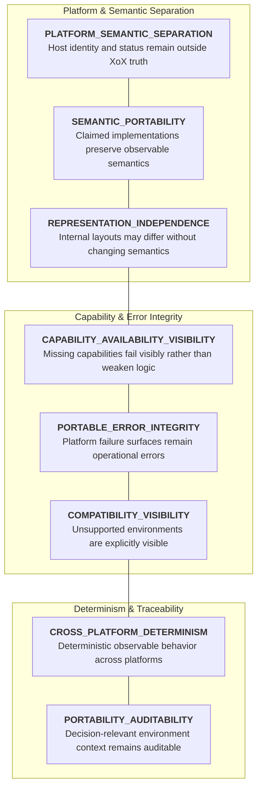
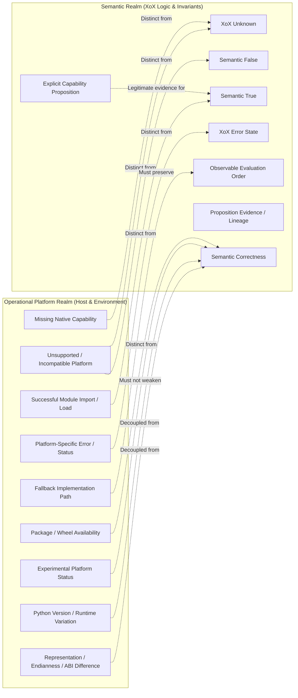
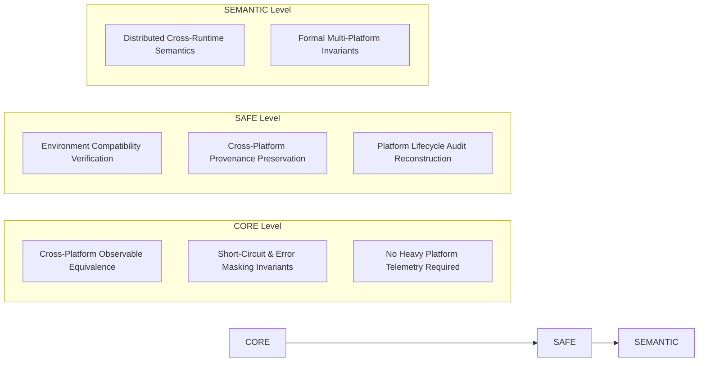

# XoX Conceptual Portability Model

This document establishes the minimum conceptual portability contract for XoX, defining how differences among supported runtimes, operating systems, CPU architectures, Python versions, build environments, packaging formats, and future implementation targets preserve semantic meaning without fabricating platform-specific truth, weakening guarantees, or making implementation-specific behavior part of the language contract.

---

## 1. Core Principle & The Portability Problem

> **Platform, runtime, architecture, packaging, and implementation differences are physical execution host attributes; they do not introduce new XoX truth states. An unsupported runtime, incompatible architecture, missing native capability, platform error, or packaging variant is an operational or environmental fact, never XoX `Unknown`, `False`, or `True`. An implementation claiming to support the XoX contract must preserve all XoX-controlled observable semantics regardless of underlying platform mechanics.**

XoX is designed to execute across heterogeneous execution environments, including diverse operating systems, CPU architectures, Python versions, build toolchains, and distribution packages. In production systems, semantic integrity is compromised when platform variability is conflated with logical propositions:
- An unsupported platform or incompatible runtime is automatically mapped to `Unknown`.
- A missing platform capability (such as a hardware feature or system call) is silently treated as proposition `False`.
- Successful module import, package installation, or native initialization is assumed to prove proposition `True`.
- A platform-specific fallback implementation silently collapses `Unknown` to `False` or drops security and authority validation.
- Differences in CPU architecture, memory endianness, or calling conventions alter observable evaluation order or short-circuit behavior.
- Native representations that cannot represent `Unknown` silently substitute null, 0, or `False`.
- An experimental platform status is used as an excuse to deliver weaker semantic guarantees.
- Platform-specific sentinels or error codes are translated directly into domain proposition values.

The XoX Conceptual Portability Model sets strict invariants ensuring that platform heterogeneity, host capability differences, and packaging variations never distort logical correctness.

---

## 2. Portability Dimensions

The XoX portability contract spans eight foundational dimensions:

| Dimension | Description | Invariant Guarantee |
| :--- | :--- | :--- |
| **`PLATFORM_SEMANTIC_SEPARATION`** | Platform, runtime, architecture, and packaging identities remain outside the XoX truth domain. | Platform incompatibility never synthesizes XoX `Unknown`, `False`, or `True`. |
| **`SEMANTIC_PORTABILITY`** | Any implementation claiming a supported XoX contract preserves XoX-visible semantics for equivalent inputs and context. | Semantics remain identical across all claimed supported platforms. |
| **`CAPABILITY_AVAILABILITY_VISIBILITY`** | A platform lacking a required capability must fail visibly rather than silently weakening semantics. | Missing host capabilities raise operational errors under [ERROR_MODEL.md](file:///home/ssr/Desktop/XoX/docs/03_runtime/ERROR_MODEL.md). |
| **`REPRESENTATION_INDEPENDENCE`** | Internal memory layouts, data structures, and ABIs may differ across platforms without altering semantic identity. | Physical representation differences are completely decoupled from logical value identity. |
| **`PORTABLE_ERROR_INTEGRITY`** | Platform-specific errors and exceptions remain operational conditions rather than semantic truth. | Host failure codes are never mapped directly to proposition `False` or `Unknown`. |
| **`CROSS_PLATFORM_DETERMINISM`** | Supported implementations preserve adopted deterministic XoX-visible behavior without requiring identical host traces. | Observable values, effects, and errors remain deterministic under [DETERMINISM.md](file:///home/ssr/Desktop/XoX/docs/03_runtime/DETERMINISM.md). |
| **`COMPATIBILITY_VISIBILITY`** | Unsupported, experimental, or incompatible environments are not misrepresented as fully supported semantic equivalents. | Compatibility status is exposed explicitly rather than masked via degraded semantics. |
| **`PORTABILITY_AUDITABILITY`** | Decision-relevant environment and compatibility context remains reconstructable where required. | Platform lifecycles leave auditable traces under [AUDIT_CONTRACT.md](file:///home/ssr/Desktop/XoX/docs/02_semantic_boundary/AUDIT_CONTRACT.md). |

---

## 3. Essential Conceptual Distinctions

Clear conceptual boundaries must be maintained between operational platform phenomena and semantic propositions:

1. **Platform support versus proposition truth**: Supporting an operating system or runtime is an operational engineering status, not a semantic truth value.
2. **Unsupported platform versus `Unknown`**: Running on an unsupported OS or CPU architecture indicates compatibility failure, not domain epistemic uncertainty.
3. **Incompatible runtime versus `False`**: An ABI mismatch or missing runtime component indicates execution incompatibility, not logical proposition refutation.
4. **Successful import/load versus `True`**: Successfully loading a native library or importing a module proves binary compatibility, not that a proposition is `True`.
5. **Missing native capability versus semantic uncertainty**: A platform lacking a specific hardware or OS feature is an environmental limitation, not domain `Unknown`.
6. **Platform-specific error versus proposition refutation**: A native OS error code is an operational failure under [ERROR_MODEL.md](file:///home/ssr/Desktop/XoX/docs/03_runtime/ERROR_MODEL.md), not proposition `False`.
7. **Representation difference versus semantic difference**: Differences in memory layout, alignment, or byte order reflect physical encoding, not semantic value divergence.
8. **Endianness/layout/ABI difference versus XoX state**: Endianness or struct packing is an internal detail, completely distinct from XoX truth states.
9. **Python version difference versus proposition context**: Running on different Python minor versions represents runtime variation, not proposition context drift.
10. **Implementation difference versus semantic divergence**: Two implementations may use completely different internal algorithms while remaining semantically identical.
11. **Performance difference versus portability failure**: Slower execution on a less-optimized platform is a performance difference under [PERFORMANCE_MODEL.md](file:///home/ssr/Desktop/XoX/docs/03_runtime/PERFORMANCE_MODEL.md), not a semantic portability failure.
12. **Resource difference versus semantic difference**: Platform differences in memory overhead or stack limits are operational constraints under [RESOURCE_MODEL.md](file:///home/ssr/Desktop/XoX/docs/03_runtime/RESOURCE_MODEL.md), not semantic differences.
13. **Scheduler/thread difference versus semantic authority**: Variations in OS thread scheduling convey zero semantic authority.
14. **Package installation success versus semantic correctness**: A successful package installation demonstrates artifact delivery; it does not prove logical semantic correctness.
15. **Wheel availability versus language semantics**: The presence or absence of a precompiled binary wheel is a distribution detail, distinct from language semantics.
16. **Experimental support versus weaker semantics**: Experimental platform status denotes validation confidence; it never authorizes weakened semantic guarantees.
17. **Unsupported environment versus best-effort semantic reinterpretation**: An unsupported platform must fail visibly rather than silently guessing or reinterpreting semantic rules.
18. **Host capability detection versus semantic evaluation**: Probing whether an OS feature is present checks host capabilities; it does not evaluate business propositions.
19. **Cross-platform serialization compatibility versus identical byte representation**: Cross-platform portability requires semantic roundtrip under [SERIALIZATION_MODEL.md](file:///home/ssr/Desktop/XoX/docs/03_runtime/SERIALIZATION_MODEL.md), not identical binary memory dumps.
20. **Portable semantics versus identical implementation**: Portability guarantees invariant XoX-controlled observable behavior, not identical internal code across all platforms.

---

## 4. Normative Portability Rules

1. **Platform, runtime, architecture, packaging, or implementation identity does not add a XoX truth state.**
2. **Unsupported, unavailable, or incompatible environments are not intrinsically XoX `Unknown` or `False`.**
3. **Successful import, load, build, installation, or native initialization is not semantic `True`.**
4. **A platform lacking a required capability must fail visibly or be declared incompatible rather than silently weakening XoX guarantees.**
5. **Experimental platform status must not imply weaker semantics; it reflects support confidence or validation status, not a different truth model.**
6. **An implementation must not claim semantic support for an environment where adopted XoX-visible guarantees cannot be preserved.**
7. **Internal representation, memory layout, ABI, calling convention, allocator, scheduling, instruction selection, and optimization strategy may differ when XoX-visible semantics remain preserved.**
8. **Equivalent semantic inputs and equivalent decision-relevant context must preserve adopted XoX-visible value, effect, error, short-circuit, and applicability behavior across implementations claiming the same supported contract.**
9. **Cross-platform determinism concerns XoX-visible semantics, not identical host execution traces, timing, allocation patterns, or scheduling.**
10. **Platform-specific errors remain aligned with [ERROR_MODEL.md](file:///home/ssr/Desktop/XoX/docs/03_runtime/ERROR_MODEL.md).**
11. **Resource differences remain aligned with [RESOURCE_MODEL.md](file:///home/ssr/Desktop/XoX/docs/03_runtime/RESOURCE_MODEL.md).**
12. **Performance differences remain aligned with [PERFORMANCE_MODEL.md](file:///home/ssr/Desktop/XoX/docs/03_runtime/PERFORMANCE_MODEL.md).**
13. **Async behavior remains aligned with [ASYNC_MODEL.md](file:///home/ssr/Desktop/XoX/docs/03_runtime/ASYNC_MODEL.md).**
14. **Concurrent behavior remains aligned with [CONCURRENCY_MODEL.md](file:///home/ssr/Desktop/XoX/docs/03_runtime/CONCURRENCY_MODEL.md).**
15. **Foreign/native runtime crossings remain aligned with [INTEROP_MODEL.md](file:///home/ssr/Desktop/XoX/docs/03_runtime/INTEROP_MODEL.md).**
16. **Persisted/transferred values remain aligned with [SERIALIZATION_MODEL.md](file:///home/ssr/Desktop/XoX/docs/03_runtime/SERIALIZATION_MODEL.md).**
17. **Recovered values remain aligned with [RECOVERY_MODEL.md](file:///home/ssr/Desktop/XoX/docs/03_runtime/RECOVERY_MODEL.md).**
18. **A representation that cannot faithfully carry `Unknown` cannot silently collapse it; faithful interop/serialization is unavailable unless an explicit compatible representation exists.**
19. **Platform-specific sentinels, error codes, nulls, status values, and capability probes have no intrinsic XoX meaning.**
20. **Different platform capabilities may constitute different operational context without becoming evaluator nondeterminism.**
21. **Portability policy such as support, deprecate, disable, fallback, emulate, or require another build remains product/runtime policy, not semantic truth.**
22. **Fallback implementation paths are acceptable only when they preserve the same adopted semantic guarantees.**
23. **A platform fallback cannot convert `Unknown`, swallow required errors, bypass authority/freshness checks, or alter short-circuit semantics.**
24. **No environment receives fewer semantic guarantees merely because its implementation uses a different mechanism.**
25. **Support claims must be distinguishable from semantic claims.**

---

## 5. Prohibited Failure Modes

The following portability failure modes violate the XoX contract:

1. **Unsupported platform mapped to `Unknown`**: Returning tri-state `Unknown` when executed on an unsupported OS or hardware architecture.
2. **Incompatible runtime mapped to `False`**: Treating an incompatible runtime or library version as proposition refutation.
3. **Successful native module load treated as `True`**: Assuming that successful dynamic library loading establishes a proposition is `True`.
4. **Missing CPU/platform capability causes silent Bool fallback**: Silently falling back to binary `True`/`False` logic because a native vector or type cannot represent `Unknown`.
5. **Platform fallback collapses `Unknown`**: A pure-software fallback path forcing `Unknown` to `False` to simplify execution.
6. **Experimental platform silently uses weaker semantics**: Delivering reduced error visibility or altered short-circuiting on experimental targets.
7. **Windows/macOS/Linux implementation changes short-circuit behavior**: Evaluating operands differently across operating systems for the same logical expression.
8. **Different architecture changes observable evaluation order**: Reordering expression operand execution across x86_64 and aarch64 in a way that alters observable effects.
9. **Platform-specific optimization swallows evaluated errors**: A platform-optimized fast path catching and suppressing an exception that reference implementations surface.
10. **Native representation cannot carry `Unknown` and silently maps it to null/`False`**: FFI boundary coercing `Unknown` into null or zero due to language type constraints.
11. **Package installation success used as semantic correctness proof**: Claiming that clean `pip install` or package resolution guarantees correctness of semantic evaluation.
12. **Wheel unavailability interpreted as proposition failure**: Treating the absence of a prebuilt wheel as evidence that a domain proposition is `False`.
13. **Different performance across platforms labeled semantic divergence**: Mislabeling execution speed differences across hardware as engine semantic divergence.
14. **Different resource behavior across platforms labeled evaluator nondeterminism**: Misreporting engine non-determinism when memory caps differ across operating systems.
15. **Platform-specific sentinel mapped directly to XoX `Unknown`**: Translating host status codes (e.g. `ENOTSUP`, `STATUS_NOT_IMPLEMENTED`) into tri-state `Unknown`.
16. **Unsupported platform advertised as supported because tests happen to pass locally**: Claiming formal platform support without verifying all invariant guarantees across the test suite.
17. **Fallback implementation skips authority validation**: A fallback implementation path omitting capability checks to minimize dependencies.
18. **Cross-platform cached state reused despite incompatible semantic context**: Reusing cached evaluations across platforms without verifying semantic compatibility.
19. **Host scheduling difference grants semantic priority**: Prioritizing evidence based on OS thread scheduling differences.
20. **AI/Agent deployment treats tool-platform availability as proposition truth**: An AI agent recording proposition `False` merely because a verification tool binary is unavailable on the current host.

---

## 6. Real-World Portability Scenarios

### 6.1 Unsupported Runtime
- **Scenario**: An application attempts to execute XoX on a runtime or environment that is not currently supported by the product.
- **Contract Expectation**: The runtime raises an operational incompatibility error under [ERROR_MODEL.md](file:///home/ssr/Desktop/XoX/docs/03_runtime/ERROR_MODEL.md). It must not synthesize XoX `Unknown` or attempt best-effort semantic reinterpretation.

### 6.2 Missing Native Capability
- **Scenario**: A host lacks an optional native vector extension or system call used by the accelerated implementation path.
- **Contract Expectation**: The engine either fails visibly with an operational error or selects a semantics-preserving fallback path that strictly preserves all XoX-visible guarantees, error visibility, and `Unknown` representations.

### 6.3 Different Operating Systems
- **Scenario**: XoX executes on Linux using epoll and on another supported OS using its native event mechanism.
- **Contract Expectation**: Both implementations produce identical XoX-controlled observable semantics, evaluation order, short-circuit masking, and error visibility, despite different underlying OS primitives.

### 6.4 Different CPU Architectures
- **Scenario**: Internal integer and pointer representations differ across 64-bit and 32-bit architectures, or across different byte-endian hardware.
- **Contract Expectation**: The physical architecture differences remain completely invisible to XoX logical evaluations. All XoX truth values, short-circuit semantics, and determinism guarantees remain invariant.

### 6.5 Cross-Platform Serialization
- **Scenario**: A proposition result is computed on Platform A, serialized to disk/network, and deserialized on Platform B.
- **Contract Expectation**: Under [SERIALIZATION_MODEL.md](file:///home/ssr/Desktop/XoX/docs/03_runtime/SERIALIZATION_MODEL.md), the value deserialized on Platform B is semantically identical to the value computed on Platform A, even if memory layout on the two platforms differs.

### 6.6 Fallback Path Integrity
- **Scenario**: A high-performance native C/Rust extension is unavailable, triggering fallback to a pure-Python reference path.
- **Contract Expectation**: The fallback implementation is valid if and only if it produces identical XoX-visible results, preserves `Unknown`, enforces short-circuit masking, and surfaces identical evaluated errors.

### 6.7 Foreign Platform Sentinel
- **Scenario**: A platform API returns an operational status code such as `PLATFORM_UNAVAILABLE` or `FEATURE_NOT_SUPPORTED`.
- **Contract Expectation**: The interop layer converts the status to an operational error under [INTEROP_MODEL.md](file:///home/ssr/Desktop/XoX/docs/03_runtime/INTEROP_MODEL.md) and [ERROR_MODEL.md](file:///home/ssr/Desktop/XoX/docs/03_runtime/ERROR_MODEL.md). It does not synthesize `Unknown` or `False`.

### 6.8 AI / Agent Multi-Platform Deployment
- **Scenario**: An AI agent harness deploys across diverse cloud container environments where some tool dependencies are available on Linux but absent on other images.
- **Contract Expectation**: Missing tool binaries are handled as operational capability failures. The harness does not treat tool absence as proof that a business proposition is `False` or uncertain (`Unknown`).

---

## 7. Precision Requirements & Boundaries

To preserve semantic integrity across platforms:

1. **Semantic portability is not implementation identity**: Different platforms may use entirely different internal algorithms, memory layouts, and optimizations, provided XoX-visible semantics match.
2. **No timing or resource identity required**: Implementations are not required to have identical execution time, instruction count, heap usage, or thread scheduling across platforms.
3. **No universal platform support implied**: XoX is not required to support every existing platform; compatibility claims apply strictly to declared supported environments.
4. **No unauthorized platform upgrades**: Experimental or unsupported platforms cannot be treated as supported without formal validation against all adopted guarantees.
5. **Experimental status cannot weaken semantics**: Developing support for a new platform allows operational bugs, but never permits altering or weakening semantic truth definitions.
6. **Semantics-preserving fallbacks are fully supported**: Fallbacks (such as pure-software paths when hardware acceleration is missing) are permitted when all XoX guarantees survive.
7. **Serialization focuses on semantic roundtrip**: Cross-platform portability requires semantic preservation, not byte-for-byte memory dump identity unless mandated by [SERIALIZATION_MODEL.md](file:///home/ssr/Desktop/XoX/docs/03_runtime/SERIALIZATION_MODEL.md).
8. **Platform probes are not business evidence**: Capability detection probes check platform features; they become domain evidence only when the explicitly framed proposition directly concerns platform capabilities.
9. **No concrete packaging or build specifications**: This model defines conceptual portability contracts and does not fix wheel tags, compiler flags, ABI choices, or toolchain commands.

---

## 8. API Level Expectations

### 8.1 CORE Level
- Requires any claimed supported implementation to preserve `True`, `False`, and `Unknown` meaning, Bool/XoX isolation, short-circuit semantics, and required error visibility.
- Permits platform-specific implementation mechanisms and semantics-preserving fallback paths.
- Must not require cross-platform audit infrastructure, platform telemetry, or universal runtime support.

### 8.2 SAFE Level
- Requires preservation and validation of decision-relevant platform compatibility context, provenance, authority, and reconstructability where needed.
- Remains purely conceptual and mechanism-neutral; does not prescribe specific OS, ABI, packaging, compiler, or runtime implementations.

### 8.3 SEMANTIC Level
- Future extension point for formal multi-platform consistency contracts, distributed cross-runtime semantics, and heterogeneous cluster coordination.
- Subject to separate formal adoption and out of scope for baseline engine runtime.

---

## 9. Developer Evaluation Questions

When porting code, reviewing multi-platform implementations, or handling platform-specific dependencies, developers must ask:

1. **Is this a semantic `Unknown`, or is the environment simply unsupported or incompatible?**
2. **Did the proposition evaluate `False`, or did a platform capability fail?**
3. **Does this fallback preserve the same XoX-visible guarantees?**
4. **Can this representation faithfully carry `Unknown`?**
5. **Am I mistaking installation or module-load success for semantic correctness?**
6. **Is this difference merely implementation/performance/resource variation, or does observable semantics actually differ?**
7. **Does experimental status affect validation confidence rather than semantic meaning?**
8. **Am I relying on platform-specific behavior that has accidentally become part of observable semantics?**
9. **Is this platform-specific sentinel operational metadata or actual proposition evidence?**
10. **Am I making a support claim stronger than the environments actually validated?**

---

## 10. Developer Testability Criteria

An implementation conforms to this portability model if an independent developer can verify:

- **Platform Incompatibility Isolation**: Tests confirm that unsupported or incompatible environments raise operational errors under [ERROR_MODEL.md](file:///home/ssr/Desktop/XoX/docs/03_runtime/ERROR_MODEL.md) and never synthesize `Unknown` or `False`.
- **Initialization Neutrality**: Tests confirm that successful package load or native module initialization does not synthesize semantic `True`.
- **Semantics-Preserving Fallbacks**: Tests confirm that fallback implementation paths produce identical value, effect, error, and short-circuit behavior to accelerated paths.
- **Representation Independence**: Tests confirm that internal data layout differences across architectures do not alter logical evaluation outcomes.
- **Resource/Performance Decoupling**: Tests confirm that platform-specific timing or memory overhead variations are not misreported as semantic divergence.
- **Foreign Sentinel Translation**: Tests confirm that host-level error codes and sentinels are converted to operational errors without corrupting truth states.
- **Experimental Semantic Invariance**: Tests confirm that experimental platform targets enforce the exact same logical truth and short-circuit contracts as stable targets.
- **Cross-Domain Conceptual Transfer**: Tests confirm that portability invariants transfer cleanly across operating systems, CPU architectures, Python runtimes, native bindings, packaging, and AI agents.
