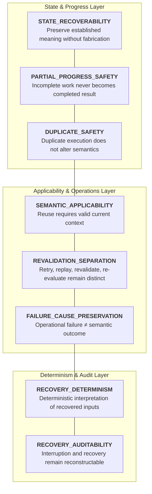
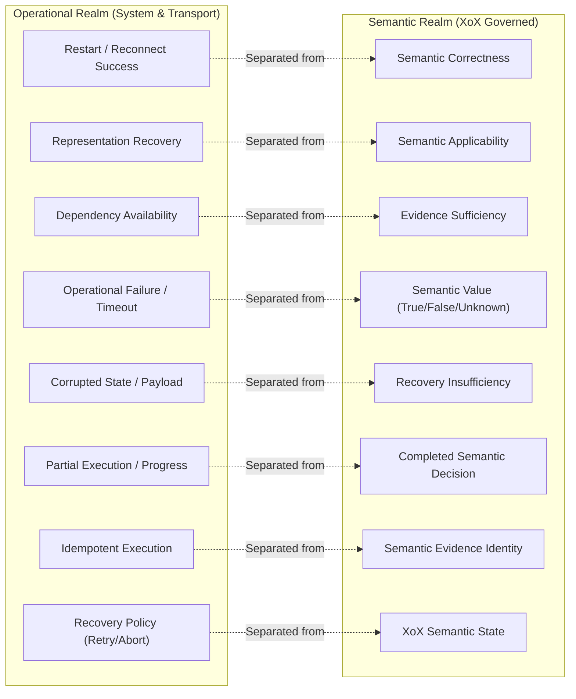
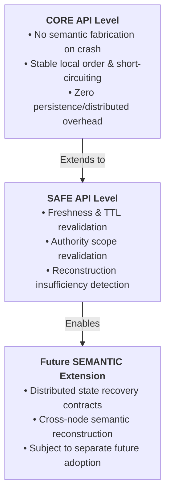

# XoX Runtime Recovery Contract

This document establishes the conceptual runtime recovery contract for XoX, defining how runtime execution resumes after failure, process interruption, exceptions, crashes, timeouts, dependency outages, partial execution, corrupted state, or stale persisted data without fabricating semantic truth, silently collapsing `Unknown`, reusing invalid context, or converting operational recovery policies into semantic meaning.

---

## 1. Core Principle & The Recovery Problem

> **Recovery is the restoration of valid execution capability and applicable representation; it is never the automatic establishment of proposition truth, authority, or freshness. XoX recovery must restore only what was legitimately established, preserve incomplete states as incomplete, and never synthesize `Unknown`, `False`, or `True` from operational failures, missing data, corrupted records, or successful restarts.**

Operational environments experience crashes, network partitions, worker preemption, and dependency restarts. In production systems, semantic integrity is frequently breached during recovery when:
- Process restarts or successful reconnects are treated as proof that an unverified proposition is currently `True`.
- Operational exceptions, timeouts, or dependency unreachability are silently converted to semantic `Unknown` or `False`.
- Stale or expired serialized evaluations are reloaded from durable storage and treated as currently applicable without freshness revalidation.
- Interrupted or partially executed operations are promoted to completed semantic outcomes upon restart.
- Corrupted representation payloads are caught and masked as `Unknown` to keep applications running.
- Message queue retries deliver duplicate payloads that are mistakenly counted as independent semantic evidence.
- Recovery policies (`RETRY`, `ABORT`, `ESCALATE`, `COMPENSATE`) are recorded in place of genuine tri-state semantic evaluations.

The XoX Runtime Recovery Contract sets unambiguous invariants for runtime recovery, guaranteeing that operational resilience never compromises semantic correctness.

---

## 2. Recovery Dimensions

XoX runtime recovery spans eight fundamental dimensions:

| Dimension | Description | Invariant Guarantee |
| :--- | :--- | :--- |
| **`STATE_RECOVERABILITY`** | Recoverable representation or runtime state preserves its established semantic meaning without fabricating missing state. | Recovery never manufactures a semantic result (`True`, `False`, `Unknown`) that was never established. |
| **`SEMANTIC_APPLICABILITY`** | Recovered state may be reused only when required decision-relevant context remains applicable. | Reloading historical data does not grant active validity if freshness or authority has expired. |
| **`REVALIDATION_SEPARATION`** | Recovery, revalidation, re-evaluation, retry, and reconstruction remain strictly distinct operations. | Checking assumptions is distinct from computing semantic results or observing new external evidence. |
| **`PARTIAL_PROGRESS_SAFETY`** | Interrupted or partially completed execution must not silently become a completed semantic result. | An operation interrupted mid-evaluation resumes or fails without fabricating a final decision. |
| **`DUPLICATE_SAFETY`** | Recovery paths must not allow duplicate execution to silently change semantic meaning or history. | Duplicate message delivery or task re-execution is idempotent regarding semantic evidence. |
| **`FAILURE_CAUSE_PRESERVATION`** | Operational failures remain distinct from `False`, `Unknown`, or policy outcomes unless evaluated by explicit propositions. | Crash, timeout, and transport errors are surfaced as runtime failures, not semantic truth states. |
| **`RECOVERY_DETERMINISM`** | Given equivalent recoverable semantic inputs and context, recovery interpretation follows deterministic XoX rules. | Runtime recovery mechanisms preserve evaluation order, short-circuiting, and effect traces. |
| **`RECOVERY_AUDITABILITY`** | Interruption, recovery, revalidation, loss, and resumed evaluation remain reconstructable without audit records becoming truth. | Recovery leaves an auditable trace without turning historical logs into active authority. |

---

## 3. Essential Conceptual Distinctions

Developers and runtime architects must maintain strict conceptual boundaries across recovery workflows:

| Distinction | Operational / Recovery Realm | Semantic Realm (XoX Controlled) | Key Invariant |
| :--- | :--- | :--- | :--- |
| **Restart Success vs. Semantic Correctness** | Process restarts successfully and services initialize. | The logical correctness and truth of evaluated propositions. | Successful boot does not imply active business propositions hold true. |
| **Representation Recovery vs. Semantic Applicability** | Reconstructing in-memory data structures from disk. | The validity of the recovered data under current context and TTL. | Loading past data is valid representation; reusing it requires fresh context. |
| **Historical Semantic Result vs. Current Proposition Truth** | A recorded `True` evaluated at timestamp $T_0$. | The active truth of the proposition at current timestamp $T_{\text{now}}$. | Past truth does not guarantee present truth in a dynamic environment. |
| **Retry vs. Replay** | Executing an operation again against a live, changing world. | Re-evaluating fixed, captured historical evidence. | Retries may yield new evidence; replays must reproduce historical deduction. |
| **Retry vs. Re-evaluation** | Acquiring fresh external observations after a failure. | Computing a semantic outcome from already available evidence. | Retries acquire external evidence; re-evaluation deducts from evidence. |
| **Re-evaluation vs. Revalidation** | Deductive evaluation of proposition truth over evidence. | Verification that context, TTL, and authority assumptions still hold. | Revalidation checks context validity before allowing re-evaluation or reuse. |
| **Reconstruction vs. Current Recovery** | Explaining past semantic transitions from audit logs. | Restoring live application runtime state to resume operations. | Reconstructing history does not restore active operational capabilities. |
| **Dependency Availability vs. Evidence Sufficiency** | Re-establishing a database or API network connection. | Possessing complete, conclusive facts to resolve a proposition. | A healthy network connection does not guarantee facts are known or sufficient. |
| **Operational Failure vs. `Unknown`** | Network timeout, 500 error, disk I/O failure, crash. | Unestablished propositional truth within XoX logic. | Transport failures are operational errors, not intrinsic semantic `Unknown`. |
| **Exception vs. `False`** | Unhandled runtime panic, deserialization error, syntax error. | Propositional refutation under declared domain rules. | An exception indicates failure to execute, never evidence of falsity. |
| **Timeout vs. `Unknown`** | Clock deadline expiration on an asynchronous call. | Explicit unestablished truth state for a proposition. | Timeout is an operational event; proposition state depends on prior facts. |
| **Corrupted State vs. Semantic Contradiction** | Truncated bytes, malformed checksum, unparseable record. | Conflicting empirical evidence (e.g., $A \land \neg A$). | Corrupted storage is a representation failure, not logical contradiction. |
| **Missing Recovery Information vs. `Unknown`** | Inability to locate recorded session state after crash. | Deductive evaluation yielding an unestablished fact. | Missing recovery context produces recovery insufficiency, not `Unknown`. |
| **Partial Progress vs. Completed Decision** | Branch $A$ evaluated, branch $B$ interrupted by crash. | Final resolved semantic tri-state value for full expression. | Interrupted execution must not be recorded or reused as completed. |
| **Duplicate Execution vs. Duplicate Semantic Evidence** | Receiving the same message twice due to network retry. | Possessing two independent factual observations of an event. | Repeated delivery of identical data is not new corroborating evidence. |
| **Idempotent Operation vs. Semantically Reusable Result** | Ability to repeat an action without side-effect divergence. | Validity of reusing a past semantic evaluation outcome. | An idempotent operation may safely re-run, but old outputs may still be stale. |
| **Restored Credential vs. Current Authority** | Reloading an API token or certificate from persistent storage. | Active authorization and capability scope in the live system. | A reloaded token may have been revoked or expired during downtime. |
| **Restored Cache Entry vs. Current Freshness** | Cache item survives server reboot in durable Redis/disk. | Temporal freshness and valid validity window. | Surviving a restart does not reset or extend an item's expiration window. |
| **Successful Deserialization vs. Valid Recovery** | Codec parses serialized bytes without syntax errors. | Semantic applicability and completeness for decision reuse. | Parsing succeeds if bytes are valid; recovery succeeds if context is valid. |
| **Recovery Policy vs. XoX Semantic State** | Operational action (`RETRY`, `ABORT`, `ESCALATE`, `RESUME`). | Tri-state evaluation result (`True`, `False`, `Unknown`). | Operational recovery actions must not overwrite or masquerade as semantic values. |

---

## 4. Core Invariants & Rules

1. **No Semantic Fabrication**: Recovery must not manufacture a XoX semantic result that was never established prior to interruption.
2. **Failure Isolation**: Operational interruption, crash, exception, timeout, unavailable dependency, or corrupted representation is not intrinsically `Unknown` or `False`.
3. **No Truth from Restart**: Successful restart, reboot, or reconnection does not establish proposition truth.
4. **Historical vs. Current Applicability**: Successfully deserialized prior state is historical reconstructed state, not automatically currently applicable state.
5. **Contextual Applicability Precondition**: Recovered semantic state may be reused only when all decision-relevant applicability conditions (freshness, authority, assumptions) required for that reuse remain satisfied.
6. **Non-Equivalence on Context Shift**: Changed evidence, freshness, authority, proposition framing, assumptions, or context makes recovery inputs non-equivalent and requires revalidation or re-evaluation.
7. **Retry/Replay Distinction**: Recovery must distinguish retry from replay: retry may interact with a changed external world, while replay interprets preserved historical inputs.
8. **Revalidation/Re-evaluation Distinction**: Recovery must distinguish revalidation from re-evaluation: revalidation checks whether prior applicability assumptions remain valid; re-evaluation computes semantic state from applicable evidence/context.
9. **Explicit Recovery Insufficiency**: Missing recovery information must be exposed as recovery insufficiency rather than automatically synthesized as `Unknown`.
10. **Strict Corruption Handling**: Corrupted or incompatible serialized state must remain a representation/recovery failure rather than being converted into semantic `Unknown`.
11. **Partial Progress Containment**: Partial execution must not be promoted to a completed semantic result solely because recovery resumes successfully.
12. **Duplicate Semantic Safety**: Duplicate or repeated execution after recovery must not silently alter semantic meaning through runtime accident.
13. **Idempotence Demarcation**: Idempotence is an operational property and must not be confused with proposition truth or semantic equivalence.
14. **Provenance Non-Authority**: Recovered provenance must not become truth, freshness, trust, or authority merely because it survived a failure.
15. **Capability Revalidation**: Recovered credentials or capabilities must still satisfy current applicability and lifecycle requirements.
16. **Freshness Invariance across Restart**: Recovered cached values must still satisfy current freshness and context requirements; downtime counts against freshness TTLs.
17. **Policy Separation**: Recovery policy such as retry, abort, escalate, compensate, resume, or defer is application/runtime policy and must not rewrite semantic `True`/`False`/`Unknown`.
18. **Determinism Alignment**: Recovery behavior controlled by XoX must remain compatible with `DETERMINISM.md`.
19. **Serialization Alignment**: Recovered serialized state must remain compatible with `SERIALIZATION_MODEL.md`.
20. **Audit Alignment**: Decision-relevant recovery events and information loss must remain reconstructable under `AUDIT_CONTRACT.md`.
21. **World State Realism**: Recovery mechanisms may restore execution capability, but they must never silently claim restoration of external world state.

---

## 5. Failure Modes & Anti-Patterns

| Anti-Pattern / Failure Mode | Root Cause | Impact | Mitigation / Contract Requirement |
| :--- | :--- | :--- | :--- |
| **Crash-Assumed-Success** | Process crashes during evaluation; on restart, system marks operation as completed. | Fabricated positive facts enter system state. | Interrupted execution state must be discarded or marked incomplete. |
| **Timeout-As-Unknown Synthesis** | Network timeout occurs; runtime automatically assigns proposition result `Unknown`. | Operational transport failure is mistaken for empirical lack of knowledge. | Surface timeout as an operational error; let explicit domain logic decide proposition state. |
| **Exception-As-False Fallacy** | Runtime exception caught; handler returns `False` as safe fallback. | System refutes a proposition simply because execution crashed. | Propagate exceptions or handle via explicit fallback policy, not semantic `False`. |
| **Reconnect-As-Truth Fallacy** | Database reconnects; system assumes entity state is now verified `True`. | Active truth is asserted without querying actual entity data. | Reconnection only restores query capability; truth requires empirical evidence. |
| **Expired State Resurrection** | Stored `True` loaded from disk after validity window expired and used directly. | Decisions executed on stale, invalid business data. | Perform freshness and TTL revalidation on all reloaded persistent state. |
| **Revoked Authority Replay** | Serialized authorization capability reloaded after underlying role was revoked. | Unauthorized actions executed based on zombie credentials. | Revalidate authorization scope against live authority source upon recovery. |
| **Queue Duplicate Evidence Inflation** | Message redelivered after worker timeout; second processing increments fact counter. | Single event is counted as multiple independent corroborating facts. | Deduplicate events or treat redeliveries as duplicate delivery of identical evidence. |
| **Promoted Partial Progress** | Subexpression $A$ completed before crash; resumed run skips $B$ and uses partial output. | Incomplete logical expression treated as fully evaluated. | Enforce atomic evaluation boundaries or re-evaluate incomplete expressions. |
| **Corrupt State Masking** | Checksum fails on session state; runtime catches error and injects `Unknown`. | Storage corruption and data loss are hidden as valid domain uncertainty. | Fail closed with explicit recovery error when serialized state is corrupt. |
| **Missing Metadata Synthesis** | Session record missing authority headers; deserializer sets defaults to `Unknown`. | Incomplete audit/context trails are disguised as valid logic states. | Report recovery insufficiency when required context metadata is missing. |
| **Replay Mistaken for Live State** | Debugger replays historical log; application treats replayed output as active truth. | Historical decisions overwrite live production state. | Tag replayed executions as simulation/audit; decouple from live egress. |
| **Retry Evidence Divergence Shock** | Retry observes updated external value; developer expects identical past result. | Confusion between changing world state and evaluator determinism. | Recognize retry as fresh evidence acquisition from a dynamic world. |
| **Restored Provenance as Absolute Trust** | Reloaded record includes valid historical origin; system bypasses current trust checks. | Compromised or stale actors are trusted based on ancient provenance. | Provenance records history; trust evaluation requires current policy. |
| **Restored Signature as Current Authority** | Reconstructed token has valid cryptographic signature; treated as unrevoked. | Revoked tokens remain active indefinitely after restart. | Separate signature integrity from current capability validity. |
| **Policy-Deny Logged as Semantic False** | After crash recovery, fallback policy issues `DENY` which is logged as `False`. | Downstream audit mistakes operational denial for empirical refutation. | Maintain strict separation between operational fallback policies and semantic values. |
| **Unchecked Cache Resurrection** | Redis cache reboots; in-memory keys reload without validating external source. | Outdated evaluations bypass upstream invalidation events that occurred during reboot. | Invalidate or revalidate persistent cache entries across service reboots. |
| **Duplicate Delivery Evidence Stacking** | Two replicas send identical observation; aggregator treats them as two distinct witnesses. | Artificial confidence inflation in distributed consensus. | Distinguish identical duplicate evidence payloads from distinct empirical observations. |
| **Unordered Recovery Iteration Race** | Recovery replays state using hash map traversal order, altering trace order. | Nondeterministic recovery execution across nodes. | Enforce canonical ordering during state recovery and replay. |
| **Agent Resumption under Lossy Summary** | Autonomous agent resumes from truncated memory omitting prior `Unknown` state. | Agent takes high-risk action assuming certainty where uncertainty existed. | Recovery context for agents must preserve tri-state uncertainty and authority bounds. |
| **Fabricated Recovery Audit Trail** | Replay engine fills missing event log gaps with synthetic events to pass validation. | Corrupted audit history masks operational failures. | Audit recovery engines must report log gaps as reconstruction insufficiency. |

---

## 6. Real-World Scenarios & Domain Transfer

### 6.1 Local Process Crash & Partial Progress
- **Scenario**: A local engine evaluates `(A AND B)`. It successfully evaluates `A = True`, but the OS process terminates abruptly before evaluating `B`.
- **Contract Expectation**: Upon restart, the engine must not record `True`, `False`, or `Unknown` for the expression. The incomplete execution state is discarded, and recovery starts the evaluation cleanly or reports an incomplete execution failure.

### 6.2 HTTP Dependency Outage & Retry
- **Scenario**: An application queries an external payment gateway to verify `PaymentSettled`. The request times out. Two minutes later, a retry succeeds, returning `{"settled": true}`.
- **Contract Expectation**:
  - The initial timeout is an operational transport failure, not semantic `Unknown`.
  - The retry is a new evidence acquisition from a dynamic external environment.
  - The resulting `True` is a deterministic deduction over the new evidence payload, not an evaluator divergence.

### 6.3 Database Restart & Stale Record Reload
- **Scenario**: A service persists an evaluation `AccountCompliant = True` with a 1-hour validity window. The server reboots and reloads the record 3 hours later.
- **Contract Expectation**: Successful deserialization from the database only recovers historical representation. Because the 1-hour freshness window expired during downtime, the runtime cannot reuse the value and must trigger a revalidation or re-evaluation.

### 6.4 Message Queue Redelivery & Worker Crash
- **Scenario**: A background worker pulls an event, processes an evaluation, and crashes before acknowledging the message. The message broker redelivers the message to a second worker.
- **Contract Expectation**: The redelivered message carries identical evidence. The second worker's execution must be semantically idempotent, producing the exact same deduction without treating the redelivery as a second corroborating fact.

### 6.5 Authorization Recovery & Scope Revocation
- **Scenario**: An authorization token granting `role = admin` is saved in session storage. While the user is disconnected, their admin role is revoked in the identity provider. The user reconnects and restores the session.
- **Contract Expectation**: The recovered session token represents historical representation. The application must revalidate the capability scope against the live authority source; it must not assume valid current authority solely because the token decoded successfully.

### 6.6 Corrupted State Handling
- **Scenario**: An application attempts to restore a persisted XoX state file, but the file was truncated during an unclean disk unmount.
- **Contract Expectation**: The deserializer encounters a parsing/checksum error. Recovery must raise an explicit representation recovery failure; it must not catch the error and replace the corrupted record with `Unknown`.

### 6.7 Historical Reconstruction with Missing Inputs
- **Scenario**: An audit auditor replays a historical transaction to reconstruct an `Unknown` evaluation, but one required external fact log is missing from the archive.
- **Contract Expectation**: The reconstruction engine must explicitly report reconstruction insufficiency. It must not invent default values or synthesize an artificial `Unknown` to complete the replay.

### 6.8 AI & Autonomous Agent Resumption
- **Scenario**: An agent workflow pauses after a tool returns `Unknown` regarding a critical security condition, triggering an operational `DENY`. On workflow resume, a compact state summary states "tool unavailable".
- **Contract Expectation**: The agent recovery layer must preserve the exact tri-state `Unknown` evaluation and the distinction between the missing evidence and the application `DENY` policy, preventing the agent from misinterpreting the state as an empirical refutation (`False`).

---

## 7. API Level Expectations

### CORE
- Guarantees that local crash, interruption, or exceptions never fabricate `True`, `False`, or `Unknown`.
- Preserves deterministic evaluation order, short-circuit semantics, and effect traces upon re-evaluation.
- Operates purely in-memory with zero overhead; does not require persistent storage, WALs, audit logs, or distributed recovery machinery.

### SAFE
- In addition to CORE guarantees, requires conceptual awareness of decision-relevant context: freshness revalidation, authority scope verification, and recovery insufficiency reporting.
- Prohibits reusing reloaded state without validating that freshness and authority assumptions remain satisfied.
- Remains purely conceptual; does not mandate specific retry engines, checkpoint databases, or logging frameworks.

### SEMANTIC (Future Extension)
- Reserved as an extension point for future standards defining distributed failover protocols, cross-system consensus recovery, and multi-node semantic state reconstruction.
- Does not introduce or depend on unadopted runtime mechanisms in this baseline contract.

---

## 8. Developer Decision Framework & Testability

### 8.1 Key Questions for Developers
When designing or auditing recovery logic, developers must ask:
1. **Prior Establishment**: What exactly was established before the failure, and what was merely attempted?
2. **Restoration Scope**: Am I restoring representation, execution capability, or current semantic applicability?
3. **Context Shift**: Has decision-relevant evidence, freshness, authority, proposition framing, or context changed during downtime?
4. **Operation Type**: Do I need a retry (new external call), revalidation (check context TTL), re-evaluation (compute from facts), or historical reconstruction (replay logs)?
5. **Duplicate Risk**: Could this operation be executed twice after recovery, and would duplicate execution create duplicate evidence or only duplicate delivery?
6. **False Truth Assumption**: Am I treating restart, reconnect, reload, or successful decoding as active proposition truth?
7. **Failure Conflation**: Am I converting an operational failure, crash, or timeout into `Unknown` or `False`?
8. **Sufficiency Check**: Is recovered state sufficiently complete for the decision I am about to make?
9. **Insufficiency Reporting**: If information is missing, can I expose recovery insufficiency instead of fabricating a default semantic state?
10. **Trace Invariance**: Will recovery preserve deterministic order, short-circuiting, effects, and exception semantics?
11. **Audit Separation**: Can the recovery path be reconstructed without treating audit history as active semantic authority?

### 8.2 Developer Testability Checklist
An independent developer or test suite should be able to:
- [ ] Distinguish process crash or operational interruption from semantic `Unknown`.
- [ ] Reject successful process restart or dependency reconnect as evidence of proposition truth.
- [ ] Distinguish retry, replay, revalidation, re-evaluation, and reconstruction in runtime code.
- [ ] Detect and reject stale or context-invalid recovered values upon reload.
- [ ] Surface corrupted serialized state as a recovery failure rather than coercing it to `Unknown`.
- [ ] Handle duplicate message delivery without inflating empirical evidence counts.
- [ ] Preserve strict separation between operational recovery policies (`RETRY`, `DENY`) and semantic tri-state values (`True`, `False`, `Unknown`).
- [ ] Apply the recovery model consistently across local processes, APIs, databases, message queues, authorization workflows, and AI agent memory.
