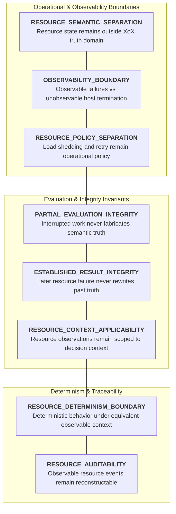
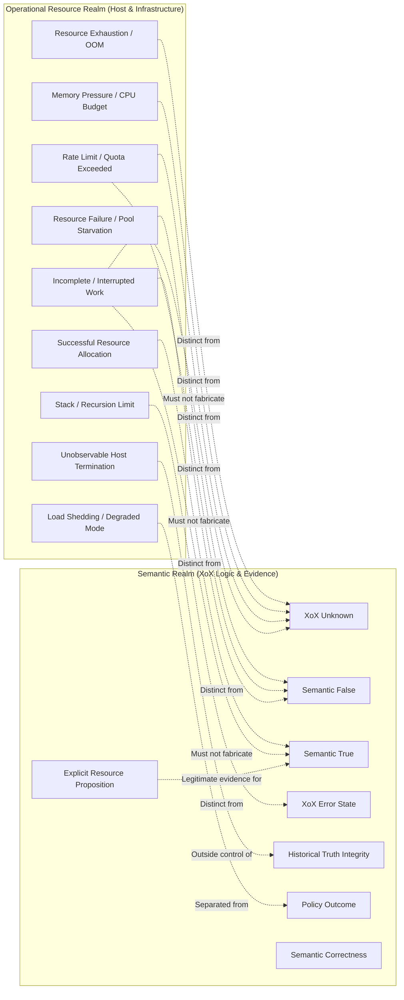
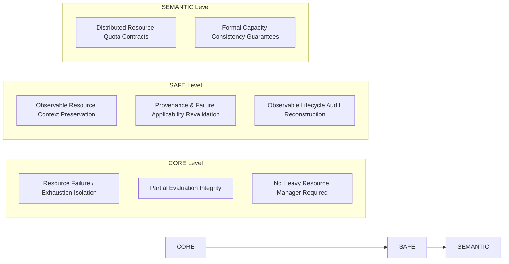

# XoX Conceptual Resource Model

This document establishes the minimum conceptual resource contract for XoX, defining how finite-resource conditions—including memory pressure, CPU limits, recursion depth, stack exhaustion, file descriptors, connection pools, quotas, rate limits, process termination, and host runtime limits—preserve semantic meaning without fabricating `Unknown`, `False`, or `True`, weakening deterministic observable behavior, or masquerading as proposition evidence.

---

## 1. Core Principle & The Resource Problem

> **Resource availability and operational exhaustion are physical execution constraints of finite host environments; they do not introduce new XoX truth states. Memory pressure, CPU exhaustion, stack limits, descriptor exhaustion, connection pool exhaustion, rate limiting, and process termination are operational events, never XoX `Unknown`, `False`, or `True`. An interrupted evaluation cannot fabricate a semantic result from incomplete computation, and resource failure never retroactively alters a previously established historical result.**

XoX executes within finite hosts and infrastructure boundaries. Evaluations may fail, pause, or terminate because memory, CPU time, stack depth, file descriptors, network connections, storage, or external API quotas are exhausted. In production environments, semantic integrity is compromised when finite-resource operational phenomena are conflated with logical propositions:
- Out-of-memory (OOM) or memory allocation failure is automatically mapped to `Unknown`.
- Rate limiting or quota exhaustion is silently treated as proposition `False`.
- Successful memory allocation or connection acquisition is automatically assumed to establish proposition `True`.
- CPU budget exhaustion or deadline expiry returns `Unknown` to keep execution moving.
- A stack overflow or recursion limit exception is labeled a logical contradiction.
- An evaluation interrupted mid-flight returns an intermediate accumulator value as a final semantic result.
- An unobservable external process kill (such as an OS SIGKILL or host supervisor termination) is claimed to guarantee XoX-level cleanup, diagnostics, or fail-closed state.
- A later resource failure is treated as retroactively invalidating a previously established historical `True`.
- Operational load-shedding or degraded-service policies (`DENY`, `DEGRADE`) overwrite proposition evaluation truth.

The XoX Conceptual Resource Model sets strict invariants ensuring that resource scarcity, host limits, and operational capacity constraints never compromise logical correctness or promise control beyond XoX's observable runtime boundary.

---

## 2. Resource Dimensions

The XoX resource contract spans eight foundational dimensions:

| Dimension | Description | Invariant Guarantee |
| :--- | :--- | :--- |
| **`RESOURCE_SEMANTIC_SEPARATION`** | Resource availability and exhaustion remain operational execution states outside the XoX truth domain. | Resource exhaustion never synthesizes XoX `Unknown`, `False`, or `True`. |
| **`OBSERVABILITY_BOUNDARY`** | Distinguishes failures observable by XoX from unobservable external termination. | Guarantees apply strictly within XoX's observable boundary; no unfulfillable guarantees are made for unobservable host termination. |
| **`PARTIAL_EVALUATION_INTEGRITY`** | An evaluation interrupted by resource exhaustion must not yield incomplete computation as final truth. | Partial work produces an operational error under [ERROR_MODEL.md](file:///home/ssr/Desktop/XoX/docs/03_runtime/ERROR_MODEL.md), never fabricated semantic values. |
| **`ESTABLISHED_RESULT_INTEGRITY`** | A previously completed semantic evaluation is not retroactively altered by later resource failure. | Historical evaluations remain true of their context even if later operations run out of resources. |
| **`RESOURCE_POLICY_SEPARATION`** | Operational mitigation policies (shed, retry, degrade, reject, terminate) remain separate from domain truth. | Policy outcomes are execution control flow decisions, not proposition truth values. |
| **`RESOURCE_CONTEXT_APPLICABILITY`** | Resource-sensitive evaluations apply only to matching observable operational context. | Resource observations cannot be assumed applicable across changed operational environments. |
| **`RESOURCE_DETERMINISM_BOUNDARY`** | XoX-controlled behavior remains deterministic for equivalent semantic inputs and observable resource context. | Host resource differences represent external context variation under [DETERMINISM.md](file:///home/ssr/Desktop/XoX/docs/03_runtime/DETERMINISM.md). |
| **`RESOURCE_AUDITABILITY`** | Decision-relevant observable resource events and policy transitions remain reconstructable where required. | Observable resource lifecycles leave auditable traces under [AUDIT_CONTRACT.md](file:///home/ssr/Desktop/XoX/docs/02_semantic_boundary/AUDIT_CONTRACT.md). |

---

## 3. Essential Conceptual Distinctions

Clear conceptual boundaries must be maintained between operational resource conditions and semantic propositions:

1. **Resource exhaustion versus `Unknown`**: Running out of memory, CPU, or descriptors is an operational capacity limit; `Unknown` represents unestablished truth due to missing domain evidence.
2. **Resource failure versus `False`**: An allocation or connection failure indicates operational unavailability; it does not logically refute a proposition.
3. **Successful allocation versus `True`**: Successfully acquiring a socket, memory buffer, or thread proves only that capacity was available, not that a proposition is `True`.
4. **Memory pressure versus proposition evidence**: High host memory usage is an environmental condition; it is not domain evidence for an unrelated proposition.
5. **CPU budget exhaustion versus semantic uncertainty**: An interrupted CPU budget indicates execution time expiration, not epistemic uncertainty.
6. **Stack/recursion exhaustion versus contradiction**: Exceeding call stack depth is an operational execution fault, not a logical proposition contradiction.
7. **Rate limit versus `Unknown`**: Being throttled by an external service is an operational rate constraint, not domain evidence uncertainty.
8. **Quota exceeded versus `False`**: An exhausted billing or API quota indicates credit/usage limit reached, not negative proposition truth.
9. **Connection pool exhaustion versus proposition failure**: Inability to acquire a database connection indicates pool starvation, not that the queried entity does not exist.
10. **Process termination versus semantic result**: An external process death is an infrastructure termination, not a semantic evaluation outcome.
11. **Observable runtime failure versus unobservable host termination**: An observable catchable resource exception is handled under [ERROR_MODEL.md](file:///home/ssr/Desktop/XoX/docs/03_runtime/ERROR_MODEL.md); unobservable host termination (e.g. SIGKILL) terminates execution before XoX can react.
12. **Incomplete evaluation versus `Unknown`**: Interrupted partial computation yields zero semantic result; it must not be converted into an established `Unknown`.
13. **Historically established result versus interrupted later computation**: A previously completed result remains historically valid even if a subsequent unrelated computation exhausts resources.
14. **Resource retry versus semantic re-evaluation**: Retrying after resource recovery initiates a new operational attempt; it is not a silent continuation of the old attempt.
15. **Load shedding policy versus proposition `False`**: Dropping incoming requests under heavy load is an operational defense policy, not logical proposition falsity.
16. **Degraded-service policy versus semantic collapse**: Serving reduced-fidelity responses under resource pressure is runtime degradation policy, not epistemic collapse of truth values.
17. **Resource availability observation versus proposition truth**: Observing that a resource is present does not establish truth for an unrelated business proposition.
18. **Resource failure evidence for a separately framed proposition versus automatic evidence for the original proposition**: A resource failure can be evidence for an explicit proposition about system health, but not for an unrelated business predicate.
19. **Resource limit configuration versus XoX semantic guarantee**: Host resource settings (heap size, timeouts, limits) configure operational capacity, not logical semantic guarantees.
20. **Performance problem versus semantic correctness**: A slow or resource-heavy execution affects operational performance, distinct from logical correctness under XoX semantics.

---

## 4. Normative Resource Rules

1. **Resource exhaustion does not add a XoX truth state.**
2. **Memory exhaustion, CPU exhaustion, stack/recursion exhaustion, descriptor exhaustion, connection exhaustion, quota exhaustion, storage exhaustion, and rate limiting are not intrinsically XoX `Unknown` or `False`.**
3. **Successful resource acquisition is not semantic `True`.**
4. **An evaluation interrupted by an observable resource failure must not fabricate `True`, `False`, or `Unknown` from incomplete computation.**
5. **Observable resource failures remain errors or operational conditions under [ERROR_MODEL.md](file:///home/ssr/Desktop/XoX/docs/03_runtime/ERROR_MODEL.md) as appropriate.**
6. **A host-level termination that prevents XoX from executing cannot be promised a XoX-level diagnostic, recovery action, audit event, or semantic fallback.**
7. **XoX must not claim fail-closed behavior after an event that prevents XoX itself from running; guarantees apply only within the runtime's observable/control boundary.**
8. **A resource failure may be valid evidence for a separately framed proposition about resource availability or system health, but it has no intrinsic semantic meaning for an unrelated proposition.**
9. **A previously established XoX result is not retroactively rewritten solely because a later operation exhausts resources.**
10. **Current applicability may still change if decision-relevant context itself changes; historical result integrity and current applicability remain distinct.**
11. **Retrying after a resource failure may constitute a new execution/context and is not automatically continuation of the same observation.**
12. **Retry, reject, shed load, defer, degrade, escalate, compensate, or terminate remain application/runtime policy.**
13. **Resource policy must not silently convert failure into `True`, `False`, or `Unknown`.**
14. **Host resource variability does not violate [DETERMINISM.md](file:///home/ssr/Desktop/XoX/docs/03_runtime/DETERMINISM.md) when the observable resource context differs.**
15. **For equivalent semantic inputs and equivalent observable resource context, XoX-controlled behavior must remain compatible with [DETERMINISM.md](file:///home/ssr/Desktop/XoX/docs/03_runtime/DETERMINISM.md).**
16. **Async resource failures remain subject to [ASYNC_MODEL.md](file:///home/ssr/Desktop/XoX/docs/03_runtime/ASYNC_MODEL.md).**
17. **Concurrent resource contention remains subject to [CONCURRENCY_MODEL.md](file:///home/ssr/Desktop/XoX/docs/03_runtime/CONCURRENCY_MODEL.md).**
18. **Cross-language resource failures remain subject to [INTEROP_MODEL.md](file:///home/ssr/Desktop/XoX/docs/03_runtime/INTEROP_MODEL.md).**
19. **Interrupted work remains subject to [RECOVERY_MODEL.md](file:///home/ssr/Desktop/XoX/docs/03_runtime/RECOVERY_MODEL.md) where recovery is possible.**
20. **Persisted resource-related state remains subject to [SERIALIZATION_MODEL.md](file:///home/ssr/Desktop/XoX/docs/03_runtime/SERIALIZATION_MODEL.md).**
21. **Decision-relevant observable resource events remain reconstructable where [AUDIT_CONTRACT.md](file:///home/ssr/Desktop/XoX/docs/02_semantic_boundary/AUDIT_CONTRACT.md) requires it.**
22. **No requirement may imply that XoX controls the operating system, process supervisor, hardware, allocator, or external infrastructure.**

---

## 5. Prohibited Failure Modes

The following resource failure modes violate the XoX contract:

1. **OOM automatically becomes `Unknown`**: Intercepting an out-of-memory condition and synthesizing tri-state `Unknown`.
2. **Allocation failure automatically becomes `False`**: Converting a memory allocation error into proposition refutation.
3. **Successful allocation automatically becomes `True`**: Assuming that obtaining a memory buffer or connection proves a domain proposition is `True`.
4. **CPU budget exhausted and evaluator returns `Unknown`**: Mapping CPU limit exhaustion to domain uncertainty.
5. **Stack overflow labeled semantic contradiction**: Mislabeling a call-stack recursion exhaustion as a logical contradiction in logic propositions.
6. **Rate limit mapped directly to `Unknown`**: Translating HTTP 429 / rate throttling into domain `Unknown`.
7. **Quota exceeded mapped directly to `False`**: Translating an API usage cap into a negative domain proposition.
8. **Connection pool exhaustion mapped to proposition `False`**: Treating database pool starvation as evidence that a record does not exist.
9. **File descriptor exhaustion swallowed into fallback `False`**: Swallowing descriptor allocation errors to return a default negative result.
10. **Resource failure during partial evaluation returns the last intermediate semantic value as final**: Emitting the intermediate state of an accumulator when interrupted by resource exhaustion.
11. **Process killed externally and documentation claims XoX guaranteed a diagnostic**: Claiming XoX emitted a structured error when the host OS terminated the process via uncatchable signal.
12. **Process killed externally and documentation claims XoX guaranteed an audit record**: Promising persistent audit trail records when the host environment abruptly terminated execution.
13. **Later OOM retroactively invalidates an already established historical `True`**: Overwriting or corrupting a previously completed evaluation result when a subsequent operation hits OOM.
14. **Resource retry treated as exact continuation despite changed external context**: Treating a post-exhaustion retry as the same observation without capturing new environmental context.
15. **Load shedding `DENY` recorded as semantic `False`**: Storing an operational load-shedding rejection as a proven `False` business proposition.
16. **Degraded mode silently collapses `Unknown`**: Forcing domain `Unknown` states to `False` or `True` to simplify degraded-mode execution.
17. **Resource availability assumed to prove unrelated business proposition**: Using the presence of free memory or connections as evidence for a business rule.
18. **Different resource availability across runs mislabeled evaluator nondeterminism**: Misreporting engine non-determinism when runs differed because one hit an external resource cap.
19. **Foreign runtime resource sentinel mapped to `Unknown`**: Cross-language FFI boundary converting foreign OOM/starvation status directly into XoX `Unknown`.
20. **AI tool resource/rate-limit failure mapped to semantic `Unknown`**: An AI agent harness recording domain `Unknown` when a tool call fails due to LLM provider rate limits or token exhaustion.

---

## 6. Real-World Resource Scenarios

### 6.1 Memory Allocation Failure
- **Scenario**: An evaluation cannot complete because host memory allocation fails during query preparation.
- **Contract Expectation**: The runtime preserves this as an operational resource failure under [ERROR_MODEL.md](file:///home/ssr/Desktop/XoX/docs/03_runtime/ERROR_MODEL.md). It must not synthesize `Unknown` or `False`.

### 6.2 External Process Kill
- **Scenario**: The host operating system or container supervisor terminates the process abruptly via SIGKILL due to cgroup memory limits.
- **Contract Expectation**: XoX guarantees apply only within its observable execution boundary. The model explicitly does not promise diagnostics, cleanup, audit trails, or recovery that XoX had no opportunity to execute.

### 6.3 Rate Limited API
- **Scenario**: An external identity verification API returns a rate-limit error (HTTP 429) due to exhausted request quotas.
- **Contract Expectation**: The rate-limit event remains an operational error. It does not establish that the user's identity is invalid (`False`) or uncertain (`Unknown`).

### 6.4 Connection Pool Exhaustion
- **Scenario**: An operation attempts to query a database to check an eligibility predicate, but all pool connections are in use.
- **Contract Expectation**: The failure is reported as an operational pool starvation error under [ERROR_MODEL.md](file:///home/ssr/Desktop/XoX/docs/03_runtime/ERROR_MODEL.md), not as a missing record (`False`) or epistemic uncertainty (`Unknown`).

### 6.5 Concurrent Resource Contention
- **Scenario**: Two concurrent workers compete for a bounded execution buffer; Worker 1 succeeds, while Worker 2 encounters resource starvation.
- **Contract Expectation**: Worker 1 completes its evaluation normally. Worker 2 raises an operational resource error under [CONCURRENCY_MODEL.md](file:///home/ssr/Desktop/XoX/docs/03_runtime/CONCURRENCY_MODEL.md) and [ERROR_MODEL.md](file:///home/ssr/Desktop/XoX/docs/03_runtime/ERROR_MODEL.md) without corrupting semantic values.

### 6.6 Historical Result Integrity
- **Scenario**: A proposition is evaluated to `True` and recorded. Ten seconds later, a separate, unrelated batch job causes an out-of-memory failure.
- **Contract Expectation**: The previously established `True` result remains historically valid. The later OOM failure does not alter or invalidate the past result.

### 6.7 Explicit Resource Proposition
- **Scenario**: An application explicitly frames the domain proposition: *"The processing service currently has sufficient connection capacity to accept new work."*
- **Contract Expectation**: In this explicit framing, connection pool metrics legitimately participate as domain evidence. If capacity is exhausted, the proposition legitimately evaluates to `False` from evidence.

### 6.8 AI / Agent Tool Quota Failure
- **Scenario**: An LLM agent verification tool fails because the underlying API key hit its monthly token quota limit.
- **Contract Expectation**: The agent harness treats the quota exhaustion as an operational tool failure under [ERROR_MODEL.md](file:///home/ssr/Desktop/XoX/docs/03_runtime/ERROR_MODEL.md). It does not synthesize proposition `Unknown`, and mitigation policies (retry, fallback model, escalate) remain application policy.

---

## 7. Precision Requirements & Boundaries

To prevent semantic overreach and false guarantees:

1. **No promise of universal catchability**: OOM or host supervisor termination cannot always be caught; XoX guarantees apply strictly within the runtime's observable execution boundary.
2. **No unobservable fail-closed promises**: XoX cannot promise fail-closed behavior after a host event that terminates execution before XoX can run.
3. **No audit promises for pre-empted execution**: XoX does not guarantee audit records for events that destroy the process before an audit record can be emitted.
4. **Context-dependent resource evidence**: Resource failures have no intrinsic semantic meaning for unrelated propositions, but may serve as valid evidence when the explicitly framed proposition directly concerns system capacity or resource availability.
5. **Partial failure does not preclude independent evaluation**: An operational resource failure in one subsystem does not prevent semantic evaluation if sufficient proposition-specific evidence exists independently of the failed resource.
6. **No concrete resource mechanisms**: The contract prescribes no specific allocators, garbage collectors, cgroups, supervisors, connection pool implementations, or rate-limiting algorithms.

---

## 8. API Level Expectations

### 8.1 CORE Level
- Enforces strict separation of observable resource failures, quota limits, and memory exhaustion from `True`, `False`, and `Unknown`.
- Guarantees that interrupted partial computations never fabricate final semantic values.
- Must not require persistent resource audit logs, resource managers, quotas, cgroups, or recovery infrastructure.

### 8.2 SAFE Level
- Requires preservation of decision-relevant observable resource failure context, provenance, and applicability when observable.
- Remains purely conceptual and mechanism-neutral; does not prescribe allocators, garbage collectors, cgroups, containers, or supervisors.

### 8.3 SEMANTIC Level
- Future extension point for cross-system distributed quota contracts, formal capacity invariants, and multi-node resource coordination.
- Subject to separate formal adoption and out of scope for baseline engine runtime.

---

## 9. Developer Evaluation Questions

When handling resource limits, reviewing capacity management, or integrating external dependencies, developers must ask:

1. **Did the proposition evaluate `Unknown`, or did the runtime merely run out of a resource?**
2. **Did the proposition evaluate `False`, or did an operation fail because capacity was unavailable?**
3. **Was this resource failure actually observable by XoX?**
4. **Did the host terminate execution before XoX could react?**
5. **Was evaluation complete before the resource failure occurred?**
6. **Am I accidentally returning an intermediate value as a final semantic result?**
7. **Is this resource event evidence for the proposition I actually framed, or only an operational event?**
8. **Did resource conditions change enough that this retry is a new execution/context?**
9. **Am I converting a load-shedding or degradation policy into semantic truth?**
10. **Am I promising a recovery/audit/diagnostic behavior that the host may prevent XoX from executing?**

---

## 10. Developer Testability Criteria

An implementation conforms to this resource model if an independent developer can verify:

- **Resource Failure Isolation**: Tests confirm that memory exhaustion, rate limits, and connection pool starvation raise operational errors under [ERROR_MODEL.md](file:///home/ssr/Desktop/XoX/docs/03_runtime/ERROR_MODEL.md) and never synthesize `Unknown` or `False`.
- **Resource Acquisition Neutrality**: Tests confirm that successful resource allocation does not synthesize semantic `True`.
- **Observability Boundary Enforcement**: Tests confirm that the runtime does not claim unfulfillable guarantees for unobservable host process termination.
- **Partial Evaluation Integrity**: Tests confirm that evaluations interrupted by resource exhaustion abort cleanly without emitting intermediate values as final truth.
- **Historical Result Preservation**: Tests confirm that previously completed evaluation results remain intact and uncorrupted when subsequent unrelated operations exhaust resources.
- **Explicit Resource Framing Support**: Tests confirm that resource metrics can legitimately serve as evidence when and only when the proposition explicitly concerns resource availability.
- **Policy Isolation**: Tests confirm that load-shedding (`DENY`), throttling, and degraded modes execute as application policy without rewriting proposition truth.
- **Cross-Domain Conceptual Transfer**: Tests confirm that resource invariants transfer cleanly across memory, CPU, stacks, databases, APIs, queues, foreign runtimes, and AI agents.
