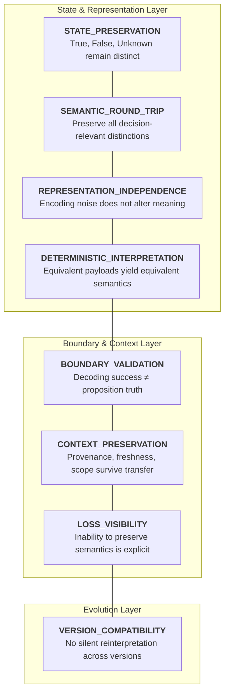
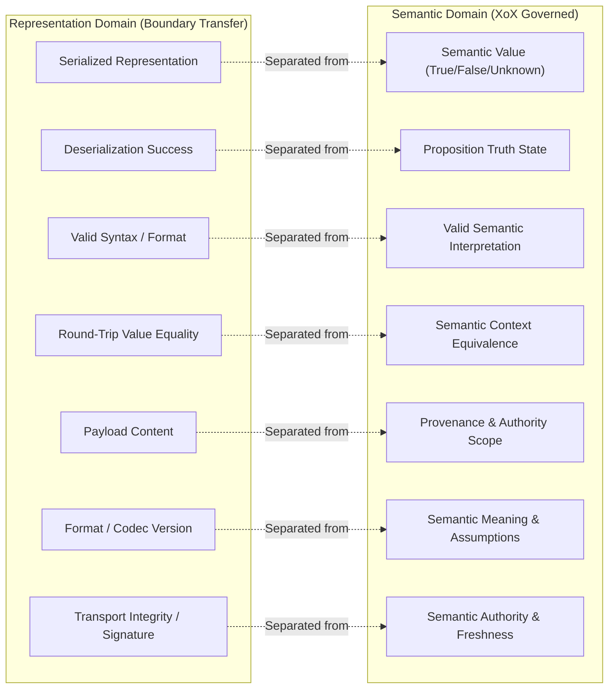
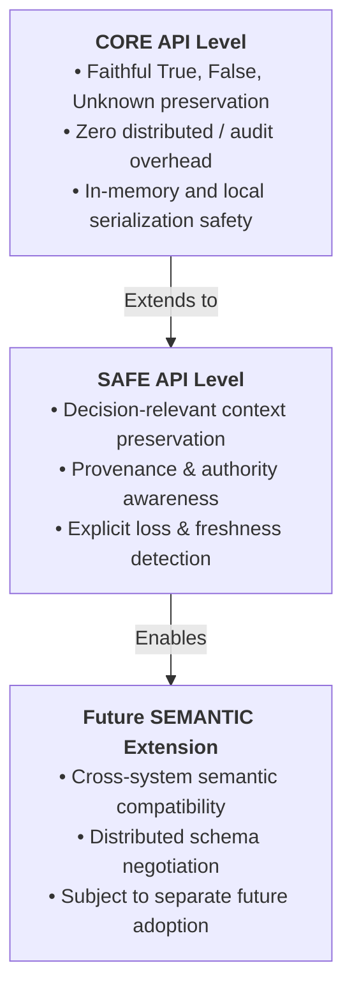

# XoX Runtime Serialization Contract

This document establishes the conceptual runtime serialization contract for XoX, defining how semantic state crosses process, storage, language, network, and version boundaries without silently altering meaning, collapsing `Unknown`, losing decision-relevant distinctions, or turning representation details into semantic authority.

---

## 1. Core Principle & The Serialization Problem

> **Serialization is a semantic boundary, not merely a data encoding step. A faithful XoX serialization must preserve the exact semantic distinctions defined by XoX—specifically distinguishing `True`, `False`, and `Unknown`—while ensuring that representation transfer never fabricates truth, erases decision-relevant context, or silently coerces incompatible states.**

At runtime, semantic values must cross storage, process, language, network, cache, and version boundaries. In production systems, semantic integrity is compromised when:
- `Unknown` is silently mapped to `False`, `null`, `None`, empty payload, zero, missing field, or exceptions.
- Deserialization success or transport delivery is conflated with current proposition truth.
- Serialized data is treated as intrinsic semantic authority simply because it is durable, signed, or replicated.
- Irrelevant encoding details (e.g., key order, byte alignment) alter semantic interpretation, or conversely, decision-relevant metadata (provenance, freshness, authority scope) is silently stripped.
- Downstream systems with Bool-only or binary models silently collapse tri-state evaluations without an explicit, auditable semantic loss boundary.
- Version evolution silently reinterprets historical payloads under different semantic assumptions.

The XoX Runtime Serialization Contract establishes the invariants governing representation transfer while strictly separating representation reconstruction from truth evaluation, authority granting, and policy execution.

---

## 2. Serialization Dimensions

XoX runtime serialization spans eight fundamental dimensions:

| Dimension | Description | Invariant Guarantee |
| :--- | :--- | :--- |
| **`STATE_PRESERVATION`** | `True`, `False`, and `Unknown` remain distinguishable after faithful serialization and deserialization. | Native tri-state values never collapse or map to host sentinels during faithful transfer. |
| **`SEMANTIC_ROUND_TRIP`** | A faithful round trip preserves all decision-relevant semantic distinctions required by the original context. | Decoding a faithfully serialized payload reconstructs the exact original semantic state. |
| **`REPRESENTATION_INDEPENDENCE`** | Irrelevant encoding differences must not alter semantic meaning. | Map key order, whitespace, and equivalent encodings produce identical semantic interpretation. |
| **`DETERMINISTIC_INTERPRETATION`** | Equivalent serialized semantic content under equivalent context is interpreted identically across implementations. | Compliant runtimes interpret identical payloads with identical semantic results. |
| **`BOUNDARY_VALIDATION`** | Deserialization reconstructs representation and validates applicability; it does not establish proposition truth. | A successfully decoded `True` represents a recorded evaluation, not active world state. |
| **`CONTEXT_PRESERVATION`** | Decision-relevant provenance, freshness, authority, and assumptions must not be silently discarded when required downstream. | Dropped decision context invalidates equivalence rather than silently passing as complete. |
| **`LOSS_VISIBILITY`** | Intentional inability to preserve a semantic distinction must be explicit and reconstructable rather than silent. | Reductions (e.g., to legacy Bool) must occur at explicit loss boundaries. |
| **`VERSION_COMPATIBILITY`** | Version evolution must not silently reinterpret an existing serialized semantic state. | Incompatible schema or semantic changes fail visibly or mandate explicit migration. |

---

## 3. Essential Conceptual Distinctions

Developers and runtime designers must maintain strict boundaries between serialized representations and semantic reality:

| Distinction | Representation Realm (Transfer & Storage) | Semantic Realm (XoX Controlled) | Key Invariant |
| :--- | :--- | :--- | :--- |
| **Serialized Representation vs. Semantic Value** | The byte sequence, text payload, or wire encoding. | The tri-state semantic value (`True`, `False`, `Unknown`). | Representation encodes semantic value; it is not the value itself. |
| **Deserialization Success vs. Proposition Truth** | Successful parsing and reconstruction of data structures. | The actual truth or falsity of the underlying real-world proposition. | Successfully reading `True` from storage does not prove the proposition holds today. |
| **Valid Syntax vs. Valid Semantic Interpretation** | Well-formed JSON, valid byte headers, correct schema syntax. | Meaningful deduction within declared assumptions and context. | Syntactically valid payloads may be semantically invalid or expired. |
| **Round-Trip Equality vs. Semantic Equivalence** | Byte-for-byte or field-by-field parity after serialization. | Equivalence of decision-relevant meaning and context applicability. | Preserving payload bytes is insufficient if decision context is stripped. |
| **Payload Equality vs. Provenance Equivalence** | Identical data fields in two serialized messages. | Origin, signing chain, and authorization history of the data. | Identical payloads with differing provenance remain semantically non-equivalent. |
| **Persistence vs. Freshness** | Indefinite durability of records in storage or logs. | Temporal validity and expiration constraints of evidence. | Durable storage does not grant perpetual freshness to past evaluations. |
| **Signature / Authenticity vs. Authority** | Cryptographic verification that bytes were signed by key $K$. | The valid operational or domain capability granted to actor $A$. | A valid signature proves origin, never that the signer possessed valid authority. |
| **Format Version vs. Semantic Meaning** | Codec or schema version tags (e.g., `v1`, `v2`). | The underlying propositional rules and truth interpretations. | Bumping a serialization format version must not mutate existing semantic truths. |
| **Representation Loss vs. Semantic Resolution** | Inability of a consumer format to represent `Unknown`. | Legitimate deductive resolution of `Unknown` via new evidence. | Dropping `Unknown` at a boundary is loss, not deduction. |
| **Unknown Preservation vs. Missing Field** | Explicit representation of unestablished truth (`Unknown`). | Omission of a key in a map or sparse record. | A missing serialized field must not be silently inferred as `Unknown` or `False`. |
| **`null` / `None` vs. `Unknown`** | Host language absence sentinels (`nil`, `None`, `null`). | XoX unestablished propositional truth (`Unknown`). | Host absence primitives must not be conflated with semantic `Unknown`. |
| **Legacy Bool Reduction vs. Native Representation** | Coercion of tri-state values into `true`/`false` for legacy systems. | Native lossless XoX tri-state representation. | Bool reduction is an explicit lossy policy boundary outside faithful serialization. |
| **Transport Success vs. Semantic Reconstruction** | HTTP 200, message queue ACK, disk write confirmation. | Successful reconstruction of decision-complete semantic state. | Transport delivery confirms packet arrival, not semantic sufficiency. |
| **Serialization Compatibility vs. Policy Compatibility** | Ability of a reader to parse the incoming payload format. | Alignment of application decision thresholds and action rules. | Parsing a serialized evaluation does not dictate downstream policy action. |

---

## 4. Core Invariants & Rules

1. **Faithful State Preservation**: Faithful XoX serialization must preserve the distinction between `True`, `False`, and `Unknown`.
2. **Strict Unknown Isolation**: `Unknown` must never be silently serialized as `False`, `null`, missing, zero, empty string, exception, or another host-language sentinel.
3. **Reconstruction Independence**: Deserialization success does not establish proposition truth.
4. **No Authority from Durability**: Serialized data does not become semantic authority merely because it is durable, signed, replicated, or received from a trusted transport.
5. **Semantic Round-Trip Focus**: Round-trip preservation is defined over decision-relevant semantic meaning, not byte-for-byte identity.
6. **Representation Invariance**: Irrelevant encoding differences (e.g., whitespace, map key ordering) must not change semantic interpretation.
7. **Mandatory Context Preservation**: Decision-relevant provenance, freshness, authority scope, assumptions, or policy/semantic distinctions must not be silently dropped when required downstream.
8. **Explicit Loss Boundary**: If a target representation cannot faithfully preserve required XoX semantics, the loss must be explicit rather than silently coerced.
9. **No Implicit Bool Collapse**: A Bool-only target must not receive `Unknown` through implicit collapse; reductions must occur across explicit adaptation boundaries.
10. **Legacy Reduction Separation**: Legacy reduction from XoX to Bool is an explicit semantic-loss boundary governed outside native serialization semantics.
11. **No Automatic Inference from Omission**: Missing serialized information must not automatically be interpreted as `Unknown`, `False`, or revoked authority.
12. **Visible Version Evolution**: Version evolution must fail visibly or require explicit migration when previous semantic meaning cannot be preserved.
13. **Forward Semantic Integrity**: A newer reader must not silently reinterpret an older representation under different semantic assumptions.
14. **Backward Semantic Safety**: An older reader must not silently accept a newer representation if it cannot preserve required decision-relevant semantics.
15. **Ordering Neutrality**: Serialization order or map-key order must not influence semantic meaning unless ordering itself is explicitly decision-relevant.
16. **Determinism Alignment**: Serialization must remain compatible with `DETERMINISM.md`: equivalent semantic content must not diverge merely because of representation or implementation variation.
17. **Audit Contract Alignment**: Serialization must remain compatible with `AUDIT_CONTRACT.md`: semantic loss at a boundary must remain reconstructable when decision-relevant.
18. **Strict Transfer Boundary**: Serialization applies only to representation transfer; it must not silently perform policy resolution, evidence evaluation, authority granting, or proposition reframing.

---

## 5. Failure Modes & Anti-Patterns

| Anti-Pattern / Failure Mode | Root Cause | Impact | Mitigation / Contract Requirement |
| :--- | :--- | :--- | :--- |
| **Unknown-As-False Collapse** | Serializer maps `Unknown` to `false` due to boolean schema limitations. | Unestablished truth is permanently misrecorded as refuted fact. | Native serializers must fail or require explicit lossy adapters if the target format lacks tri-state support. |
| **Unknown-As-Null Ambiguity** | Serializer writes `Unknown` as `null`, which the reader interprets as absent/unspecified field. | Tri-state evaluation result is confused with missing data or field omission. | Distinguish the explicit semantic value `Unknown` from field absence or structural `null`. |
| **Missing-As-Unknown Inference** | Deserializer automatically populates omitted fields with `Unknown`. | Corrupted or truncated payloads appear valid, masking serialization errors. | Omission of required fields must trigger a schema/deserialization error, not automatic `Unknown`. |
| **Deserialization-As-Truth Fallacy** | Reader treats freshly loaded `{ "verified": true }` as proof of active world state. | Application makes stale decisions based on historical records without freshness validation. | Treat deserialized payloads as historical observations requiring freshness check. |
| **Signed Object Authority Drift** | System trusts an old serialized authorization token because its cryptographic signature is valid. | Revoked or expired authority is incorrectly exercised. | Separate cryptographic authenticity from current capability validity. |
| **Stale Persisted Value Reuse** | Cache or database returns past serialized evaluation despite changed context. | Invalid state reuse violating determinism and freshness rules. | Invalidate or re-evaluate serialized state when decision context changes. |
| **Stripped Provenance Divergence** | Payload value is serialized while origin, authority chain, and signatures are omitted. | Receiver cannot verify authority, leading to unauthorized or ungrounded reuse. | Retain decision-relevant provenance metadata alongside serialized values. |
| **Lost Authority Scope in Queue** | Message queue drops scope/tenant context during event serialization. | Consumer executes event with broader or undefined authority permissions. | Bind authority scope explicitly to serialized messages crossing boundaries. |
| **Policy-Deny as Semantic False** | Application serializes a `DENY` decision as `False`. | Downstream consumers misinterpret a security policy decision as an empirical refutation. | Maintain strict separation between policy actions and tri-state evaluation outcomes. |
| **Operational Code as Policy Denial** | Transport/network error code serialized as operational failure and read as business `False`. | Temporary outage is recorded as a permanent business rule failure. | Keep transport/operational status codes distinct from semantic propositions. |
| **Silent Legacy Bool Coercion** | Bridge to legacy system silently coerces `Unknown` to `false`. | Downstream legacy workflow executes with fabricated negative facts. | Enforce explicit, audited mapping policies at legacy boundaries. |
| **Semantic Drift on Version Bump** | New schema version redefines a field's meaning without changing its name. | Older or newer readers misinterpret data without raising errors. | Require distinct field identifiers or explicit migration handlers on semantic changes. |
| **Ignoring Unknown New Fields** | Older reader discards unrecognized fields containing critical decision constraints. | Partial evaluation proceeds without essential safety or policy context. | Reject payloads with unrecognized decision-critical fields (fail-closed deserialization). |
| **Iteration-Order Poisoning** | Serializer writes object fields in nondeterministic hash order, altering downstream digest. | Identical semantic states produce divergent digital signatures or cache misses. | Enforce canonical key sorting or order-invariant representation interpretation. |
| **Host Sentinel Conflation** | Bridge maps host language `None`, `nil`, or `undefined` directly to `Unknown`. | Generic application absence or uninitialized variables become valid tri-state logic. | Require explicit constructor/mapping for XoX `Unknown`; never map host sentinels implicitly. |
| **Exception Masking as Unknown** | Deserialization parse error is caught and converted to `Unknown`. | Syntax errors and malformed payloads are treated as valid unestablished propositions. | Surface deserialization failures explicitly as runtime exceptions. |
| **Transport Integrity Confusion** | Valid checksum or TLS delivery is treated as proof of semantic correctness. | Corrupted or logically invalid propositions bypass semantic validation. | Verify semantic validity independently of transport security. |
| **Lossy Round-Trip False Positive** | Test suite validates only `payload == deserialized(serialized(payload))`, ignoring stripped context. | Context-stripping bugs pass CI silently while breaking production auditability. | Test round-trip preservation of complete decision context and provenance. |

---

## 6. Real-World Scenarios & Domain Transfer

### 6.1 Local Persistence
- **Scenario**: A local runtime evaluates an expression to `Unknown` and persists the state to a local storage file for subsequent session resumption.
- **Contract Expectation**: The storage layer must explicitly represent `Unknown`. Upon reloading, the runtime recovers `Unknown` distinctly rather than coercing it to `False`, `null`, a missing field, or raising a read exception.

### 6.2 Legacy Bool Consumer
- **Scenario**: A downstream integration endpoint only accepts binary boolean values (`true`/`false`). An internal evaluation yields `Unknown`.
- **Contract Expectation**: Native XoX serialization refuses to silently serialize `Unknown` as `false` or `true`. The boundary adapter must invoke an explicit, application-defined policy mapping (e.g., default-deny with audit logging) outside native faithful serialization.

### 6.3 Database Storage & Decoupled Freshness
- **Scenario**: An evaluation result (`True`) and its associated TTL / freshness timestamp are stored in separate database columns. A query retrieves only the value column.
- **Contract Expectation**: The deserialized `True` represents a recorded historical value. Without its associated freshness metadata, the runtime cannot treat the value as equivalent to a fresh evaluation for decision-critical reuse.

### 6.4 Message Queue & Authority Scope
- **Scenario**: An authorization decision is published to an asynchronous message broker. During message compaction, authority scope metadata is stripped from the payload header.
- **Contract Expectation**: The consumer cannot assume valid semantic authority for the event. The loss of decision-relevant authority context renders the payload non-equivalent to the original decision state.

### 6.5 Cross-Language Boundary (Python / Rust / Host Runtimes)
- **Scenario**: A native Rust core evaluates a rule to `Unknown` and passes the value across an FFI boundary to Python.
- **Contract Expectation**: The bridge must map `Unknown` to an explicit tri-state representation in Python. It must not map Python `None` to `Unknown` or vice versa, ensuring host language `None`/`nil`/`Option::None` remains strictly distinct from semantic `Unknown`.

### 6.6 Version Evolution & Forward Compatibility
- **Scenario**: Schema v2 adds a required `authority_scope` constraint to an evaluation payload. An older v1 service receives this payload.
- **Contract Expectation**: If the v1 service cannot process `authority_scope`, it must not silently discard the field and proceed. It must fail visibly or invoke an explicit backward-compatibility migration path.

### 6.7 HTTP / API Interchange
- **Scenario**: Service A receives `{ "eligible": true }` via an HTTP 200 response from Service B.
- **Contract Expectation**:
  - The HTTP 200 is transport success.
  - Successful JSON parsing is representation reconstruction.
  - The value `True` represents Service B's recorded evaluation.
  - Current eligibility truth remains conditional on Service A's domain assumptions and freshness requirements.

### 6.8 AI & Autonomous Agent Workflows
- **Scenario**: An autonomous agent invokes a tool that outputs a complex tri-state evaluation with provenance metadata. A downstream summarizer produces a simplified text summary.
- **Contract Expectation**: The summarization step is an explicit semantic loss boundary. Any downstream agent consuming the summary must not treat it as an authoritative, complete XoX semantic state.

---

## 7. API Level Expectations

### CORE
- Requires faithful serialization and deserialization of native `True`, `False`, and `Unknown`.
- Prohibits silent mapping of `Unknown` to host sentinels, booleans, or missing values.
- Operates purely locally with zero mandatory overhead; does not require provenance, authority, audit, distributed, or version-negotiation machinery for ordinary local usage.

### SAFE
- In addition to CORE guarantees, requires conceptual awareness of decision-relevant context: provenance, freshness, authority scope, and policy/semantic distinction.
- Requires that loss of decision-relevant context during transfer is explicitly detectable, preventing stale or unauthorized reuse.
- Remains purely conceptual and does not mandate specific wire formats, codecs, or storage engines.

### SEMANTIC (Future Extension)
- Reserved as an extension point for future standards defining distributed semantic schema negotiation, cross-system contract enforcement, and multi-node validation.
- Does not introduce or depend on unadopted runtime mechanisms in this baseline contract.

---

## 8. Developer Decision Framework & Testability

### 8.1 Key Questions for Developers
When designing or auditing serialization boundaries, developers must ask:
1. **Semantic Distinction**: Which semantic distinctions must survive this boundary?
2. **Tri-State Capability**: Can the target representation represent `True`, `False`, and `Unknown` distinctly?
3. **Sentinel Detection**: Is any semantic value being silently collapsed or mapped to a host sentinel (`null`, `None`, `false`)?
4. **Context Completeness**: Does the receiver have enough decision-relevant context (freshness, provenance, authority) to interpret or reuse the value correctly?
5. **Context Loss**: Did provenance, freshness, authority scope, assumptions, or semantic/policy distinctions get lost during transfer?
6. **Truth vs. Decoding**: Does decoding success merely reconstruct representation, or is someone incorrectly treating it as proposition truth?
7. **Version Applicability**: Can this reader faithfully understand the semantic version represented by this data?
8. **Forward Safety**: What happens if an older reader encounters new decision-relevant content?
9. **Loss Auditability**: Is semantic loss at this boundary explicit, auditable, and isolated from native serialization?
10. **Implementation Invariance**: Would two compliant implementations interpret equivalent serialized content the same way?

### 8.2 Developer Testability Checklist
An independent developer or test suite should be able to:
- [ ] Preserve `Unknown` distinctly across a native serialization and deserialization round trip.
- [ ] Reject `None`, `null`, `nil`, zero, or missing fields as automatic mappings to `Unknown`.
- [ ] Reject silent `Unknown`-to-Bool coercion when targeting binary boolean consumers.
- [ ] Distinguish successful payload decoding from current proposition truth verification.
- [ ] Recognize stale persisted evaluations as non-equivalent for decision reuse despite successful decoding.
- [ ] Detect and flag the loss of decision-relevant provenance, freshness, or authority context across a boundary.
- [ ] Verify that schema and version evolution fail visibly when semantic meaning cannot be faithfully preserved.
- [ ] Apply the serialization model consistently across local files, databases, message queues, APIs, cross-language FFI boundaries, and AI agent workflows.
