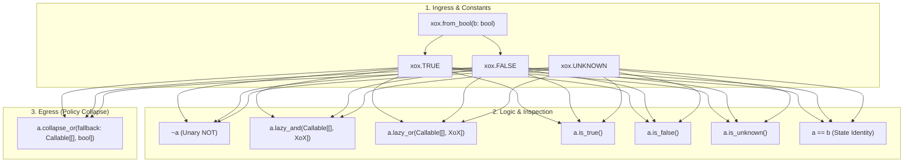

# XoX Public CORE API Specification

This document defines the minimal, normative public `CORE` API surface for Python developers using XoX. It specifies how developers construct, inspect, combine, branch on, and explicitly collapse tri-state logic values (`True`, `False`, `Unknown`) while strictly preserving all adopted XoX semantic invariants and preventing accidental boolean collapse.

---

## 1. Core Principles & Design Objectives

1. **Smallest Surface Above the Problem**: The `CORE` API exposes only the operations necessary to safely represent, combine, inspect, and collapse tri-state uncertainty. No internal algebraic machinery or advanced tier features are exposed.
2. **Strict Domain Separation**: Native Python `bool` and XoX tri-state values are non-interchangeable types. Crossing between them requires explicit boundary operations (`XOX-GUAR-003`).
3. **No Silent Truthiness Collapse**: Python truthiness (`bool()`, `if xox_val:`, `while xox_val:`, `and`, `or`, `not`) must never silently coerce `Unknown` into `False` or `True`. Attempting truthiness coercion raises an explicit runtime error.
4. **Real Host-Boundary Short-Circuiting**: In Python, binary operators (such as `&` and `|`) evaluate both operands eagerly before method execution. To guarantee true observable short-circuit evaluation without evaluating skipped branches, composite logical conjunction and disjunction are exposed exclusively as lazy callable operations (`lazy_and`, `lazy_or`).
5. **Caller-Owned Collapse Policy**: Collapsing an XoX value into a binary Python `bool` is an application-level policy decision requiring an explicit, lazy fallback callable.
6. **Developer-Facing Diagnostics**: Misuse diagnostics explain the developer's conceptual mistake (e.g., trying to use `if` on an un-collapsed tri-state value) rather than compiler or internal engine jargon.

---

## 2. The Minimal CORE API Surface

The complete public `CORE` API surface comprises three value constants, one canonical ingress constructor, three inspection methods, unary NOT, two lazy Strong Kleene operations, one explicit lazy collapse method, and state-equality comparison.



### 2.1 Canonical Value Constants

XoX provides three singleton semantic constants:

```python
xox.TRUE: XoX
xox.FALSE: XoX
xox.UNKNOWN: XoX
```

- **`xox.TRUE`**: Represents a proposition definitively established as true.
- **`xox.FALSE`**: Represents a proposition definitively refuted as false.
- **`xox.UNKNOWN`**: Represents a proposition whose truth status is not established. It carries no directional bias toward `True` or `False`.

### 2.2 Canonical Ingress (Bool-to-XoX Promotion)

```python
xox.from_bool(value: bool) -> XoX
```

- **Semantics**: The single canonical entry point to promote a binary Python `bool` into the XoX semantic domain.
  - `xox.from_bool(True)` returns `xox.TRUE`.
  - `xox.from_bool(False)` returns `xox.FALSE`.
- **Rejection**: Passing any non-bool type (including `None`, integers `1`/`0`, strings, or objects with `__bool__`) raises a `TypeError` / `SemanticMisuseError`.
- **No Redundant Aliases**: There is no secondary `xox(...)` constructor alias.

### 2.3 State Inspection

Developers inspect the exact semantic state without collapsing to boolean:

```python
val.is_true() -> bool
val.is_false() -> bool
val.is_unknown() -> bool
```

- **`val.is_true()`**: Returns Python `True` if `val` is `xox.TRUE`, else `False`.
- **`val.is_false()`**: Returns Python `True` if `val` is `xox.FALSE`, else `False`.
- **`val.is_unknown()`**: Returns Python `True` if `val` is `xox.UNKNOWN`, else `False`.
- **Equality Comparison (`==`, `!=`)**:
  - `val1 == val2` evaluates state-identity equality between two `XoX` instances.
  - Comparing an `XoX` value with a Python `bool` (`xox.TRUE == True` or `xox.FALSE == False`) evaluates to `False` to preserve strict domain separation.

### 2.4 Strong Kleene ($K_3$) Operations

#### Unary NOT (`~`)

```python
~val -> XoX
```

- **Semantics**: Inverts `xox.TRUE` $\leftrightarrow$ `xox.FALSE`; `xox.UNKNOWN` remains `xox.UNKNOWN`.
- **Safety**: Unary operator evaluation in Python creates no RHS eagerness hazard.

#### Lazy AND (`lazy_and`)

```python
val.lazy_and(rhs: Callable[[], XoX]) -> XoX
```

- **Semantics**: Strong Kleene conjunction with true short-circuit evaluation.
  - If `val` is `xox.FALSE`, returns `xox.FALSE` immediately. `rhs` is **never** invoked (producing zero observable side effects or errors).
  - If `val` is `xox.TRUE` or `xox.UNKNOWN`, invokes `rhs()` exactly once.
  - The return value of `rhs()` must be an `XoX` instance. Returning a Python `bool` or any other type raises `TypeError`.

#### Lazy OR (`lazy_or`)

```python
val.lazy_or(rhs: Callable[[], XoX]) -> XoX
```

- **Semantics**: Strong Kleene disjunction with true short-circuit evaluation.
  - If `val` is `xox.TRUE`, returns `xox.TRUE` immediately. `rhs` is **never** invoked (producing zero observable side effects or errors).
  - If `val` is `xox.FALSE` or `xox.UNKNOWN`, invokes `rhs()` exactly once.
  - The return value of `rhs()` must be an `XoX` instance. Returning a Python `bool` or any other type raises `TypeError`.

#### Strong Kleene Truth Tables

| `a` | `b` (resolved) | `~a` | `a.lazy_and(lambda: b)` | `a.lazy_or(lambda: b)` |
| :--- | :--- | :--- | :--- | :--- |
| `TRUE` | `TRUE` | `FALSE` | `TRUE` (invoked) | `TRUE` (skipped) |
| `TRUE` | `FALSE` | `FALSE` | `FALSE` (invoked) | `TRUE` (skipped) |
| `TRUE` | `UNKNOWN` | `FALSE` | `UNKNOWN` (invoked) | `TRUE` (skipped) |
| `FALSE` | `TRUE` | `TRUE` | `FALSE` (skipped) | `TRUE` (invoked) |
| `FALSE` | `FALSE` | `TRUE` | `FALSE` (skipped) | `FALSE` (invoked) |
| `FALSE` | `UNKNOWN` | `TRUE` | `FALSE` (skipped) | `UNKNOWN` (invoked) |
| `UNKNOWN` | `TRUE` | `UNKNOWN` | `UNKNOWN` (invoked) | `TRUE` (invoked) |
| `UNKNOWN` | `FALSE` | `UNKNOWN` | `FALSE` (invoked) | `UNKNOWN` (invoked) |
| `UNKNOWN` | `UNKNOWN` | `UNKNOWN` | `UNKNOWN` (invoked) | `UNKNOWN` (invoked) |

### 2.5 Explicit Egress (Lazy XoX-to-Bool Collapse)

When general application code requires a binary `bool`, the developer must explicitly collapse the `XoX` value using a caller-chosen fallback policy:

```python
val.collapse_or(fallback: Callable[[], bool]) -> bool
```

- **Behavior**:
  - If `val` is `xox.TRUE`, returns Python `True`. `fallback` is **never** invoked.
  - If `val` is `xox.FALSE`, returns Python `False`. `fallback` is **never** invoked.
  - If `val` is `xox.UNKNOWN`, invokes `fallback()` exactly once and returns its boolean result.
- **Strict Return Type**: `fallback()` must return a Python `bool` (`True` or `False`). Returning `XoX`, `None`, integers, or arbitrary truthy/falsy objects raises `TypeError`.
- **True Laziness**: Requiring `fallback` to be a zero-argument callable (`Callable[[], bool]`, such as `lambda: False` or `lambda: query_default()`) guarantees that fallback computation and side effects only occur when uncertainty is actually encountered.

---

## 3. Control Flow & Truthiness Rules

### 3.1 Prohibited Truthiness (`__bool__`)

In Python, `if obj:`, `while obj:`, `bool(obj)`, `not obj`, `and`, and `or` invoke `__bool__()`. For `XoX` values:

```python
# PROHIBITED:
if xox_val:        # Raises TypeError: Cannot use XoX value directly in boolean context.
    ...

bool(xox_val)      # Raises TypeError: Cannot convert XoX value directly to bool.
```

**Diagnostic Rationale**: If `__bool__()` returned `True` or `False` for `xox.UNKNOWN`, `if xox_val:` would silently treat `UNKNOWN` as `False` (or `True`), causing silent bugs, unauthorized access, or duplicate operations. Raising `TypeError` forces the developer to make an explicit three-way decision or explicit collapse.

### 3.2 Correct Three-Way Decision Patterns

#### Pattern A: Method Inspection

```python
if decision.is_true():
    execute_action()
elif decision.is_false():
    reject_action()
else:  # decision.is_unknown()
    handle_uncertainty()
```

#### Pattern B: Python 3.10+ Structural Pattern Matching

```python
match decision:
    case xox.TRUE:
        execute_action()
    case xox.FALSE:
        reject_action()
    case xox.UNKNOWN:
        handle_uncertainty()
```

#### Pattern C: Explicit Guarded Collapse

```python
# When a binary gate requires a fail-closed (False) fallback:
if decision.collapse_or(lambda: False):
    execute_privileged_action()
```

---

## 4. Prohibited Misuse Cases & Diagnostic Contract

| Misuse Case | Code Example | Runtime Behavior | Developer Diagnostic Message |
| :--- | :--- | :--- | :--- |
| **Direct `if` evaluation** | `if xox_val:` | Raises `TypeError` | `"Cannot use XoX value directly in boolean context. Use '.is_true()', pattern match, or '.collapse_or(lambda: fallback)' to resolve uncertainty explicitly."` |
| **Direct `bool()` cast** | `bool(xox_val)` | Raises `TypeError` | `"Cannot convert XoX value directly to bool. Use 'xox_val.collapse_or(lambda: fallback)' with an explicit boolean fallback policy."` |
| **Domain equality erasure** | `xox.TRUE == True` | Evaluates to `False` | Preserves domain separation; XoX values and Python booleans are never equal. |
| **Eager binary operators** | `a & b` or `a \| b` | Raises `TypeError` / not supported | `"Bitwise operators '&' and '|' are not supported on XoX values because Python evaluates operands eagerly. Use 'a.lazy_and(lambda: b)' or 'a.lazy_or(lambda: b)' to preserve short-circuit evaluation."` |
| **Bool return from logic RHS** | `val.lazy_and(lambda: True)` | Raises `TypeError` | `"RHS callable in lazy_and must return an XoX value (xox.TRUE, xox.FALSE, xox.UNKNOWN), got 'bool'. Use 'xox.from_bool(True)'."` |
| **XoX return from collapse** | `val.collapse_or(lambda: xox.FALSE)` | Raises `TypeError` | `"Collapse fallback callable must return a Python bool, got 'XoX'. Collapse must cross into the bool domain."` |
| **Non-callable in collapse** | `val.collapse_or(False)` | Raises `TypeError` | `"Collapse fallback must be a zero-argument callable returning bool (e.g., 'lambda: False') to ensure lazy execution."` |
| **Unknown as None** | `xox.UNKNOWN is None` | Evaluates to `False` | `UNKNOWN` is a tri-state logic value, not an object absence marker. |
| **Unknown as exception** | `try: ... except xox.UNKNOWN:` | Raises `TypeError` | `UNKNOWN` is not an exception class; runtime failures remain errors. |
| **Raw enum integer inspection** | `val._state == 2` | Private/forbidden | Public API provides `.is_true()`, `.is_false()`, `.is_unknown()`. Internal tags are encapsulated. |

---

## 5. Developer FAQ

### How do I create an XoX value from a Python bool?
Use `xox.from_bool(b)`. For static constants, reference `xox.TRUE`, `xox.FALSE`, or `xox.UNKNOWN` directly.

### How do I test whether a value is Unknown without collapsing it?
Call `val.is_unknown()`, or use structural pattern matching `case xox.UNKNOWN:`.

### What happens if I use an XoX value directly in Python `if`?
It raises `TypeError`. Python `if` requires a binary boolean; XoX prohibits silent truthiness conversion to prevent bugs.

### Can XoX True compare equal to Python True?
No. `xox.TRUE == True` evaluates to `False`. XoX tri-state values and Python booleans reside in strictly separated domains.

### Why does XoX use `lazy_and` and `lazy_or` instead of `&` and `|`?
Python evaluates the right side of `a & b` and `a | b` before the operator method is called. If the right side performs an expensive query or raises an error, it would execute even when the left side is `FALSE` (for AND) or `TRUE` (for OR). `lazy_and` and `lazy_or` take a callable and invoke it only when needed, preserving true short-circuit semantics.

### How do I explicitly choose what Unknown means for a Bool-only boundary?
Use `val.collapse_or(lambda: fallback_bool)` where the callable defines your application's policy (e.g., `lambda: False` for fail-closed, `lambda: True` for optimistic pass).

### Is the fallback lazy?
Yes. Because `collapse_or` requires a zero-argument callable, the callable is executed **only** when `val` is `xox.UNKNOWN`.

### What is the smallest correct way to write a three-way decision?
Use `match val:` with `case xox.TRUE:`, `case xox.FALSE:`, `case xox.UNKNOWN:`, or an `if val.is_true(): ... elif val.is_false(): ... else: ...` block.

### Which parts of the API are CORE and which concepts remain unavailable until SAFE or SEMANTIC?
- **`CORE`**: `xox.TRUE`, `xox.FALSE`, `xox.UNKNOWN`, `xox.from_bool()`, `is_true()`, `is_false()`, `is_unknown()`, `~`, `lazy_and()`, `lazy_or()`, and `collapse_or()`.
- **`SAFE` (unavailable in CORE)**: Guarded policy wrappers, auditable collapse tokens, provenance inspection, and evidence verification gates.
- **`SEMANTIC` (unavailable in CORE)**: Distributed epoch contexts, cross-system semantic negotiation, and proof lineage trees.

---

## 6. Minimal Realistic Examples

### Example 1: Ingress Boundary & Lazy Short-Circuit Conjunction

```python
import xox

def check_remote_entitlement() -> xox.XoX:
    # Simulates an external check that should be skipped if subscription is inactive
    return query_entitlement_service()

def evaluate_customer_eligibility(has_active_subscription: bool) -> xox.XoX:
    # Explicitly promote Python bool into XoX domain
    sub_status = xox.from_bool(has_active_subscription)
    
    # Lazy conjunction: if sub_status is FALSE, check_remote_entitlement() is never invoked.
    return sub_status.lazy_and(check_remote_entitlement)
```

### Example 2: Three-Way Branching Without Boolean Coercion

```python
import xox

def process_order_gate(entitlement: xox.XoX) -> str:
    match entitlement:
        case xox.TRUE:
            return "FULFILL_ORDER"
        case xox.FALSE:
            return "REJECT_ORDER"
        case xox.UNKNOWN:
            # Explicit handling: queue for asynchronous re-verification
            return "HOLD_FOR_MANUAL_REVIEW"
```

### Example 3: Explicit Egress with Lazy Fallback Policy

```python
import xox
import logging

def can_access_resource(auth_check: xox.XoX) -> bool:
    def on_uncertainty() -> bool:
        logging.warning("Authorization state indeterminate; enforcing fail-closed policy.")
        return False

    # Collapses to bool. Lazy callback only runs if auth_check is UNKNOWN.
    return auth_check.collapse_or(on_uncertainty)
```

---

## 7. Conformance & Testability Criteria

An implementation conforms to the `CORE` API specification if an independent developer can verify:

1. **Singleton Constants**: `xox.TRUE`, `xox.FALSE`, and `xox.UNKNOWN` are distinct, immutable, and representable.
2. **Strict Boolean Isolation**: `bool(xox.UNKNOWN)`, `bool(xox.TRUE)`, `bool(xox.FALSE)`, `if xox.UNKNOWN:`, and `val.lazy_and(lambda: True)` raise `TypeError`.
3. **Truth Table Conformance**: All 9 cases of Strong Kleene AND, OR, and all 3 cases of NOT evaluate according to the $K_3$ truth table.
4. **Observable Short-Circuit Preservation**:
   - In `xox.FALSE.lazy_and(rhs_fn)`, `rhs_fn` is never invoked.
   - In `xox.TRUE.lazy_or(rhs_fn)`, `rhs_fn` is never invoked.
   - In `xox.TRUE.lazy_and(rhs_fn)` and `xox.FALSE.lazy_or(rhs_fn)`, `rhs_fn` is invoked exactly once.
5. **Lazy Fallback Execution**:
   - In `xox.TRUE.collapse_or(fn)` and `xox.FALSE.collapse_or(fn)`, `fn` is never invoked.
   - In `xox.UNKNOWN.collapse_or(fn)`, `fn` is invoked exactly once.
6. **Strict Callable Types**:
   - `lazy_and` / `lazy_or` reject non-callable arguments or callables returning non-`XoX` types.
   - `collapse_or` rejects non-callable arguments or callables returning non-`bool` types.
7. **No Leaked Advanced Concepts**: The public namespace contains zero references to provenance, tokens, witnesses, world states, or internal runtime representations.
